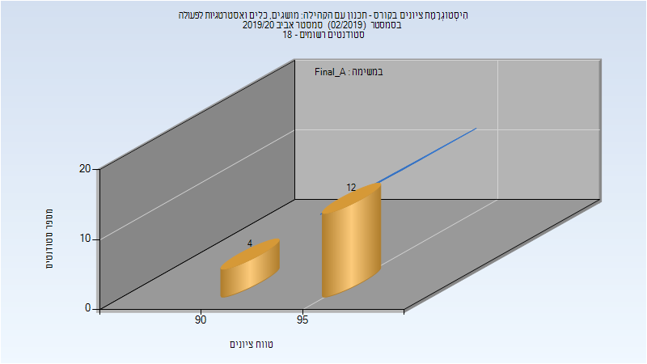

# 207440 - תכנון עם הקהילה, מושגים, כלים

## חורף 2017-2018

| איש סגל | תפקיד |
| ---- | ---- |
| קלוש רחל | מרצה - אחראי מקצוע |

## אביב 2020

| איש סגל | תפקיד |
| ---- | ---- |
| שילון מור | מרצה - אחראי מקצוע |

### סופי מועד א'

| סטודנטים | עברו/נכשלו | אחוז עוברים | ציון מינימלי | ציון מקסימלי | ממוצע | חציון |
| ---- | ---- | ---- | ---- | ---- | ---- | ---- |
| 16 | 16/0 | 100 | 94 | 97 | 95.938 | 96 |

### סופי

| סטודנטים | עברו/נכשלו | אחוז עוברים | ציון מינימלי | ציון מקסימלי | ממוצע | חציון |
| ---- | ---- | ---- | ---- | ---- | ---- | ---- |
| 16 | 16/0 | 100 | 94 | 97 | 95.938 | 96 |

