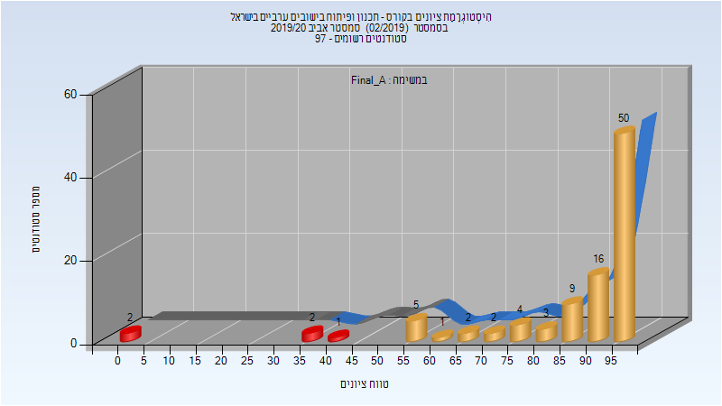

# 207807 - תכנון ופיתוח בישובים ערביים בישרא

## אביב 2020

| איש סגל | תפקיד |
| ---- | ---- |
| ג'בארין יוסף | מרצה - אחראי מקצוע |

### סופי מועד א'

| סטודנטים | עברו/נכשלו | אחוז עוברים | ציון מינימלי | ציון מקסימלי | ממוצע | חציון |
| ---- | ---- | ---- | ---- | ---- | ---- | ---- |
| 97 | 92/5 | 95 | 0 | 99 | 86.412 | 95 |

### סופי

| סטודנטים | עברו/נכשלו | אחוז עוברים | ציון מינימלי | ציון מקסימלי | ממוצע | חציון |
| ---- | ---- | ---- | ---- | ---- | ---- | ---- |
| 95 | 92/3 | 97 | 37 | 99 | 88.916 | 95 |

