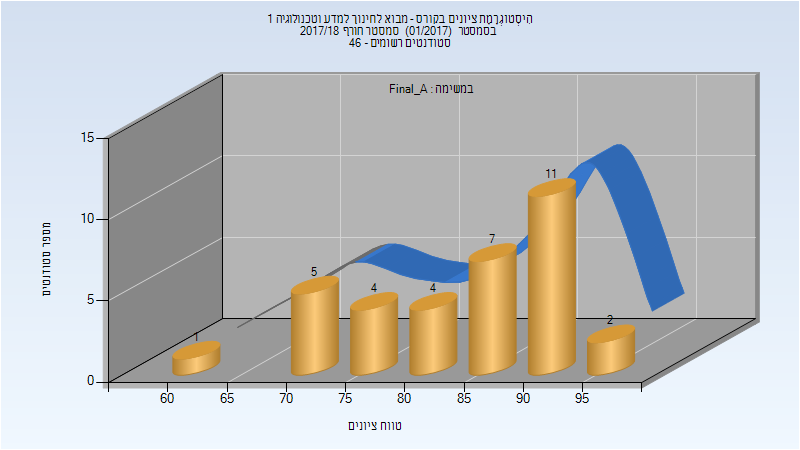
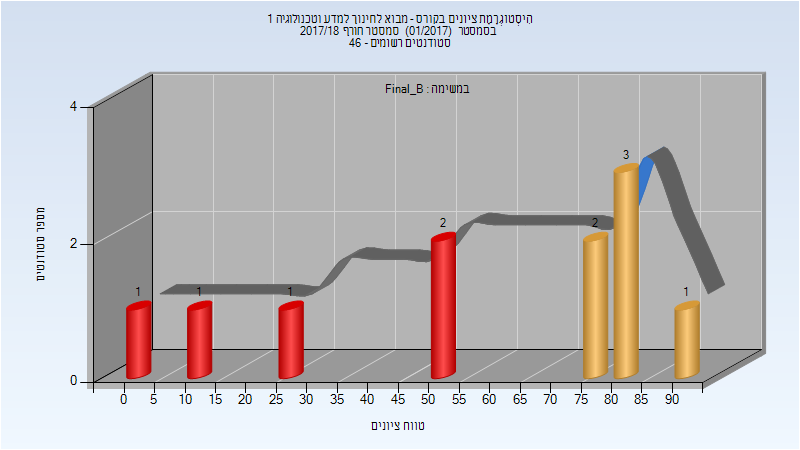
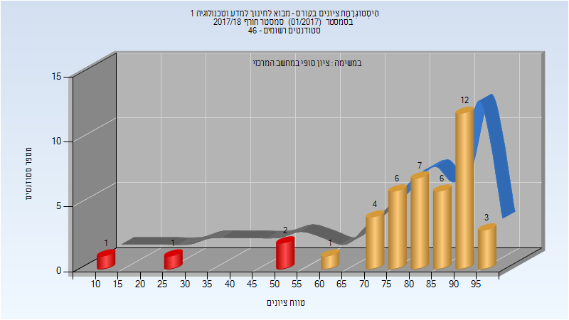

# 214117 - מבוא לחינוך למדע וטכנולוגיה 1

## חורף 2017-2018

| איש סגל | תפקיד |
| ---- | ---- |
| הד-מצויינים עינת | מרצה - אחראי מקצוע |
| ברעם-צברי אילת | מרצה |
| וינגרדן מרב | מתרגל - עם הרשאות מרצה אחראי |
| סבירסקי חני | מתרגל - עם הרשאות מרצה אחראי |

### סופי מועד א'

| סטודנטים | עברו/נכשלו | אחוז עוברים | ציון מינימלי | ציון מקסימלי | ממוצע | חציון |
| ---- | ---- | ---- | ---- | ---- | ---- | ---- |
| 34 | 34/0 | 100 | 61.05 | 96.9 | 84.837 | 86.35 |

### סופי מועד ב'

| סטודנטים | עברו/נכשלו | אחוז עוברים | ציון מינימלי | ציון מקסימלי | ממוצע | חציון |
| ---- | ---- | ---- | ---- | ---- | ---- | ---- |
| 11 | 6/5 | 55 | 0 | 91 | 58.636 | 54 |

### סופי

| סטודנטים | עברו/נכשלו | אחוז עוברים | ציון מינימלי | ציון מקסימלי | ממוצע | חציון |
| ---- | ---- | ---- | ---- | ---- | ---- | ---- |
| 43 | 39/4 | 91 | 12 | 97 | 80.07 | 83 |

