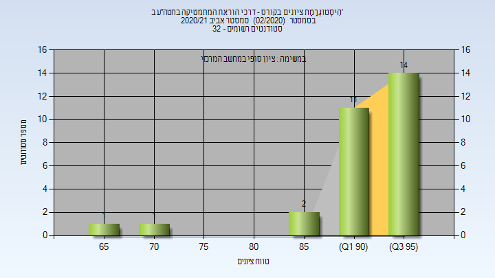

# 214134 - דרכי הוראת המתימטיקה בחטה"ע ב'

## אביב 2021

| איש סגל | תפקיד |
| ---- | ---- |
| ניצן אורטל | מרצה - אחראי מקצוע |
| כהן ניסן אורית | מתרגל - עם הרשאות מרצה אחראי |

### סופי מועד א'

| סטודנטים | עברו/נכשלו | אחוז עוברים | ציון מינימלי | ציון מקסימלי | ממוצע | חציון |
| ---- | ---- | ---- | ---- | ---- | ---- | ---- |
| 29 | 29/0 | 100 | 67 | 99 | 92.69 | 94 |

### סופי

| סטודנטים | עברו/נכשלו | אחוז עוברים | ציון מינימלי | ציון מקסימלי | ממוצע | חציון |
| ---- | ---- | ---- | ---- | ---- | ---- | ---- |
| 29 | 29/0 | 100 | 67 | 99 | 92.69 | 94 |

