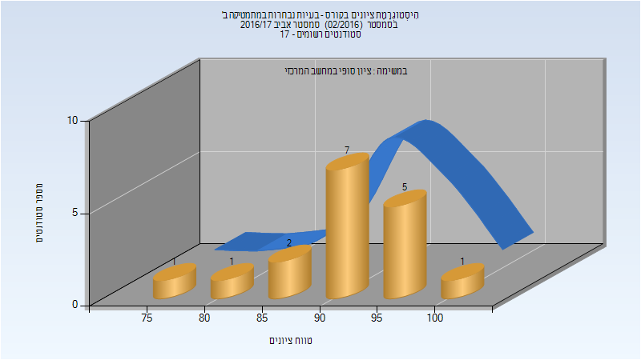

# 214199 - בעיות נבחרות במתמטיקה ב'

## אביב 2017

| איש סגל | תפקיד |
| ---- | ---- |
| הד-מצויינים עינת | מרצה - אחראי מקצוע |
| מרמור עופר | מרצה |

### סופי מועד א'

| סטודנטים | עברו/נכשלו | אחוז עוברים | ציון מינימלי | ציון מקסימלי | ממוצע | חציון |
| ---- | ---- | ---- | ---- | ---- | ---- | ---- |
| 17 | 17/0 | 100 | 78 | 100 | 91.706 | 92 |

### סופי

| סטודנטים | עברו/נכשלו | אחוז עוברים | ציון מינימלי | ציון מקסימלי | ממוצע | חציון |
| ---- | ---- | ---- | ---- | ---- | ---- | ---- |
| 17 | 17/0 | 100 | 78 | 100 | 91.706 | 92 |

