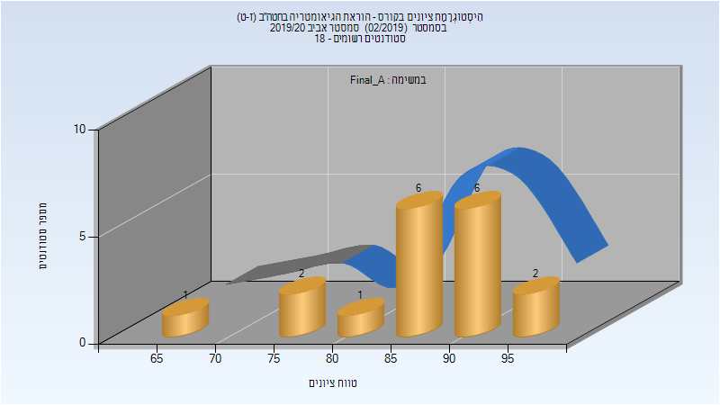

# 214207 - הוראת הגיאומטריה בחטה"ב (ז-ט)

## אביב 2020

| איש סגל | תפקיד |
| ---- | ---- |
| תנחום-זודיק איריס | מרצה - אחראי מקצוע |
| וינגרדן מרב | מתרגל - עם הרשאות מרצה אחראי |

### סופי מועד א'

| סטודנטים | עברו/נכשלו | אחוז עוברים | ציון מינימלי | ציון מקסימלי | ממוצע | חציון |
| ---- | ---- | ---- | ---- | ---- | ---- | ---- |
| 18 | 18/0 | 100 | 68 | 95 | 86.389 | 88 |

