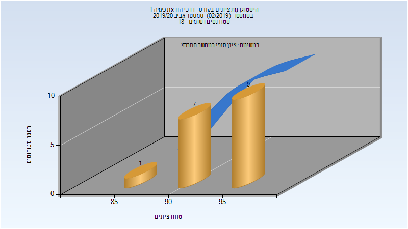

# 214401 - דרכי הוראת כימיה 1

## אביב 2020

| איש סגל | תפקיד |
| ---- | ---- |
| הרשקוביץ אורית | מרצה - אחראי מקצוע |
| שוורץ גבריאלה | מתרגל - עם הרשאות מרצה אחראי |

### סופי מועד א'

| סטודנטים | עברו/נכשלו | אחוז עוברים | ציון מינימלי | ציון מקסימלי | ממוצע | חציון |
| ---- | ---- | ---- | ---- | ---- | ---- | ---- |
| 17 | 17/0 | 100 | 87 | 99 | 94.706 | 95 |

### סופי

| סטודנטים | עברו/נכשלו | אחוז עוברים | ציון מינימלי | ציון מקסימלי | ממוצע | חציון |
| ---- | ---- | ---- | ---- | ---- | ---- | ---- |
| 17 | 17/0 | 100 | 87 | 99 | 94.706 | 95 |

