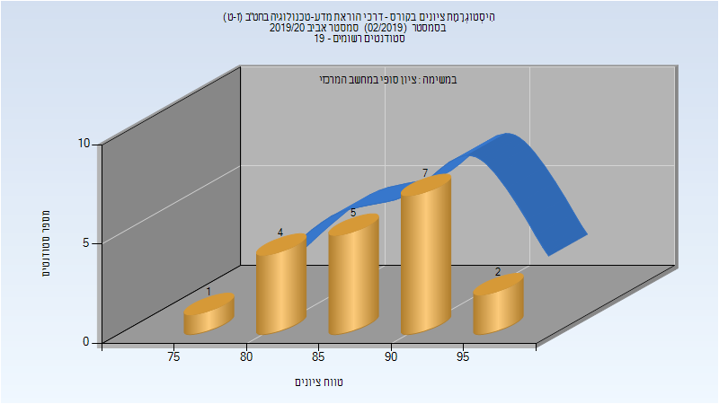

# 214607 - דרכי הוראת מדע-טכנולו. בחט"ב(ז-ט)

## אביב 2020

| איש סגל | תפקיד |
| ---- | ---- |
| ברק מרים | מרצה - אחראי מקצוע |
| עסאקלה שאדי | מתרגל - עם הרשאות מרצה אחראי |

### סופי מועד א'

| סטודנטים | עברו/נכשלו | אחוז עוברים | ציון מינימלי | ציון מקסימלי | ממוצע | חציון |
| ---- | ---- | ---- | ---- | ---- | ---- | ---- |
| 19 | 19/0 | 100 | 79 | 95 | 88.105 | 88 |

### סופי

| סטודנטים | עברו/נכשלו | אחוז עוברים | ציון מינימלי | ציון מקסימלי | ממוצע | חציון |
| ---- | ---- | ---- | ---- | ---- | ---- | ---- |
| 19 | 19/0 | 100 | 79 | 95 | 88.105 | 88 |

