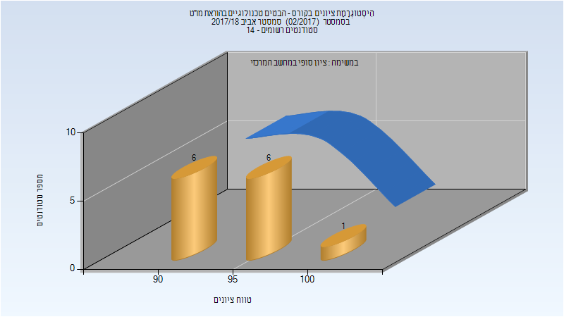

# 214609 - הבטים טכנולוגיים בהוראת מו"ט

## אביב 2018

| איש סגל | תפקיד |
| ---- | ---- |
| קופרמן דן | מרצה - אחראי מקצוע |
| גרינהולץ משה | מתרגל - עם הרשאות מרצה אחראי |

### סופי מועד א'

| סטודנטים | עברו/נכשלו | אחוז עוברים | ציון מינימלי | ציון מקסימלי | ממוצע | חציון |
| ---- | ---- | ---- | ---- | ---- | ---- | ---- |
| 13 | 13/0 | 100 | 91 | 100 | 95 | 95 |

### סופי

| סטודנטים | עברו/נכשלו | אחוז עוברים | ציון מינימלי | ציון מקסימלי | ממוצע | חציון |
| ---- | ---- | ---- | ---- | ---- | ---- | ---- |
| 13 | 13/0 | 100 | 91 | 100 | 95 | 95 |

