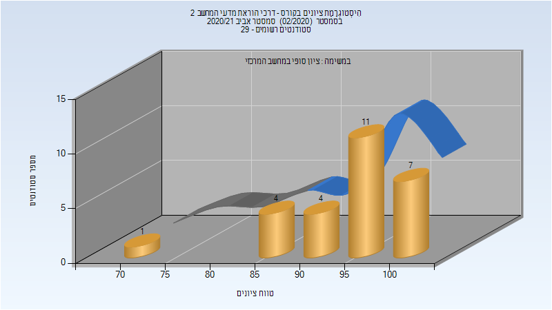

# 214902 - דרכי הוראת מדעי המחשב 2

## אביב 2019

| איש סגל | תפקיד |
| ---- | ---- |
| רוזנברג-קימה רינת | מרצה - אחראי מקצוע |
| מייק יעקב | מתרגל - עם הרשאות מרצה אחראי |

## אביב 2021

| איש סגל | תפקיד |
| ---- | ---- |
| רוזנברג-קימה רינת | מרצה - אחראי מקצוע |

### סופי מועד א'

| סטודנטים | עברו/נכשלו | אחוז עוברים | ציון מינימלי | ציון מקסימלי | ממוצע | חציון |
| ---- | ---- | ---- | ---- | ---- | ---- | ---- |
| 27 | 27/0 | 100 | 71 | 100 | 94.704 | 96 |

### סופי

| סטודנטים | עברו/נכשלו | אחוז עוברים | ציון מינימלי | ציון מקסימלי | ממוצע | חציון |
| ---- | ---- | ---- | ---- | ---- | ---- | ---- |
| 27 | 27/0 | 100 | 71 | 100 | 94.704 | 96 |

