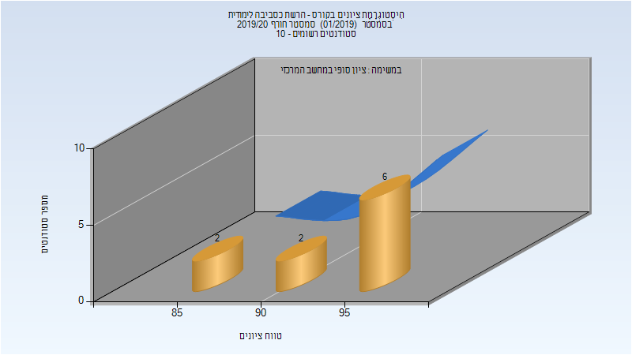

# 216101 - הרשת כסביבה לימודית

## חורף 2019-2020

| איש סגל | תפקיד |
| ---- | ---- |
| ברק מרים | מרצה - אחראי מקצוע |
| עסאקלה שאדי | מתרגל - עם הרשאות מרצה אחראי |

### סופי

| סטודנטים | עברו/נכשלו | אחוז עוברים | ציון מינימלי | ציון מקסימלי | ממוצע | חציון |
| ---- | ---- | ---- | ---- | ---- | ---- | ---- |
| 10 | 10/0 | 100 | 85 | 98 | 93.6 | 95.5 |

