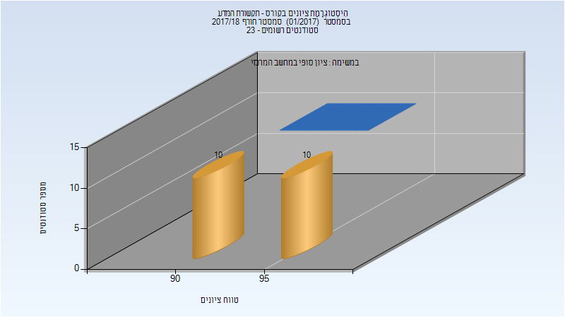
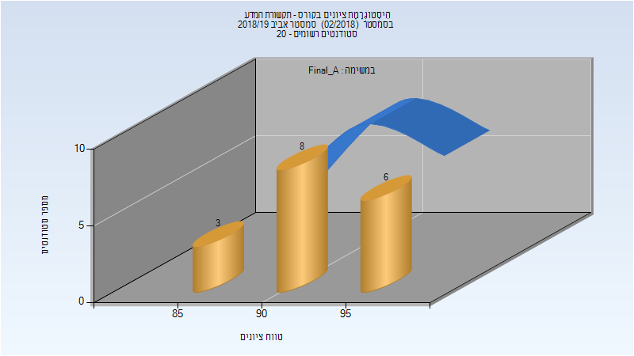

# 216117 - תקשורת המדע

## חורף 2017-2018

| איש סגל | תפקיד |
| ---- | ---- |
| ברעם-צברי אילת | מרצה - אחראי מקצוע |
| בראל יעל | מתרגל - עם הרשאות מרצה אחראי |

### סופי מועד א'

| סטודנטים | עברו/נכשלו | אחוז עוברים | ציון מינימלי | ציון מקסימלי | ממוצע | חציון |
| ---- | ---- | ---- | ---- | ---- | ---- | ---- |
| 20 | 20/0 | 100 | 90 | 99 | 94.85 | 94.5 |

### סופי

| סטודנטים | עברו/נכשלו | אחוז עוברים | ציון מינימלי | ציון מקסימלי | ממוצע | חציון |
| ---- | ---- | ---- | ---- | ---- | ---- | ---- |
| 20 | 20/0 | 100 | 90 | 99 | 94.85 | 94.5 |

## אביב 2019

| איש סגל | תפקיד |
| ---- | ---- |
| ברעם-צברי אילת | מרצה - אחראי מקצוע |
| ברונשטיין יוליה | מתרגל - עם הרשאות מרצה אחראי |

### סופי מועד א'

| סטודנטים | עברו/נכשלו | אחוז עוברים | ציון מינימלי | ציון מקסימלי | ממוצע | חציון |
| ---- | ---- | ---- | ---- | ---- | ---- | ---- |
| 17 | 17/0 | 100 | 86 | 99 | 92.941 | 93 |

