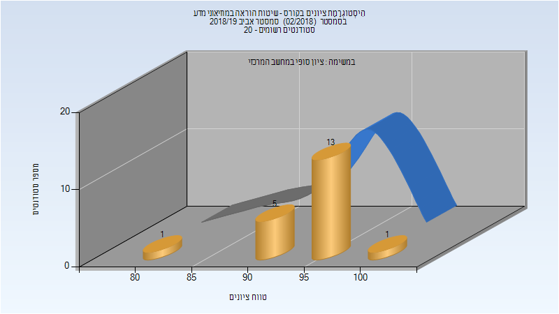

# 216127 - שיטות הוראה במוזיאוני מדע

## אביב 2019

| איש סגל | תפקיד |
| ---- | ---- |
| ורנר איגור | מרצה - אחראי מקצוע |
| פולישוק אלכסנדר | מרצה |

### סופי מועד א'

| סטודנטים | עברו/נכשלו | אחוז עוברים | ציון מינימלי | ציון מקסימלי | ממוצע | חציון |
| ---- | ---- | ---- | ---- | ---- | ---- | ---- |
| 20 | 20/0 | 100 | 84 | 100 | 95.25 | 96 |

### סופי

| סטודנטים | עברו/נכשלו | אחוז עוברים | ציון מינימלי | ציון מקסימלי | ממוצע | חציון |
| ---- | ---- | ---- | ---- | ---- | ---- | ---- |
| 20 | 20/0 | 100 | 84 | 100 | 95.25 | 96 |

