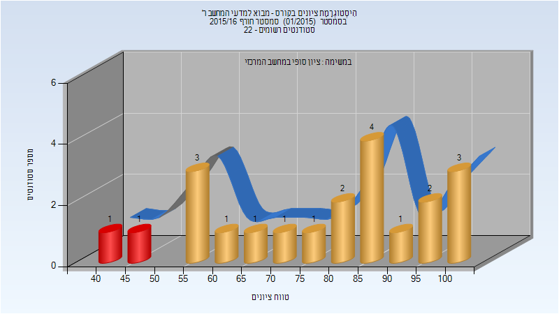

# 234106 - מבוא למדעי המחשב ר'

## חורף 2015-2016

| איש סגל | תפקיד |
| ---- | ---- |
| נופברי ילנה | מרצה - אחראי מקצוע |

### סופי

| סטודנטים | עברו/נכשלו | אחוז עוברים | ציון מינימלי | ציון מקסימלי | ממוצע | חציון |
| ---- | ---- | ---- | ---- | ---- | ---- | ---- |
| 21 | 19/2 | 90 | 44 | 100 | 77.857 | 84 |

