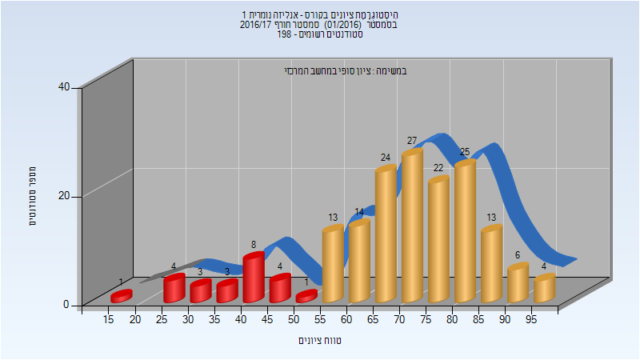

# 234107 - אנליזה נומרית 1

## אביב 2009

| איש סגל | תפקיד |
| ---- | ---- |
| סידי אברהם | מרצה - אחראי מקצוע |

## חורף 2013-2014

| איש סגל | תפקיד |
| ---- | ---- |
| אונגריש מריוס | מרצה - אחראי מקצוע |

## חורף 2016-2017

### סופי

| סטודנטים | עברו/נכשלו | אחוז עוברים | ציון מינימלי | ציון מקסימלי | ממוצע | חציון |
| ---- | ---- | ---- | ---- | ---- | ---- | ---- |
| 172 | 148/24 | 86 | 16 | 99 | 69.076 | 71 |

