# 234118 - ארגון ותכנות המחשב

## אביב 2011

| איש סגל | תפקיד |
| ---- | ---- |
| ברעם יורם | מרצה - אחראי מקצוע |

## חורף 2011-2012

| איש סגל | תפקיד |
| ---- | ---- |
| ברעם יורם | מרצה - אחראי מקצוע |

## אביב 2013

| איש סגל | תפקיד |
| ---- | ---- |
| ברעם יורם | מרצה - אחראי מקצוע |

## חורף 2014-2015

| איש סגל | תפקיד |
| ---- | ---- |
| רוט רוני | מרצה - אחראי מקצוע |

### סופי

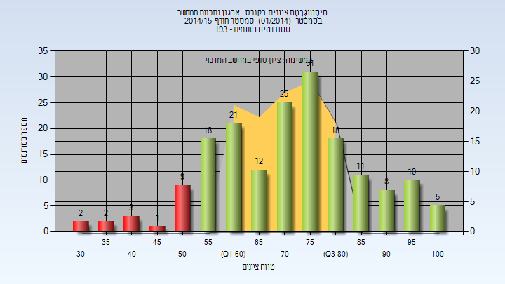

| סטודנטים | עברו/נכשלו | אחוז עוברים | ציון מינימלי | ציון מקסימלי | ממוצע | חציון |
| ---- | ---- | ---- | ---- | ---- | ---- | ---- |
| 176 | 159/17 | 90 | 32 | 100 | 72.244 | 74 |

## אביב 2015

| איש סגל | תפקיד |
| ---- | ---- |
| סלמאן תאמר | מרצה - אחראי מקצוע |

### סופי

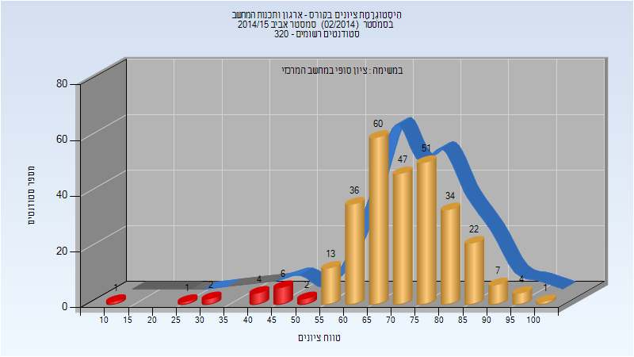

| סטודנטים | עברו/נכשלו | אחוז עוברים | ציון מינימלי | ציון מקסימלי | ממוצע | חציון |
| ---- | ---- | ---- | ---- | ---- | ---- | ---- |
| 291 | 275/16 | 95 | 13 | 100 | 71.619 | 72 |

## קיץ 2015

### סופי

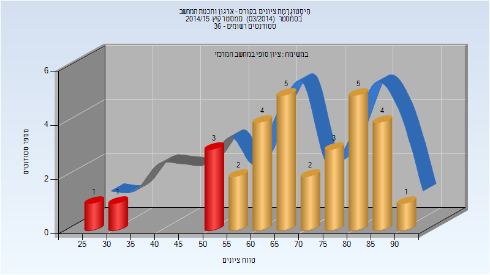

| סטודנטים | עברו/נכשלו | אחוז עוברים | ציון מינימלי | ציון מקסימלי | ממוצע | חציון |
| ---- | ---- | ---- | ---- | ---- | ---- | ---- |
| 31 | 26/5 | 84 | 26 | 91 | 68.968 | 69 |

## חורף 2015-2016

| איש סגל | תפקיד |
| ---- | ---- |
| רוט רוני | מרצה - אחראי מקצוע |

### סופי

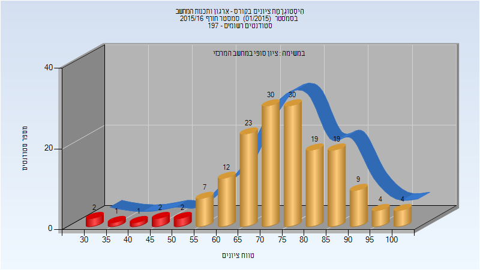

| סטודנטים | עברו/נכשלו | אחוז עוברים | ציון מינימלי | ציון מקסימלי | ממוצע | חציון |
| ---- | ---- | ---- | ---- | ---- | ---- | ---- |
| 165 | 157/8 | 95 | 30 | 100 | 74.715 | 75 |

## אביב 2016

| איש סגל | תפקיד |
| ---- | ---- |
| סלמאן תאמר | מרצה - אחראי מקצוע |

### סופי

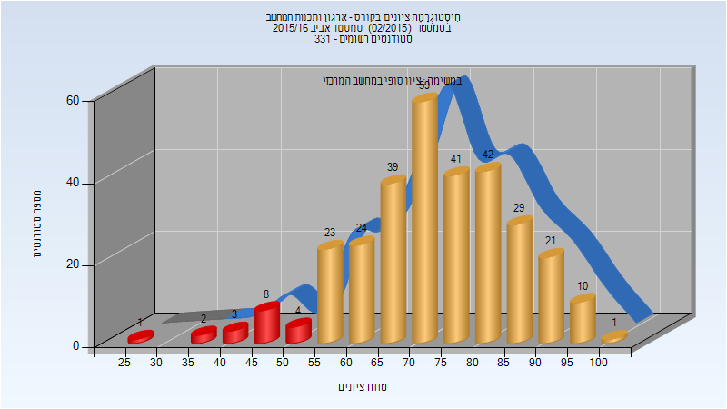

| סטודנטים | עברו/נכשלו | אחוז עוברים | ציון מינימלי | ציון מקסימלי | ממוצע | חציון |
| ---- | ---- | ---- | ---- | ---- | ---- | ---- |
| 307 | 289/18 | 94 | 25 | 100 | 73.596 | 73 |

## חורף 2016-2017

| איש סגל | תפקיד |
| ---- | ---- |
| רוט רוני | מרצה - אחראי מקצוע |

### סופי

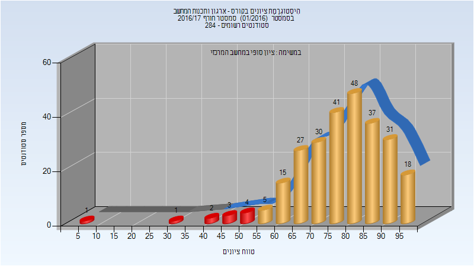

| סטודנטים | עברו/נכשלו | אחוז עוברים | ציון מינימלי | ציון מקסימלי | ממוצע | חציון |
| ---- | ---- | ---- | ---- | ---- | ---- | ---- |
| 263 | 252/11 | 96 | 8 | 99 | 78.24 | 80 |

## אביב 2017

| איש סגל | תפקיד |
| ---- | ---- |
| סלמאן תאמר | מרצה - אחראי מקצוע |

### סופי

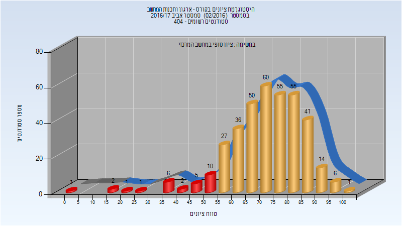

| סטודנטים | עברו/נכשלו | אחוז עוברים | ציון מינימלי | ציון מקסימלי | ממוצע | חציון |
| ---- | ---- | ---- | ---- | ---- | ---- | ---- |
| 373 | 345/28 | 92 | 1 | 100 | 71.995 | 73 |

## חורף 2017-2018

| איש סגל | תפקיד |
| ---- | ---- |
| רוט רוני | מרצה - אחראי מקצוע |

### סופי

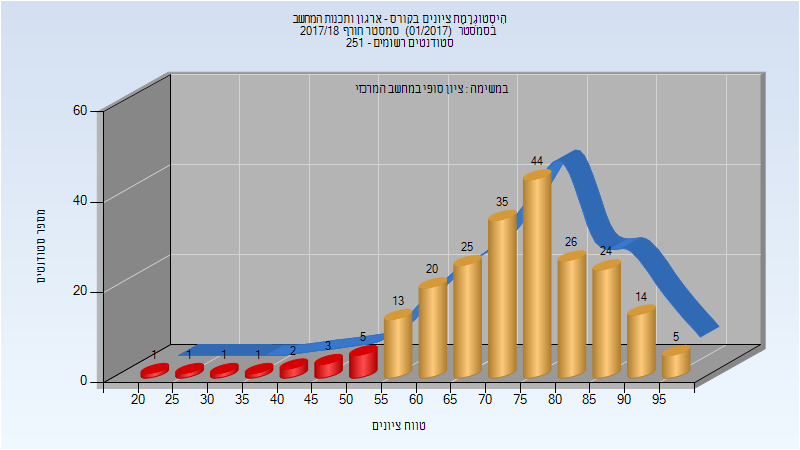

| סטודנטים | עברו/נכשלו | אחוז עוברים | ציון מינימלי | ציון מקסימלי | ממוצע | חציון |
| ---- | ---- | ---- | ---- | ---- | ---- | ---- |
| 220 | 206/14 | 94 | 21 | 99 | 73.359 | 75 |

## אביב 2018

| איש סגל | תפקיד |
| ---- | ---- |
| סלמאן תאמר | מרצה - אחראי מקצוע |

### סופי

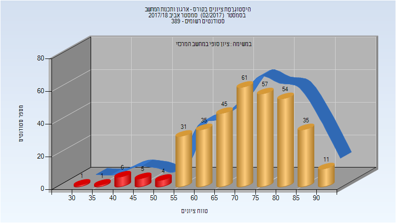

| סטודנטים | עברו/נכשלו | אחוז עוברים | ציון מינימלי | ציון מקסימלי | ממוצע | חציון |
| ---- | ---- | ---- | ---- | ---- | ---- | ---- |
| 346 | 329/17 | 95 | 34 | 94 | 72.179 | 73 |

## חורף 2018-2019

| איש סגל | תפקיד |
| ---- | ---- |
| סלמאן תאמר | מרצה - אחראי מקצוע |

### סופי

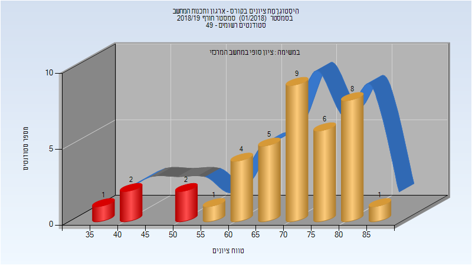

| סטודנטים | עברו/נכשלו | אחוז עוברים | ציון מינימלי | ציון מקסימלי | ממוצע | חציון |
| ---- | ---- | ---- | ---- | ---- | ---- | ---- |
| 39 | 34/5 | 87 | 35 | 86 | 69.795 | 70 |

## אביב 2019

### סופי

| סטודנטים | עברו/נכשלו | אחוז עוברים | ציון מינימלי | ציון מקסימלי | ממוצע | חציון |
| ---- | ---- | ---- | ---- | ---- | ---- | ---- |
| 52 | 51/1 | 98 | 41 | 97 | 78.731 | 81 |

## חורף 2019-2020

| איש סגל | תפקיד |
| ---- | ---- |
| יהב ערן | מרצה - אחראי מקצוע |

### סופי

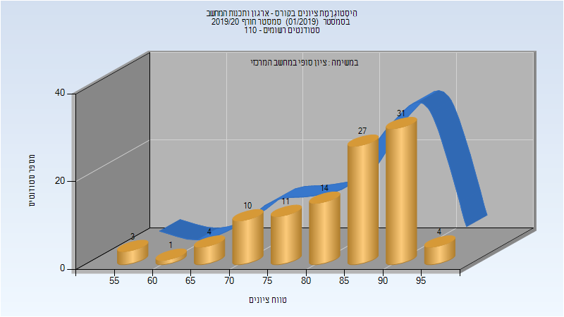

| סטודנטים | עברו/נכשלו | אחוז עוברים | ציון מינימלי | ציון מקסימלי | ממוצע | חציון |
| ---- | ---- | ---- | ---- | ---- | ---- | ---- |
| 105 | 105/0 | 100 | 55 | 98 | 84.752 | 87 |

## אביב 2020

| איש סגל | תפקיד |
| ---- | ---- |
| יהב ערן | מרצה - אחראי מקצוע |

### סופי

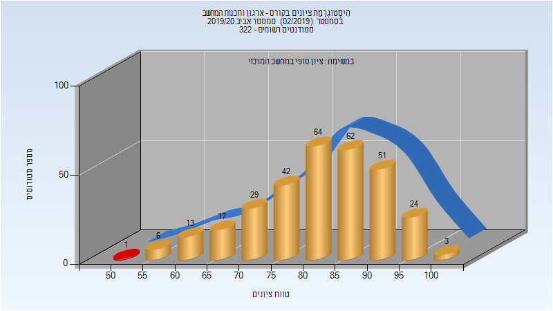

| סטודנטים | עברו/נכשלו | אחוז עוברים | ציון מינימלי | ציון מקסימלי | ממוצע | חציון |
| ---- | ---- | ---- | ---- | ---- | ---- | ---- |
| 313 | 311/2 | 99 | 38 | 100 | 82.69 | 84 |

## חורף 2020-2021

| איש סגל | תפקיד |
| ---- | ---- |
| יהב ערן | מרצה - אחראי מקצוע |

### סופי

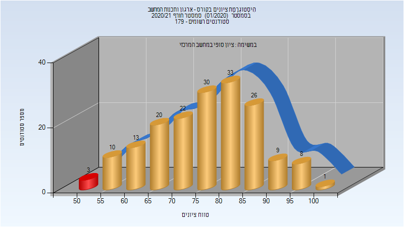

| סטודנטים | עברו/נכשלו | אחוז עוברים | ציון מינימלי | ציון מקסימלי | ממוצע | חציון |
| ---- | ---- | ---- | ---- | ---- | ---- | ---- |
| 171 | 169/2 | 99 | 52 | 99 | 76.673 | 78 |

