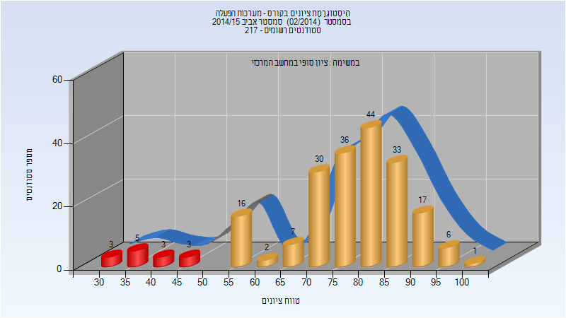
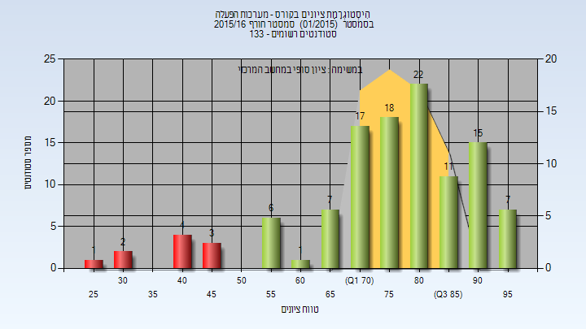
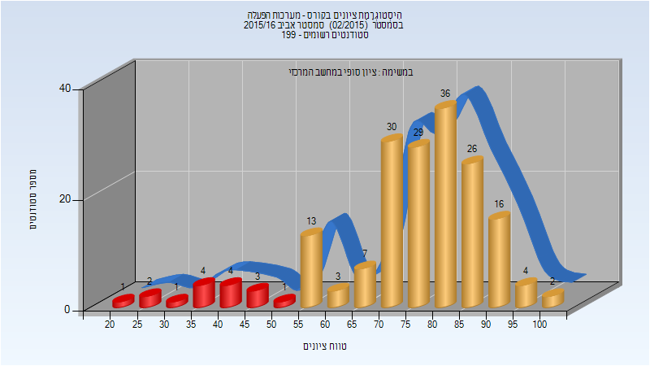
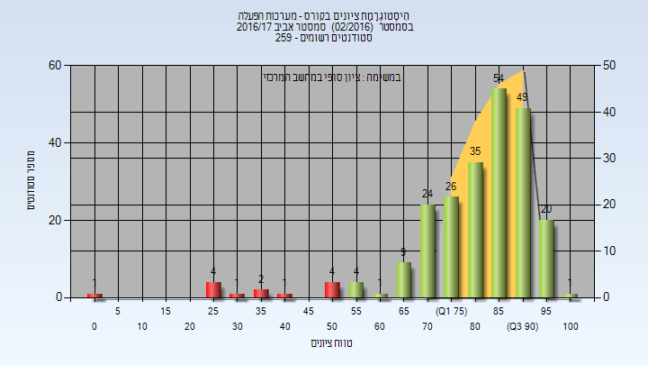
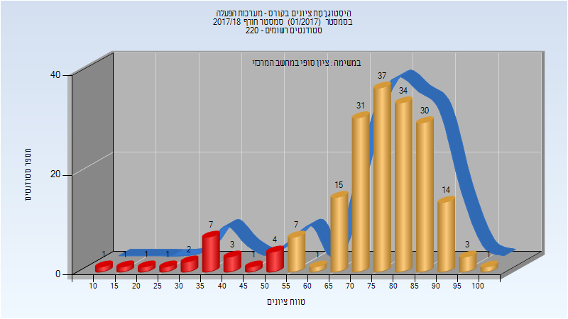
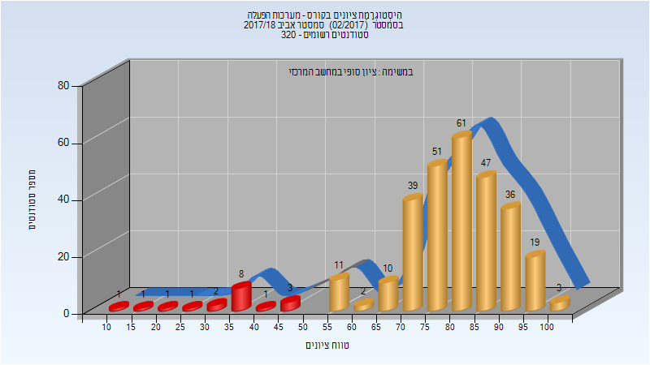
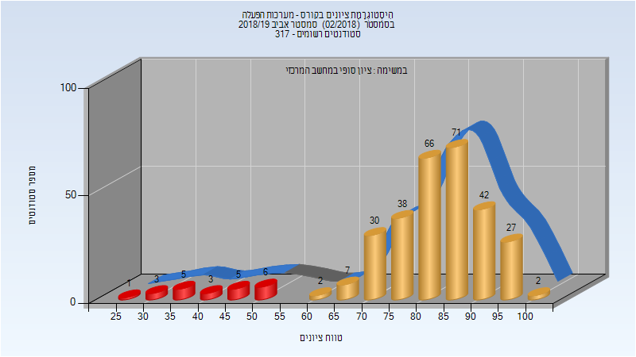
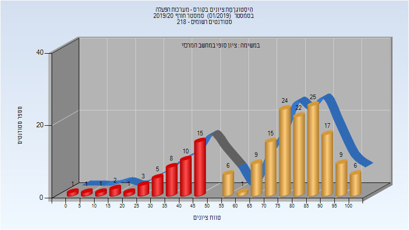
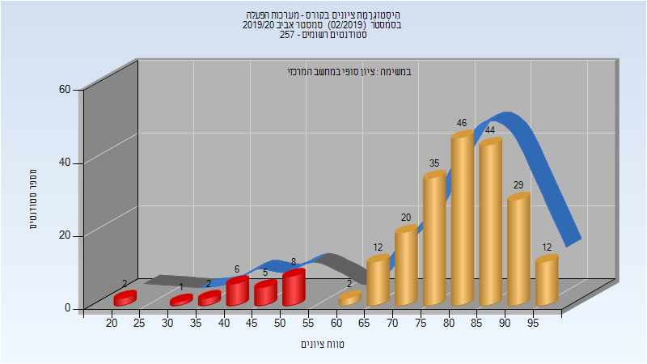
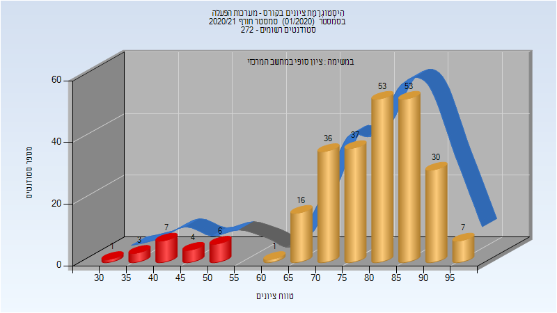

# 234123 - מערכות הפעלה

## אביב 2015

### סופי

| סטודנטים | עברו/נכשלו | אחוז עוברים | ציון מינימלי | ציון מקסימלי | ממוצע | חציון |
| ---- | ---- | ---- | ---- | ---- | ---- | ---- |
| 206 | 192/14 | 93 | 30 | 100 | 76.209 | 79 |

## חורף 2015-2016

| איש סגל | תפקיד |
| ---- | ---- |
| רסקין לאוניד | מרצה - אחראי מקצוע |

### סופי

| סטודנטים | עברו/נכשלו | אחוז עוברים | ציון מינימלי | ציון מקסימלי | ממוצע | חציון |
| ---- | ---- | ---- | ---- | ---- | ---- | ---- |
| 114 | 104/10 | 91 | 26 | 98 | 76.272 | 79 |

## אביב 2016

| איש סגל | תפקיד |
| ---- | ---- |
| צפריר דן | מרצה - אחראי מקצוע |

### סופי

| סטודנטים | עברו/נכשלו | אחוז עוברים | ציון מינימלי | ציון מקסימלי | ממוצע | חציון |
| ---- | ---- | ---- | ---- | ---- | ---- | ---- |
| 182 | 166/16 | 91 | 21 | 100 | 75.154 | 78 |

## חורף 2016-2017

| איש סגל | תפקיד |
| ---- | ---- |
| רסקין לאוניד | מרצה - אחראי מקצוע |

### סופי

| סטודנטים | עברו/נכשלו | אחוז עוברים | ציון מינימלי | ציון מקסימלי | ממוצע | חציון |
| ---- | ---- | ---- | ---- | ---- | ---- | ---- |
| 173 | 159/14 | 92 | 20 | 97 | 75.601 | 77 |

## אביב 2017

| איש סגל | תפקיד |
| ---- | ---- |
| צפריר דן | מרצה - אחראי מקצוע |

### סופי

| סטודנטים | עברו/נכשלו | אחוז עוברים | ציון מינימלי | ציון מקסימלי | ממוצע | חציון |
| ---- | ---- | ---- | ---- | ---- | ---- | ---- |
| 236 | 223/13 | 94 | 4 | 100 | 81.403 | 85 |

## חורף 2017-2018

| איש סגל | תפקיד |
| ---- | ---- |
| רסקין לאוניד | מרצה - אחראי מקצוע |

### סופי

| סטודנטים | עברו/נכשלו | אחוז עוברים | ציון מינימלי | ציון מקסימלי | ממוצע | חציון |
| ---- | ---- | ---- | ---- | ---- | ---- | ---- |
| 194 | 173/21 | 89 | 10 | 100 | 74.402 | 78 |

## אביב 2018

| איש סגל | תפקיד |
| ---- | ---- |
| רסקין לאוניד | מרצה - אחראי מקצוע |

### סופי

| סטודנטים | עברו/נכשלו | אחוז עוברים | ציון מינימלי | ציון מקסימלי | ממוצע | חציון |
| ---- | ---- | ---- | ---- | ---- | ---- | ---- |
| 297 | 279/18 | 94 | 10 | 100 | 78.465 | 81 |

## חורף 2018-2019

| איש סגל | תפקיד |
| ---- | ---- |
| רסקין לאוניד | מרצה - אחראי מקצוע |

### סופי

| סטודנטים | עברו/נכשלו | אחוז עוברים | ציון מינימלי | ציון מקסימלי | ממוצע | חציון |
| ---- | ---- | ---- | ---- | ---- | ---- | ---- |
| 227 | 216/11 | 95 | 26 | 97 | 79.361 | 81 |

## אביב 2019

| איש סגל | תפקיד |
| ---- | ---- |
| רסקין לאוניד | מרצה - אחראי מקצוע |

### סופי

| סטודנטים | עברו/נכשלו | אחוז עוברים | ציון מינימלי | ציון מקסימלי | ממוצע | חציון |
| ---- | ---- | ---- | ---- | ---- | ---- | ---- |
| 308 | 285/23 | 93 | 28 | 100 | 80.984 | 84 |

## חורף 2019-2020

| איש סגל | תפקיד |
| ---- | ---- |
| צפריר דן | מרצה - אחראי מקצוע |

### סופי

| סטודנטים | עברו/נכשלו | אחוז עוברים | ציון מינימלי | ציון מקסימלי | ממוצע | חציון |
| ---- | ---- | ---- | ---- | ---- | ---- | ---- |
| 202 | 181/21 | 90 | 13 | 100 | 76.781 | 80 |

## אביב 2020

| איש סגל | תפקיד |
| ---- | ---- |
| רסקין לאוניד | מרצה - אחראי מקצוע |

### סופי

| סטודנטים | עברו/נכשלו | אחוז עוברים | ציון מינימלי | ציון מקסימלי | ממוצע | חציון |
| ---- | ---- | ---- | ---- | ---- | ---- | ---- |
| 249 | 235/14 | 94 | 17 | 99 | 79.317 | 82 |

## חורף 2020-2021

| איש סגל | תפקיד |
| ---- | ---- |
| רסקין לאוניד | מרצה - אחראי מקצוע |

### סופי

| סטודנטים | עברו/נכשלו | אחוז עוברים | ציון מינימלי | ציון מקסימלי | ממוצע | חציון |
| ---- | ---- | ---- | ---- | ---- | ---- | ---- |
| 254 | 231/23 | 91 | 34 | 99 | 78.11 | 81 |

