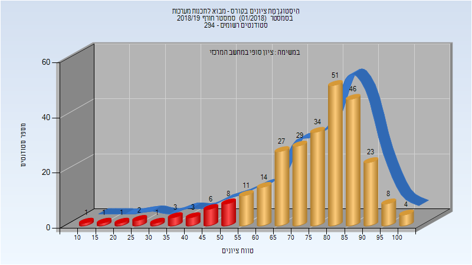
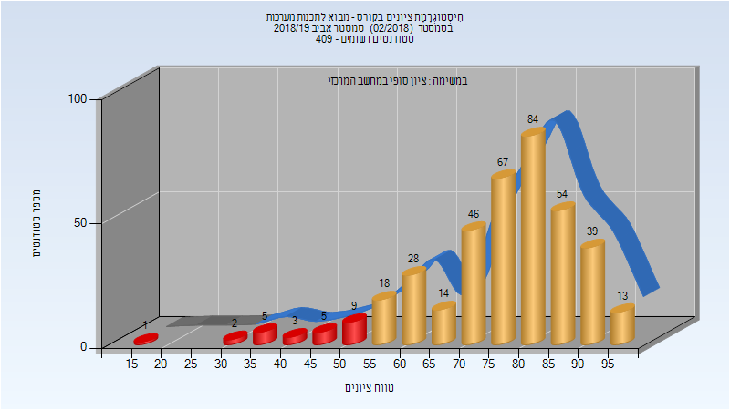
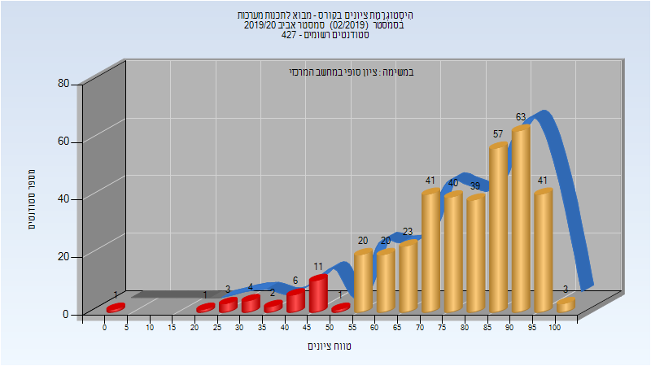
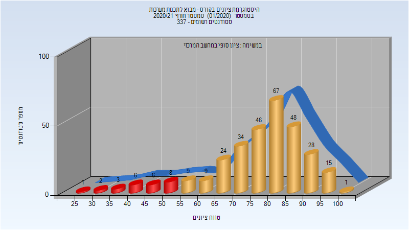

# 234124 - מבוא לתכנות מערכות

## חורף 2018-2019

| איש סגל | תפקיד |
| ---- | ---- |
| אלבר גרשון | מרצה - אחראי מקצוע |

### סופי

| סטודנטים | עברו/נכשלו | אחוז עוברים | ציון מינימלי | ציון מקסימלי | ממוצע | חציון |
| ---- | ---- | ---- | ---- | ---- | ---- | ---- |
| 273 | 247/26 | 90 | 13 | 100 | 75.443 | 79 |

## אביב 2019

| איש סגל | תפקיד |
| ---- | ---- |
| ברקת גיל | מרצה - אחראי מקצוע |

### סופי

| סטודנטים | עברו/נכשלו | אחוז עוברים | ציון מינימלי | ציון מקסימלי | ממוצע | חציון |
| ---- | ---- | ---- | ---- | ---- | ---- | ---- |
| 388 | 364/24 | 94 | 18 | 98 | 76.521 | 79 |

## קיץ 2019

### סופי

| סטודנטים | עברו/נכשלו | אחוז עוברים | ציון מינימלי | ציון מקסימלי | ממוצע | חציון |
| ---- | ---- | ---- | ---- | ---- | ---- | ---- |
| 70 | 61/9 | 87 | 26 | 100 | 76.971 | 80 |

## חורף 2019-2020

| איש סגל | תפקיד |
| ---- | ---- |
| אלבר גרשון | מרצה - אחראי מקצוע |

### סופי

| סטודנטים | עברו/נכשלו | אחוז עוברים | ציון מינימלי | ציון מקסימלי | ממוצע | חציון |
| ---- | ---- | ---- | ---- | ---- | ---- | ---- |
| 301 | 283/18 | 94 | 16 | 100 | 76.535 | 79 |

## אביב 2020

### סופי

| סטודנטים | עברו/נכשלו | אחוז עוברים | ציון מינימלי | ציון מקסימלי | ממוצע | חציון |
| ---- | ---- | ---- | ---- | ---- | ---- | ---- |
| 376 | 348/28 | 93 | 1 | 100 | 78.003 | 81 |

## חורף 2020-2021

| איש סגל | תפקיד |
| ---- | ---- |
| אלבר גרשון | מרצה - אחראי מקצוע |

### סופי

| סטודנטים | עברו/נכשלו | אחוז עוברים | ציון מינימלי | ציון מקסימלי | ממוצע | חציון |
| ---- | ---- | ---- | ---- | ---- | ---- | ---- |
| 307 | 278/29 | 91 | 27 | 100 | 76.749 | 80 |

