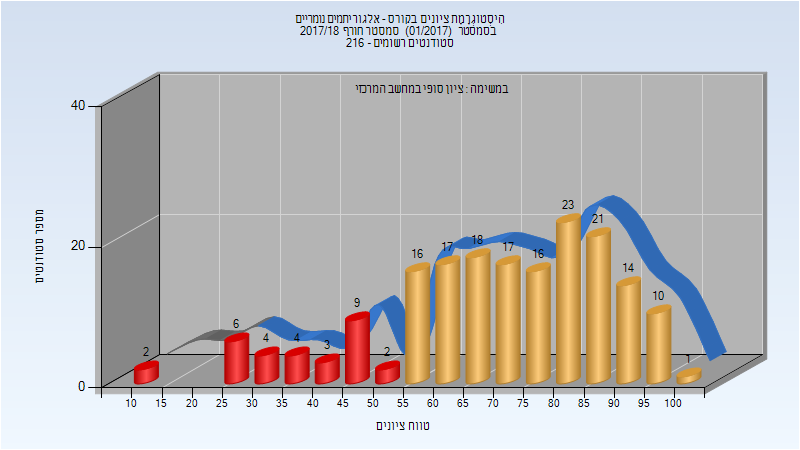
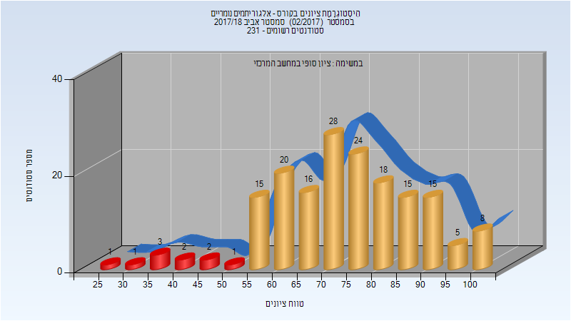
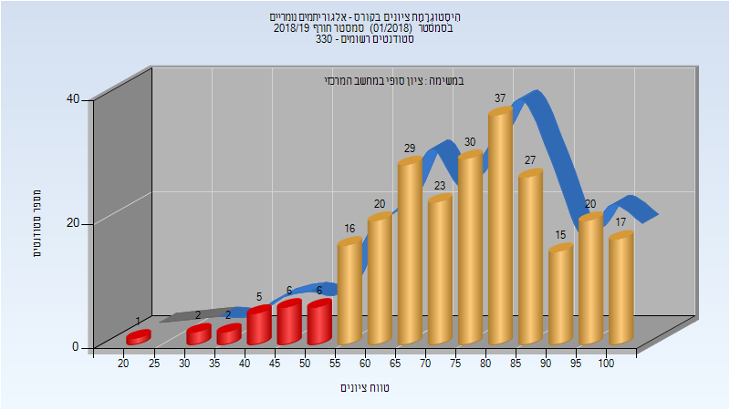
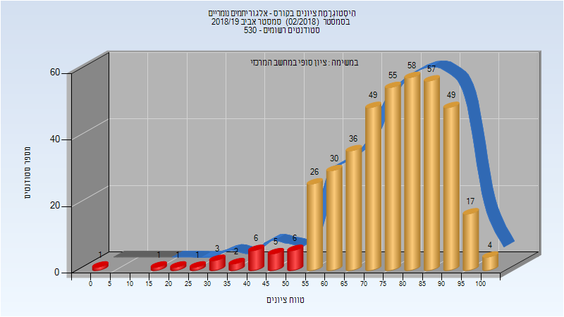
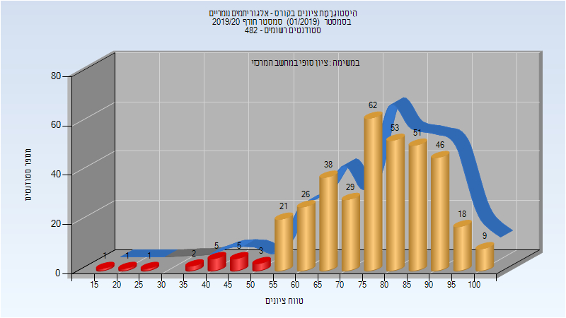
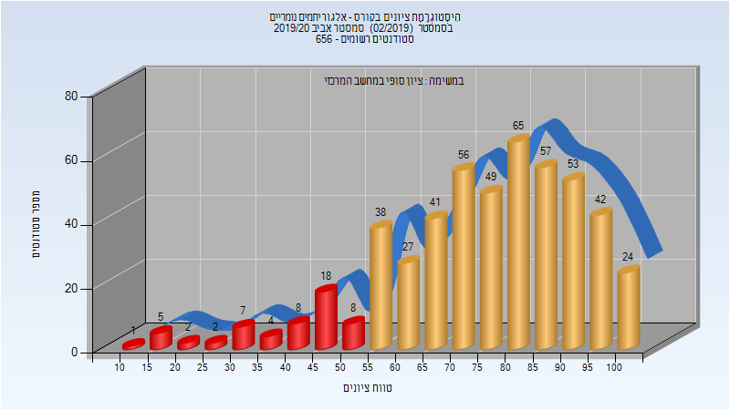

# 234125 - אלגוריתמים נומריים

## חורף 2017-2018

| איש סגל | תפקיד |
| ---- | ---- |
| אלעד מיכאל | מרצה - אחראי מקצוע |

### סופי

| סטודנטים | עברו/נכשלו | אחוז עוברים | ציון מינימלי | ציון מקסימלי | ממוצע | חציון |
| ---- | ---- | ---- | ---- | ---- | ---- | ---- |
| 183 | 153/30 | 84 | 11 | 100 | 69.831 | 73 |

## אביב 2018

| איש סגל | תפקיד |
| ---- | ---- |
| יבנה עירד | מרצה - אחראי מקצוע |

### סופי

| סטודנטים | עברו/נכשלו | אחוז עוברים | ציון מינימלי | ציון מקסימלי | ממוצע | חציון |
| ---- | ---- | ---- | ---- | ---- | ---- | ---- |
| 174 | 164/10 | 94 | 25 | 100 | 74.011 | 74 |

## חורף 2018-2019

| איש סגל | תפקיד |
| ---- | ---- |
| אלעד מיכאל | מרצה - אחראי מקצוע |

### סופי

| סטודנטים | עברו/נכשלו | אחוז עוברים | ציון מינימלי | ציון מקסימלי | ממוצע | חציון |
| ---- | ---- | ---- | ---- | ---- | ---- | ---- |
| 256 | 234/22 | 91 | 21 | 100 | 75.801 | 77 |

## אביב 2019

| איש סגל | תפקיד |
| ---- | ---- |
| יבנה עירד | מרצה - אחראי מקצוע |

### סופי

| סטודנטים | עברו/נכשלו | אחוז עוברים | ציון מינימלי | ציון מקסימלי | ממוצע | חציון |
| ---- | ---- | ---- | ---- | ---- | ---- | ---- |
| 407 | 381/26 | 94 | 3 | 100 | 75.575 | 78 |

## חורף 2019-2020

| איש סגל | תפקיד |
| ---- | ---- |
| יבנה עירד | מרצה - אחראי מקצוע |

### סופי

| סטודנטים | עברו/נכשלו | אחוז עוברים | ציון מינימלי | ציון מקסימלי | ממוצע | חציון |
| ---- | ---- | ---- | ---- | ---- | ---- | ---- |
| 373 | 355/18 | 95 | 17 | 100 | 77.155 | 79 |

## אביב 2020

| איש סגל | תפקיד |
| ---- | ---- |
| יבנה עירד | מרצה - אחראי מקצוע |

### סופי

| סטודנטים | עברו/נכשלו | אחוז עוברים | ציון מינימלי | ציון מקסימלי | ממוצע | חציון |
| ---- | ---- | ---- | ---- | ---- | ---- | ---- |
| 408 | 330/78 | 81 | 10 | 100 | 70.397 | 74 |

