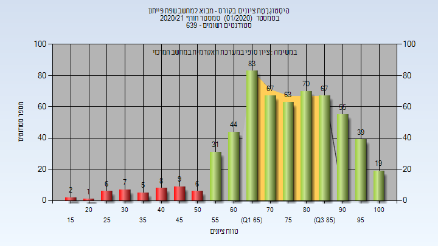

# 234128 - מבוא למחשב שפת פייתון

## חורף 2019-2020

| איש סגל | תפקיד |
| ---- | ---- |
| ריבלין אהוד | מרצה - אחראי מקצוע |

### סופי

| סטודנטים | עברו/נכשלו | אחוז עוברים | ציון מינימלי | ציון מקסימלי | ממוצע | חציון |
| ---- | ---- | ---- | ---- | ---- | ---- | ---- |
| 511 | 475/36 | 93 | 6 | 100 | 76.818 | 78 |

## אביב 2020

| איש סגל | תפקיד |
| ---- | ---- |
| נופברי ילנה | מרצה - אחראי מקצוע |

### סופי

| סטודנטים | עברו/נכשלו | אחוז עוברים | ציון מינימלי | ציון מקסימלי | ממוצע | חציון |
| ---- | ---- | ---- | ---- | ---- | ---- | ---- |
| 351 | 328/23 | 93 | 26 | 100 | 80.652 | 84 |

## קיץ 2020

### סופי

| סטודנטים | עברו/נכשלו | אחוז עוברים | ציון מינימלי | ציון מקסימלי | ממוצע | חציון |
| ---- | ---- | ---- | ---- | ---- | ---- | ---- |
| 26 | 24/2 | 92 | 36 | 100 | 82.269 | 87.5 |

## חורף 2020-2021

| איש סגל | תפקיד |
| ---- | ---- |
| ריבלין אהוד | מרצה - אחראי מקצוע |

### סופי

| סטודנטים | עברו/נכשלו | אחוז עוברים | ציון מינימלי | ציון מקסימלי | ממוצע | חציון |
| ---- | ---- | ---- | ---- | ---- | ---- | ---- |
| 582 | 537/45 | 92 | 16 | 100 | 75.05 | 76 |

