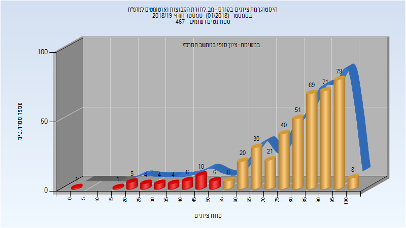
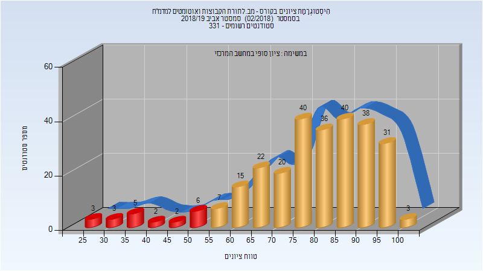
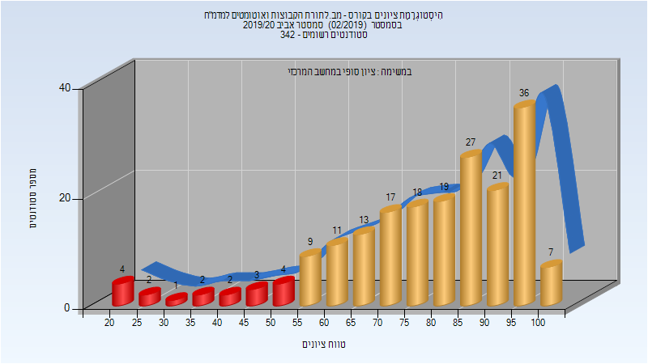

# 234129 - מב.לתורת הקבוצות ואוטומטים למדמ"ח

## חורף 2018-2019

| איש סגל | תפקיד |
| ---- | ---- |
| רוטבלום רון | מרצה - אחראי מקצוע |

### סופי

| סטודנטים | עברו/נכשלו | אחוז עוברים | ציון מינימלי | ציון מקסימלי | ממוצע | חציון |
| ---- | ---- | ---- | ---- | ---- | ---- | ---- |
| 436 | 395/41 | 91 | 3 | 100 | 80.154 | 85 |

## אביב 2019

| איש סגל | תפקיד |
| ---- | ---- |
| פילמוס יובל | מרצה - אחראי מקצוע |

### סופי

| סטודנטים | עברו/נכשלו | אחוז עוברים | ציון מינימלי | ציון מקסימלי | ממוצע | חציון |
| ---- | ---- | ---- | ---- | ---- | ---- | ---- |
| 273 | 252/21 | 92 | 26 | 100 | 78.531 | 81 |

## חורף 2019-2020

| איש סגל | תפקיד |
| ---- | ---- |
| רוטבלום רון | מרצה - אחראי מקצוע |

### סופי

| סטודנטים | עברו/נכשלו | אחוז עוברים | ציון מינימלי | ציון מקסימלי | ממוצע | חציון |
| ---- | ---- | ---- | ---- | ---- | ---- | ---- |
| 454 | 374/80 | 82 | 4 | 100 | 74.761 | 80 |

## אביב 2020

| איש סגל | תפקיד |
| ---- | ---- |
| פילמוס יובל | מרצה - אחראי מקצוע |

### סופי

| סטודנטים | עברו/נכשלו | אחוז עוברים | ציון מינימלי | ציון מקסימלי | ממוצע | חציון |
| ---- | ---- | ---- | ---- | ---- | ---- | ---- |
| 133 | 121/12 | 91 | 21 | 100 | 79.368 | 84 |

