# 234141 - קומבינטוריקה למדעי המחשב

## קיץ 2011

| איש סגל | תפקיד |
| ---- | ---- |
| זקס שמואל | מרצה - אחראי מקצוע |

## אביב 2013

| איש סגל | תפקיד |
| ---- | ---- |
| אל-יניב רן | מרצה - אחראי מקצוע |

## חורף 2013-2014

| איש סגל | תפקיד |
| ---- | ---- |
| עציון טובי | מרצה - אחראי מקצוע |

## חורף 2014-2015

| איש סגל | תפקיד |
| ---- | ---- |
| אל-יניב רן | מרצה - אחראי מקצוע |

### סופי

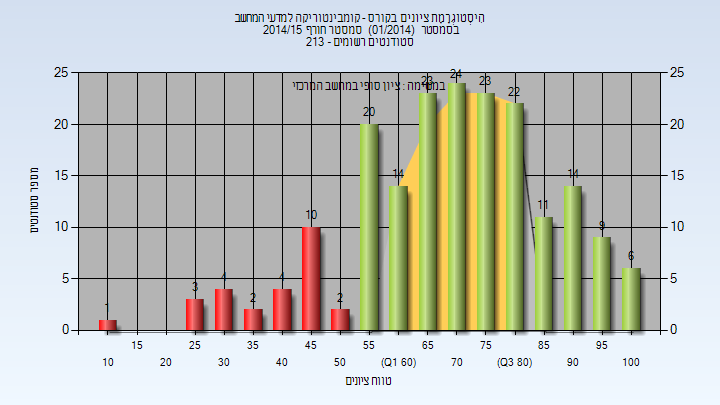

| סטודנטים | עברו/נכשלו | אחוז עוברים | ציון מינימלי | ציון מקסימלי | ממוצע | חציון |
| ---- | ---- | ---- | ---- | ---- | ---- | ---- |
| 192 | 166/26 | 86 | 11 | 100 | 70.818 | 72 |

## חורף 2015-2016

### סופי

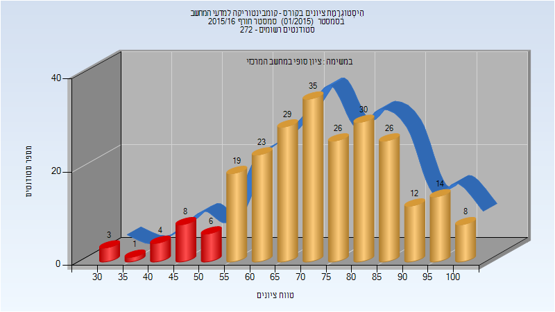

| סטודנטים | עברו/נכשלו | אחוז עוברים | ציון מינימלי | ציון מקסימלי | ממוצע | חציון |
| ---- | ---- | ---- | ---- | ---- | ---- | ---- |
| 244 | 222/22 | 91 | 32 | 100 | 73.594 | 74 |

## אביב 2016

| איש סגל | תפקיד |
| ---- | ---- |
| יעקובי איתן | מרצה - אחראי מקצוע |

### סופי

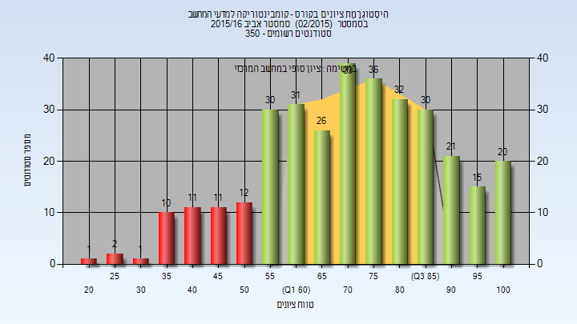

| סטודנטים | עברו/נכשלו | אחוז עוברים | ציון מינימלי | ציון מקסימלי | ממוצע | חציון |
| ---- | ---- | ---- | ---- | ---- | ---- | ---- |
| 328 | 280/48 | 85 | 20 | 100 | 72.29 | 73.5 |

## קיץ 2016

### סופי

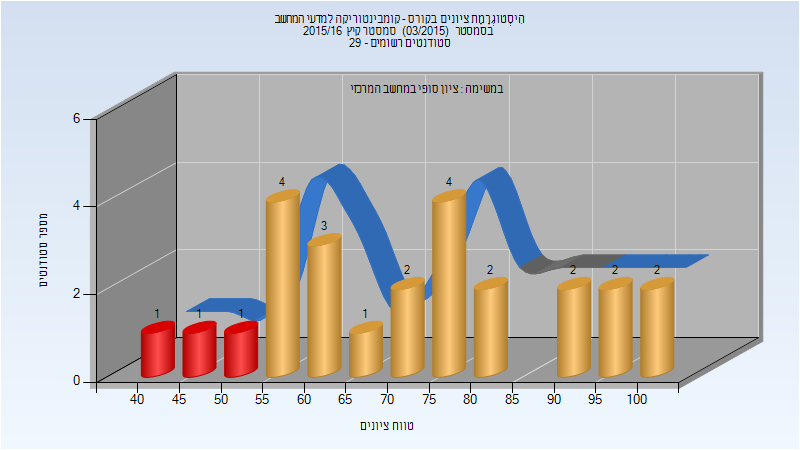

| סטודנטים | עברו/נכשלו | אחוז עוברים | ציון מינימלי | ציון מקסימלי | ממוצע | חציון |
| ---- | ---- | ---- | ---- | ---- | ---- | ---- |
| 25 | 22/3 | 88 | 44 | 100 | 72.48 | 72 |

## חורף 2016-2017

| איש סגל | תפקיד |
| ---- | ---- |
| אל-יניב רן | מרצה - אחראי מקצוע |

### סופי

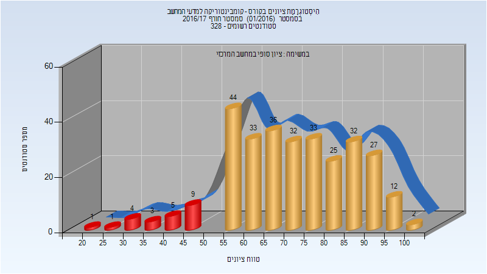

| סטודנטים | עברו/נכשלו | אחוז עוברים | ציון מינימלי | ציון מקסימלי | ממוצע | חציון |
| ---- | ---- | ---- | ---- | ---- | ---- | ---- |
| 299 | 276/23 | 92 | 23 | 100 | 71.508 | 71 |

## אביב 2017

| איש סגל | תפקיד |
| ---- | ---- |
| זקס שמואל | מרצה - אחראי מקצוע |

### סופי

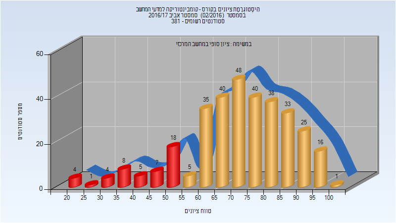

| סטודנטים | עברו/נכשלו | אחוז עוברים | ציון מינימלי | ציון מקסימלי | ממוצע | חציון |
| ---- | ---- | ---- | ---- | ---- | ---- | ---- |
| 328 | 281/47 | 86 | 22 | 100 | 72.088 | 74 |

## קיץ 2017

### סופי

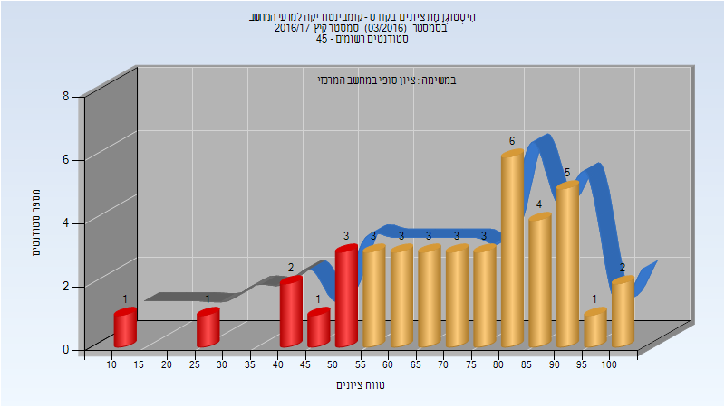

| סטודנטים | עברו/נכשלו | אחוז עוברים | ציון מינימלי | ציון מקסימלי | ממוצע | חציון |
| ---- | ---- | ---- | ---- | ---- | ---- | ---- |
| 41 | 33/8 | 80 | 10 | 100 | 70.976 | 75 |

## חורף 2017-2018

| איש סגל | תפקיד |
| ---- | ---- |
| בשותי נאדר | מרצה - אחראי מקצוע |

### סופי

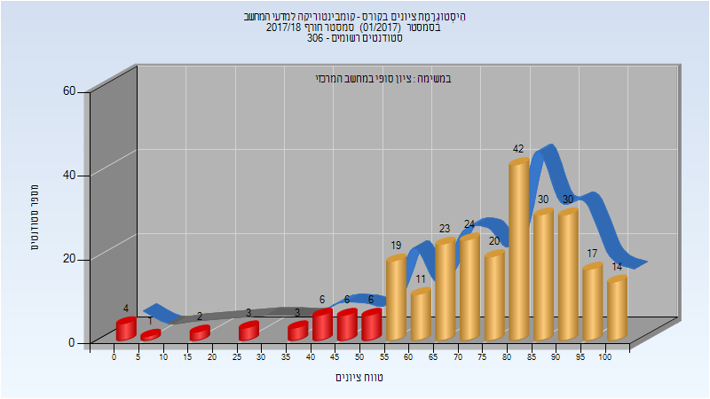

| סטודנטים | עברו/נכשלו | אחוז עוברים | ציון מינימלי | ציון מקסימלי | ממוצע | חציון |
| ---- | ---- | ---- | ---- | ---- | ---- | ---- |
| 261 | 230/31 | 88 | 1 | 100 | 74.766 | 80 |

## אביב 2018

| איש סגל | תפקיד |
| ---- | ---- |
| יעקובי איתן | מרצה - אחראי מקצוע |

### סופי

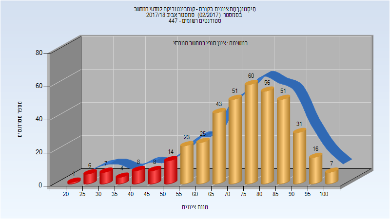

| סטודנטים | עברו/נכשלו | אחוז עוברים | ציון מינימלי | ציון מקסימלי | ממוצע | חציון |
| ---- | ---- | ---- | ---- | ---- | ---- | ---- |
| 411 | 363/48 | 88 | 24 | 100 | 73.394 | 76 |

## קיץ 2018

### סופי

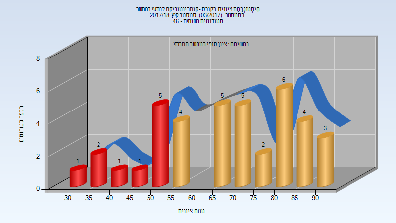

| סטודנטים | עברו/נכשלו | אחוז עוברים | ציון מינימלי | ציון מקסימלי | ממוצע | חציון |
| ---- | ---- | ---- | ---- | ---- | ---- | ---- |
| 39 | 29/10 | 74 | 34 | 94 | 67.846 | 67 |

## חורף 2018-2019

| איש סגל | תפקיד |
| ---- | ---- |
| בשותי נאדר | מרצה - אחראי מקצוע |

### סופי

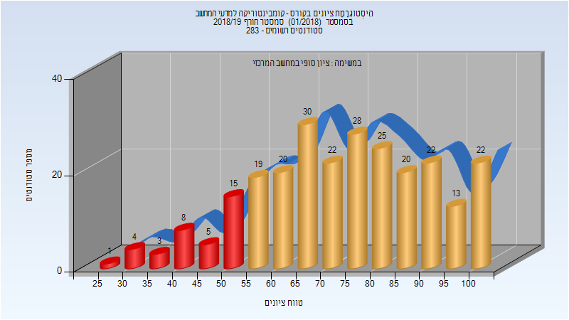

| סטודנטים | עברו/נכשלו | אחוז עוברים | ציון מינימלי | ציון מקסימלי | ממוצע | חציון |
| ---- | ---- | ---- | ---- | ---- | ---- | ---- |
| 257 | 221/36 | 86 | 26 | 100 | 73.778 | 75 |

## אביב 2019

| איש סגל | תפקיד |
| ---- | ---- |
| יעקובי איתן | מרצה - אחראי מקצוע |

### סופי

| סטודנטים | עברו/נכשלו | אחוז עוברים | ציון מינימלי | ציון מקסימלי | ממוצע | חציון |
| ---- | ---- | ---- | ---- | ---- | ---- | ---- |
| 345 | 297/48 | 86 | 23 | 100 | 70.145 | 71 |

## קיץ 2019

| איש סגל | תפקיד |
| ---- | ---- |
| יוחננוב לב | מרצה - אחראי מקצוע |

### סופי

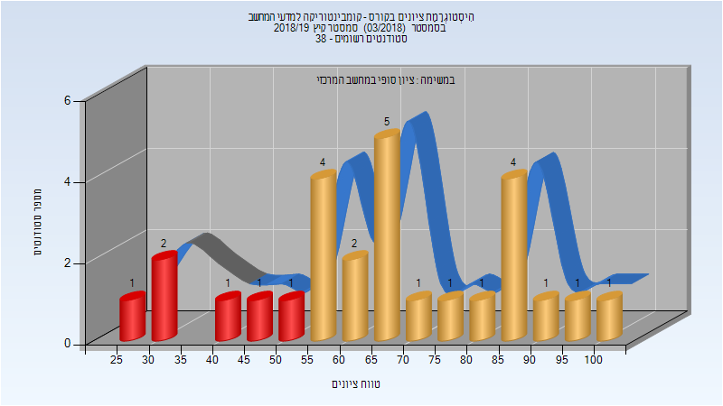

| סטודנטים | עברו/נכשלו | אחוז עוברים | ציון מינימלי | ציון מקסימלי | ממוצע | חציון |
| ---- | ---- | ---- | ---- | ---- | ---- | ---- |
| 27 | 21/6 | 78 | 27 | 100 | 65.63 | 65 |

## חורף 2019-2020

| איש סגל | תפקיד |
| ---- | ---- |
| בשותי נאדר | מרצה - אחראי מקצוע |

### סופי

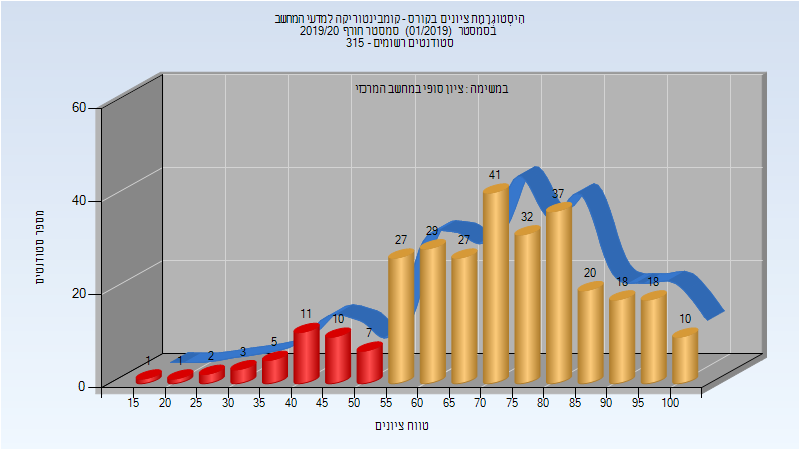

| סטודנטים | עברו/נכשלו | אחוז עוברים | ציון מינימלי | ציון מקסימלי | ממוצע | חציון |
| ---- | ---- | ---- | ---- | ---- | ---- | ---- |
| 299 | 259/40 | 87 | 15 | 100 | 71.666 | 73 |

## אביב 2020

| איש סגל | תפקיד |
| ---- | ---- |
| יעקובי איתן | מרצה - אחראי מקצוע |

### סופי

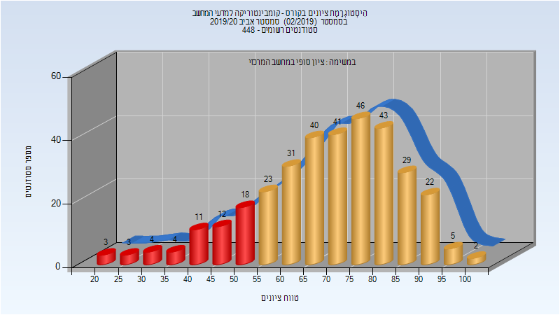

| סטודנטים | עברו/נכשלו | אחוז עוברים | ציון מינימלי | ציון מקסימלי | ממוצע | חציון |
| ---- | ---- | ---- | ---- | ---- | ---- | ---- |
| 401 | 341/60 | 85 | 21 | 100 | 71.337 | 74 |

## קיץ 2020

### סופי

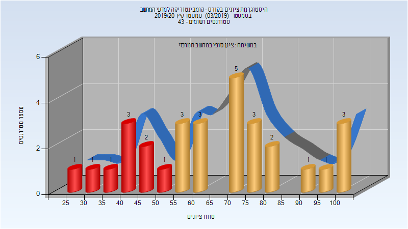

| סטודנטים | עברו/נכשלו | אחוז עוברים | ציון מינימלי | ציון מקסימלי | ממוצע | חציון |
| ---- | ---- | ---- | ---- | ---- | ---- | ---- |
| 36 | 30/6 | 83 | 27 | 100 | 71.222 | 72.5 |

## חורף 2020-2021

| איש סגל | תפקיד |
| ---- | ---- |
| רוט רוני | מרצה - אחראי מקצוע |

### סופי

| סטודנטים | עברו/נכשלו | אחוז עוברים | ציון מינימלי | ציון מקסימלי | ממוצע | חציון |
| ---- | ---- | ---- | ---- | ---- | ---- | ---- |
| 284 | 247/37 | 87 | 18 | 100 | 72.588 | 73 |

