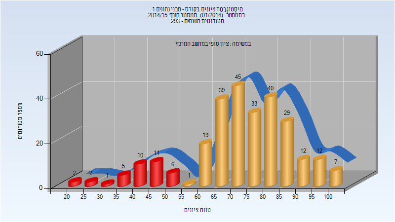
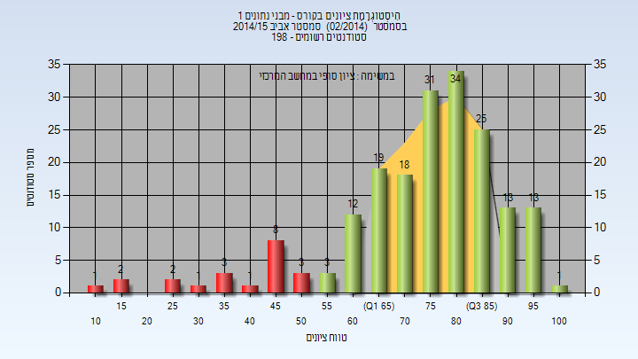
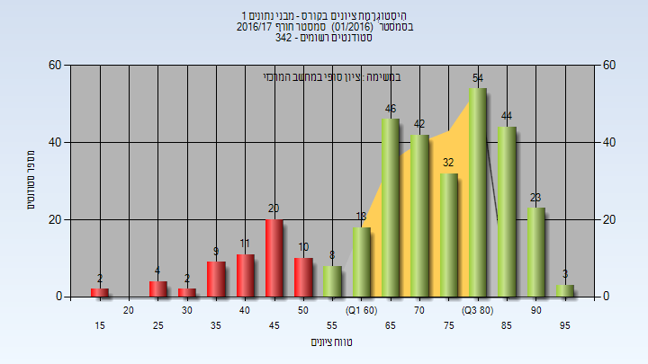
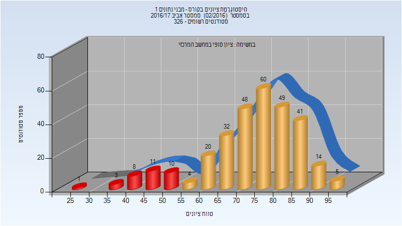
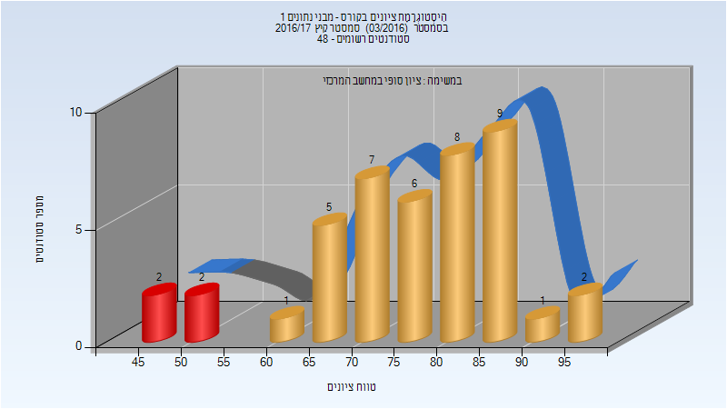
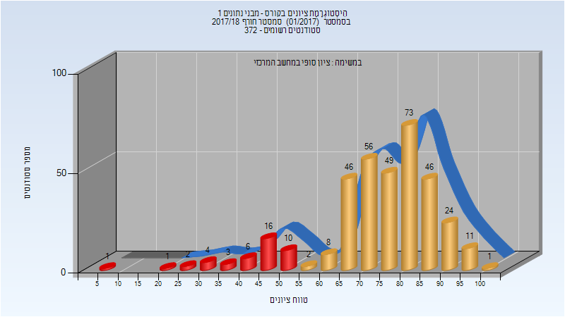
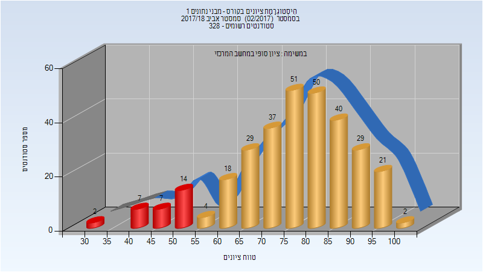
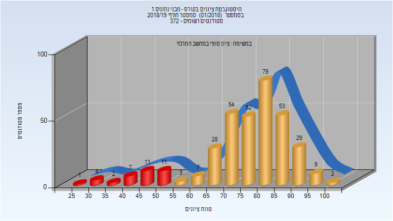
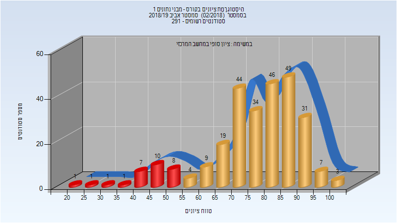
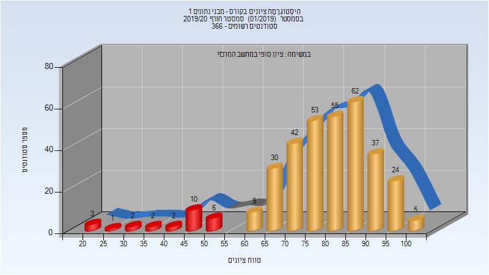

# 234218 - מבני נתונים 1

## אביב 2009

| איש סגל | תפקיד |
| ---- | ---- |
| בשותי נאדר | מרצה - אחראי מקצוע |

## חורף 2011-2012

| איש סגל | תפקיד |
| ---- | ---- |
| בשותי נאדר | מרצה - אחראי מקצוע |

## חורף 2013-2014

| איש סגל | תפקיד |
| ---- | ---- |
| בשותי נאדר | מרצה - אחראי מקצוע |

## אביב 2014

| איש סגל | תפקיד |
| ---- | ---- |
| גייגר דן | מרצה - אחראי מקצוע |

## חורף 2014-2015

### סופי

| סטודנטים | עברו/נכשלו | אחוז עוברים | ציון מינימלי | ציון מקסימלי | ממוצע | חציון |
| ---- | ---- | ---- | ---- | ---- | ---- | ---- |
| 274 | 237/37 | 86 | 23 | 100 | 72.73 | 73 |

## אביב 2015

| איש סגל | תפקיד |
| ---- | ---- |
| גייגר דן | מרצה - אחראי מקצוע |

### סופי

| סטודנטים | עברו/נכשלו | אחוז עוברים | ציון מינימלי | ציון מקסימלי | ממוצע | חציון |
| ---- | ---- | ---- | ---- | ---- | ---- | ---- |
| 190 | 169/21 | 89 | 13 | 100 | 74.768 | 78.5 |

## חורף 2016-2017

| איש סגל | תפקיד |
| ---- | ---- |
| בשותי נאדר | מרצה - אחראי מקצוע |

### סופי

| סטודנטים | עברו/נכשלו | אחוז עוברים | ציון מינימלי | ציון מקסימלי | ממוצע | חציון |
| ---- | ---- | ---- | ---- | ---- | ---- | ---- |
| 328 | 270/58 | 82 | 15 | 95 | 70.979 | 73 |

## אביב 2017

| איש סגל | תפקיד |
| ---- | ---- |
| פטרנק ארז | מרצה - אחראי מקצוע |

### סופי

| סטודנטים | עברו/נכשלו | אחוז עוברים | ציון מינימלי | ציון מקסימלי | ממוצע | חציון |
| ---- | ---- | ---- | ---- | ---- | ---- | ---- |
| 306 | 273/33 | 89 | 29 | 97 | 73.66 | 76 |

## קיץ 2017

| איש סגל | תפקיד |
| ---- | ---- |
| בשותי נאדר | מרצה - אחראי מקצוע |

### סופי

| סטודנטים | עברו/נכשלו | אחוז עוברים | ציון מינימלי | ציון מקסימלי | ממוצע | חציון |
| ---- | ---- | ---- | ---- | ---- | ---- | ---- |
| 43 | 39/4 | 91 | 45 | 95 | 76.302 | 76 |

## חורף 2017-2018

| איש סגל | תפקיד |
| ---- | ---- |
| כהן רמי | מרצה - אחראי מקצוע |

### סופי

| סטודנטים | עברו/נכשלו | אחוז עוברים | ציון מינימלי | ציון מקסימלי | ממוצע | חציון |
| ---- | ---- | ---- | ---- | ---- | ---- | ---- |
| 359 | 316/43 | 88 | 5 | 100 | 74.256 | 77 |

## אביב 2018

| איש סגל | תפקיד |
| ---- | ---- |
| פטרנק ארז | מרצה - אחראי מקצוע |

### סופי

| סטודנטים | עברו/נכשלו | אחוז עוברים | ציון מינימלי | ציון מקסימלי | ממוצע | חציון |
| ---- | ---- | ---- | ---- | ---- | ---- | ---- |
| 311 | 281/30 | 90 | 33 | 100 | 76.389 | 78 |

## קיץ 2018

### סופי

| סטודנטים | עברו/נכשלו | אחוז עוברים | ציון מינימלי | ציון מקסימלי | ממוצע | חציון |
| ---- | ---- | ---- | ---- | ---- | ---- | ---- |
| 43 | 42/1 | 98 | 50 | 99 | 76.302 | 77 |

## חורף 2018-2019

| איש סגל | תפקיד |
| ---- | ---- |
| רוטנשטרייך אורי | מרצה - אחראי מקצוע |

### סופי

| סטודנטים | עברו/נכשלו | אחוז עוברים | ציון מינימלי | ציון מקסימלי | ממוצע | חציון |
| ---- | ---- | ---- | ---- | ---- | ---- | ---- |
| 352 | 316/36 | 90 | 28 | 100 | 76.207 | 79 |

## אביב 2019

| איש סגל | תפקיד |
| ---- | ---- |
| פטרנק ארז | מרצה - אחראי מקצוע |

### סופי

| סטודנטים | עברו/נכשלו | אחוז עוברים | ציון מינימלי | ציון מקסימלי | ממוצע | חציון |
| ---- | ---- | ---- | ---- | ---- | ---- | ---- |
| 275 | 246/29 | 89 | 22 | 100 | 76.316 | 79 |

## חורף 2019-2020

| איש סגל | תפקיד |
| ---- | ---- |
| רוטנשטרייך אורי | מרצה - אחראי מקצוע |

### סופי

| סטודנטים | עברו/נכשלו | אחוז עוברים | ציון מינימלי | ציון מקסימלי | ממוצע | חציון |
| ---- | ---- | ---- | ---- | ---- | ---- | ---- |
| 343 | 317/26 | 92 | 20 | 100 | 78.417 | 80 |

