# 234247 - אלגוריתמים 1

## אביב 2011

| איש סגל | תפקיד |
| ---- | ---- |
| שכנאי הדס | מרצה - אחראי מקצוע |

## אביב 2015

| איש סגל | תפקיד |
| ---- | ---- |
| מורן שלמה | מרצה - אחראי מקצוע |

### סופי

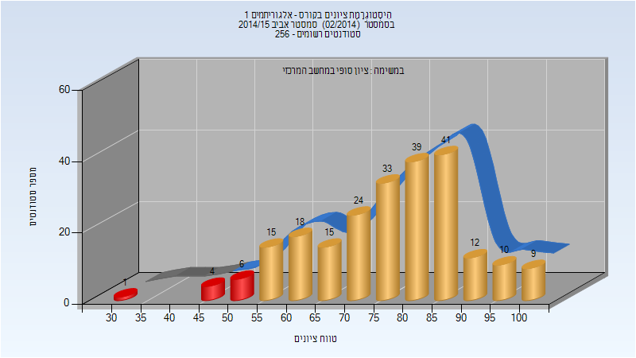

| סטודנטים | עברו/נכשלו | אחוז עוברים | ציון מינימלי | ציון מקסימלי | ממוצע | חציון |
| ---- | ---- | ---- | ---- | ---- | ---- | ---- |
| 227 | 216/11 | 95 | 34 | 100 | 77.313 | 79 |

## חורף 2015-2016

| איש סגל | תפקיד |
| ---- | ---- |
| נאור יוסף | מרצה - אחראי מקצוע |

### סופי

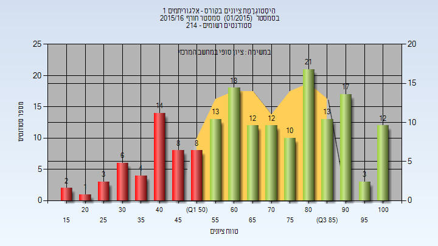

| סטודנטים | עברו/נכשלו | אחוז עוברים | ציון מינימלי | ציון מקסימלי | ממוצע | חציון |
| ---- | ---- | ---- | ---- | ---- | ---- | ---- |
| 177 | 131/46 | 74 | 18 | 100 | 68.153 | 69 |

## אביב 2016

| איש סגל | תפקיד |
| ---- | ---- |
| שכנאי הדס | מרצה - אחראי מקצוע |

### סופי

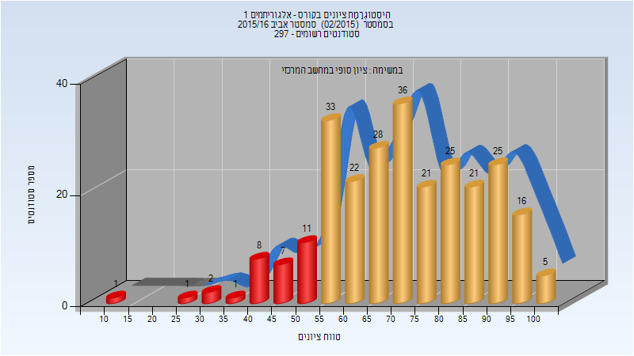

| סטודנטים | עברו/נכשלו | אחוז עוברים | ציון מינימלי | ציון מקסימלי | ממוצע | חציון |
| ---- | ---- | ---- | ---- | ---- | ---- | ---- |
| 263 | 232/31 | 88 | 10 | 100 | 71.913 | 72 |

## חורף 2016-2017

| איש סגל | תפקיד |
| ---- | ---- |
| נאור יוסף | מרצה - אחראי מקצוע |

### סופי

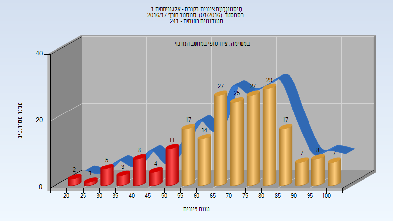

| סטודנטים | עברו/נכשלו | אחוז עוברים | ציון מינימלי | ציון מקסימלי | ממוצע | חציון |
| ---- | ---- | ---- | ---- | ---- | ---- | ---- |
| 212 | 178/34 | 84 | 21 | 100 | 70.387 | 71 |

## אביב 2017

| איש סגל | תפקיד |
| ---- | ---- |
| שורץ רועי | מרצה - אחראי מקצוע |

### סופי

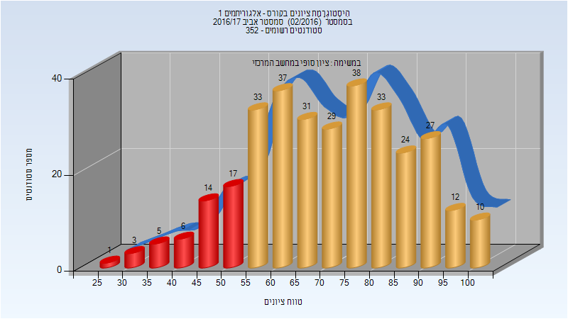

| סטודנטים | עברו/נכשלו | אחוז עוברים | ציון מינימלי | ציון מקסימלי | ממוצע | חציון |
| ---- | ---- | ---- | ---- | ---- | ---- | ---- |
| 320 | 274/46 | 86 | 29 | 100 | 71.262 | 72 |

## חורף 2017-2018

| איש סגל | תפקיד |
| ---- | ---- |
| פישר אלדר | מרצה - אחראי מקצוע |

### סופי

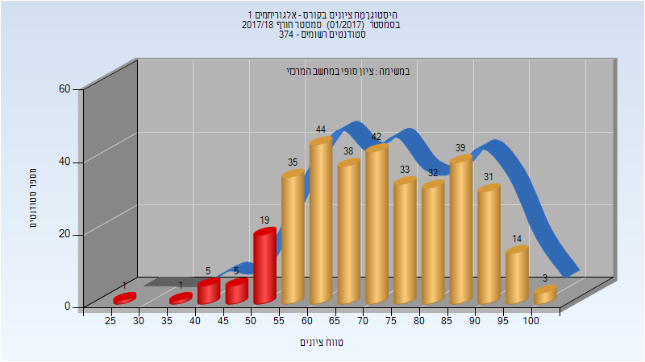

| סטודנטים | עברו/נכשלו | אחוז עוברים | ציון מינימלי | ציון מקסימלי | ממוצע | חציון |
| ---- | ---- | ---- | ---- | ---- | ---- | ---- |
| 342 | 311/31 | 91 | 26 | 100 | 72.599 | 73 |

## אביב 2018

| איש סגל | תפקיד |
| ---- | ---- |
| שורץ רועי | מרצה - אחראי מקצוע |

### סופי

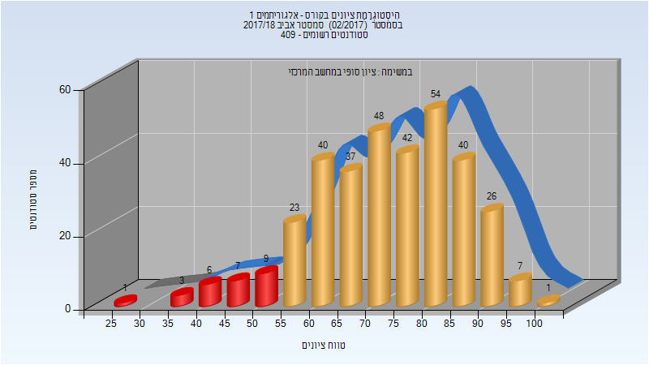

| סטודנטים | עברו/נכשלו | אחוז עוברים | ציון מינימלי | ציון מקסימלי | ממוצע | חציון |
| ---- | ---- | ---- | ---- | ---- | ---- | ---- |
| 344 | 318/26 | 92 | 27 | 100 | 73.212 | 74 |

## קיץ 2018

### סופי

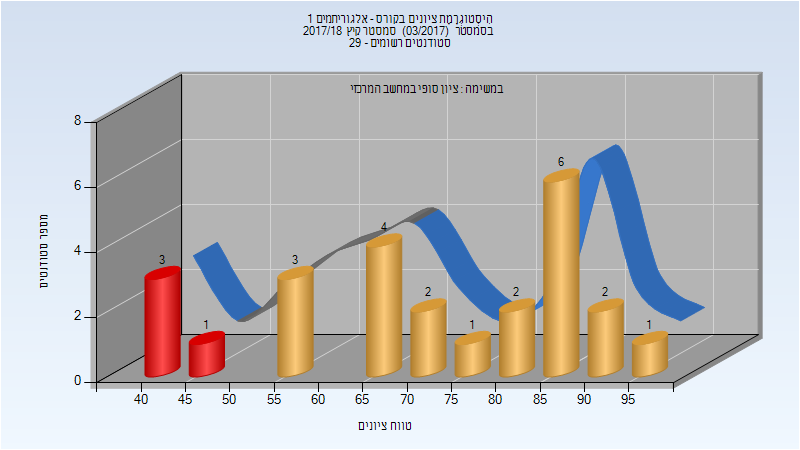

| סטודנטים | עברו/נכשלו | אחוז עוברים | ציון מינימלי | ציון מקסימלי | ממוצע | חציון |
| ---- | ---- | ---- | ---- | ---- | ---- | ---- |
| 25 | 21/4 | 84 | 41 | 99 | 71.56 | 71 |

## חורף 2018-2019

| איש סגל | תפקיד |
| ---- | ---- |
| נאור יוסף | מרצה - אחראי מקצוע |

### סופי

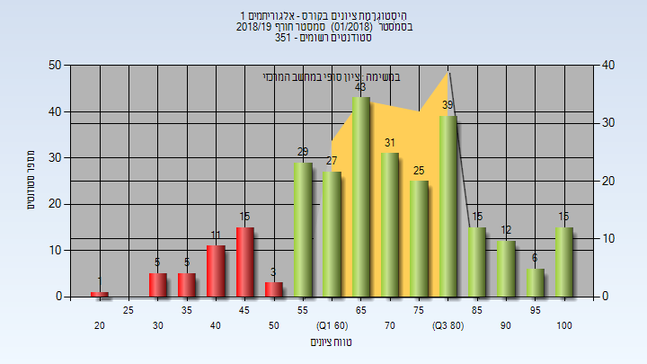

| סטודנטים | עברו/נכשלו | אחוז עוברים | ציון מינימלי | ציון מקסימלי | ממוצע | חציון |
| ---- | ---- | ---- | ---- | ---- | ---- | ---- |
| 282 | 242/40 | 86 | 21 | 100 | 70.053 | 70 |

## אביב 2019

| איש סגל | תפקיד |
| ---- | ---- |
| שכנאי הדס | מרצה - אחראי מקצוע |

### סופי

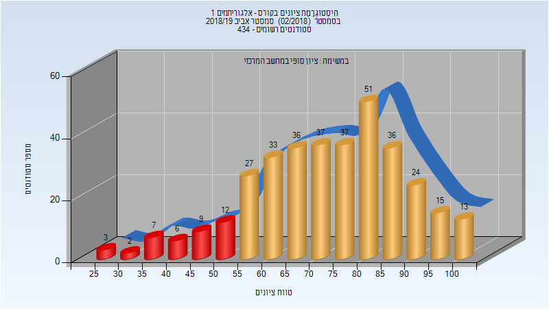

| סטודנטים | עברו/נכשלו | אחוז עוברים | ציון מינימלי | ציון מקסימלי | ממוצע | חציון |
| ---- | ---- | ---- | ---- | ---- | ---- | ---- |
| 348 | 309/39 | 89 | 26 | 100 | 73.161 | 75 |

## חורף 2019-2020

| איש סגל | תפקיד |
| ---- | ---- |
| נאור יוסף | מרצה - אחראי מקצוע |

### סופי

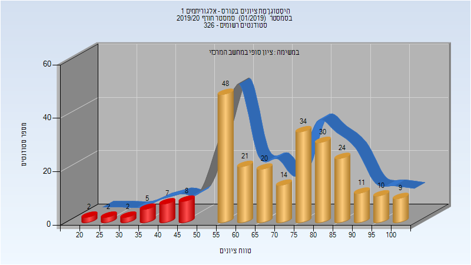

| סטודנטים | עברו/נכשלו | אחוז עוברים | ציון מינימלי | ציון מקסימלי | ממוצע | חציון |
| ---- | ---- | ---- | ---- | ---- | ---- | ---- |
| 247 | 221/26 | 89 | 21 | 100 | 70.65 | 73 |

## אביב 2020

| איש סגל | תפקיד |
| ---- | ---- |
| שכנאי הדס | מרצה - אחראי מקצוע |

### סופי

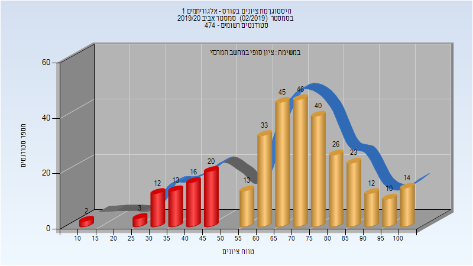

| סטודנטים | עברו/נכשלו | אחוז עוברים | ציון מינימלי | ציון מקסימלי | ממוצע | חציון |
| ---- | ---- | ---- | ---- | ---- | ---- | ---- |
| 381 | 335/46 | 88 | 6 | 100 | 72.237 | 74 |

## חורף 2020-2021

| איש סגל | תפקיד |
| ---- | ---- |
| נאור יוסף | מרצה - אחראי מקצוע |

### סופי

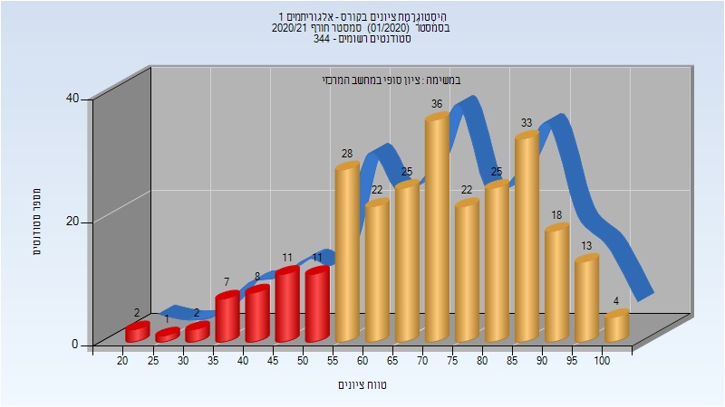

| סטודנטים | עברו/נכשלו | אחוז עוברים | ציון מינימלי | ציון מקסימלי | ממוצע | חציון |
| ---- | ---- | ---- | ---- | ---- | ---- | ---- |
| 268 | 226/42 | 84 | 21 | 100 | 70.716 | 72 |

