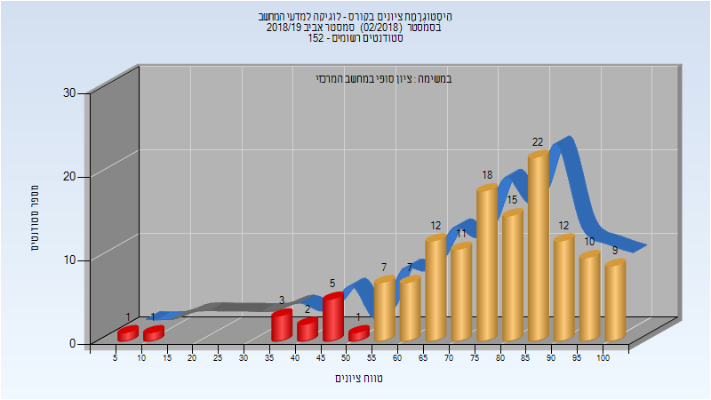
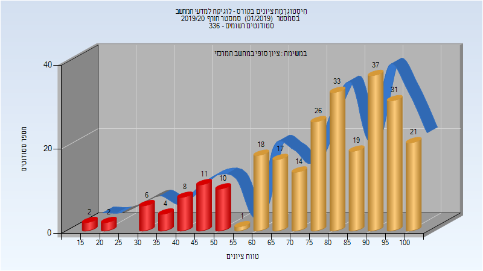
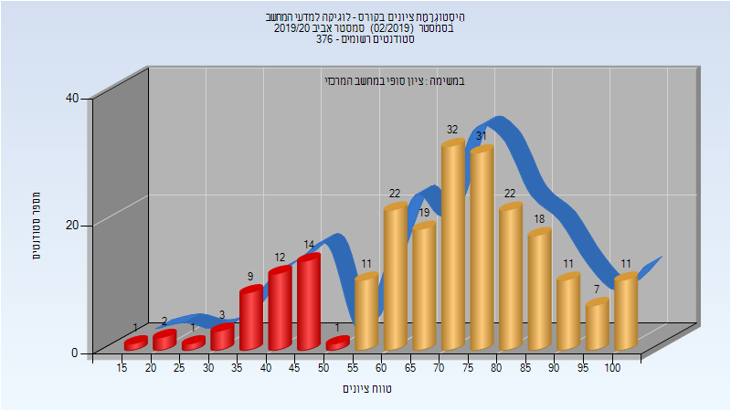
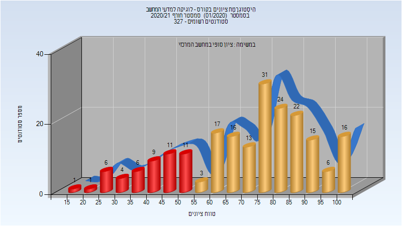

# 234292 - לוגיקה למדעי המחשב

## אביב 2019

| איש סגל | תפקיד |
| ---- | ---- |
| גרימברג אורנה | מרצה - אחראי מקצוע |

### סופי

| סטודנטים | עברו/נכשלו | אחוז עוברים | ציון מינימלי | ציון מקסימלי | ממוצע | חציון |
| ---- | ---- | ---- | ---- | ---- | ---- | ---- |
| 136 | 123/13 | 90 | 7 | 100 | 76.853 | 79.5 |

## חורף 2019-2020

| איש סגל | תפקיד |
| ---- | ---- |
| הלל צנזור קרן | מרצה - אחראי מקצוע |

### סופי

| סטודנטים | עברו/נכשלו | אחוז עוברים | ציון מינימלי | ציון מקסימלי | ממוצע | חציון |
| ---- | ---- | ---- | ---- | ---- | ---- | ---- |
| 288 | 249/39 | 86 | 16 | 100 | 77.526 | 81 |

## אביב 2020

| איש סגל | תפקיד |
| ---- | ---- |
| ויזל יקיר | מרצה - אחראי מקצוע |

### סופי

| סטודנטים | עברו/נכשלו | אחוז עוברים | ציון מינימלי | ציון מקסימלי | ממוצע | חציון |
| ---- | ---- | ---- | ---- | ---- | ---- | ---- |
| 287 | 214/73 | 75 | 33 | 100 | 70.822 | 73 |

## חורף 2020-2021

| איש סגל | תפקיד |
| ---- | ---- |
| הלל צנזור קרן | מרצה - אחראי מקצוע |

### סופי

| סטודנטים | עברו/נכשלו | אחוז עוברים | ציון מינימלי | ציון מקסימלי | ממוצע | חציון |
| ---- | ---- | ---- | ---- | ---- | ---- | ---- |
| 273 | 213/60 | 78 | 15 | 100 | 69.729 | 75 |

