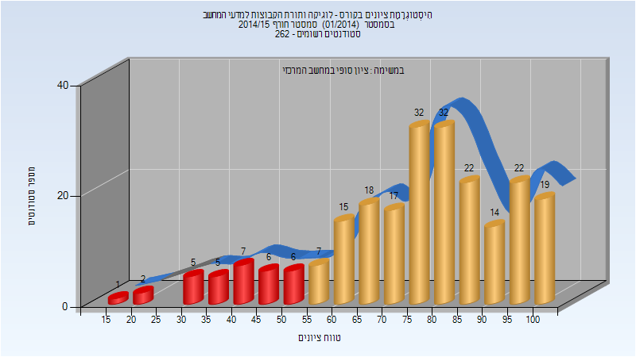
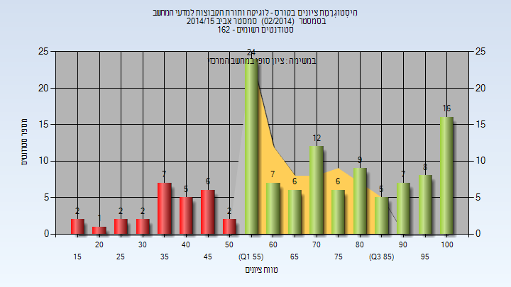
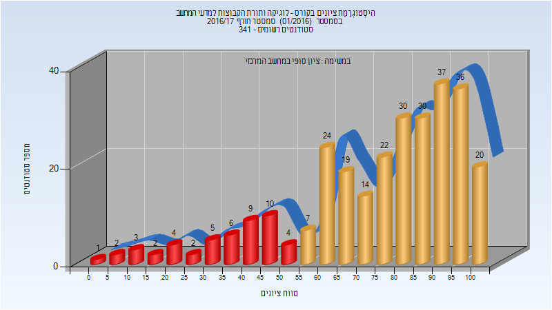
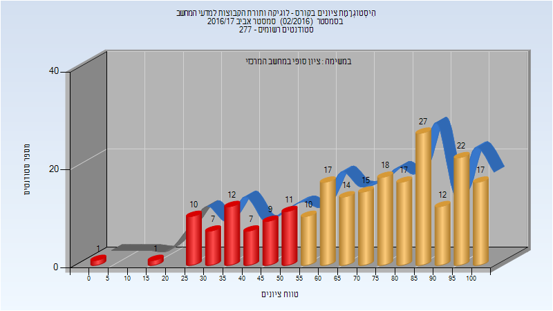
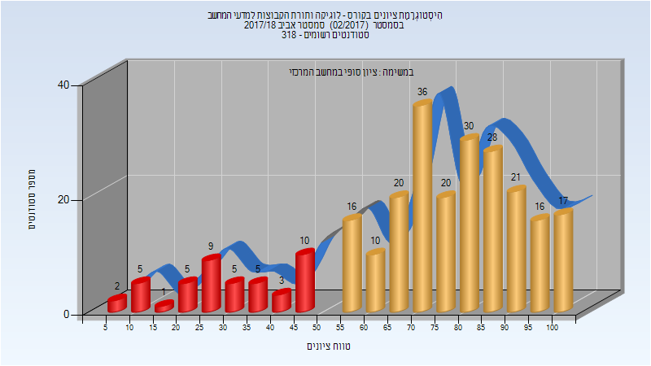
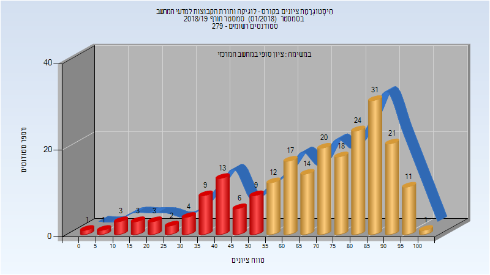
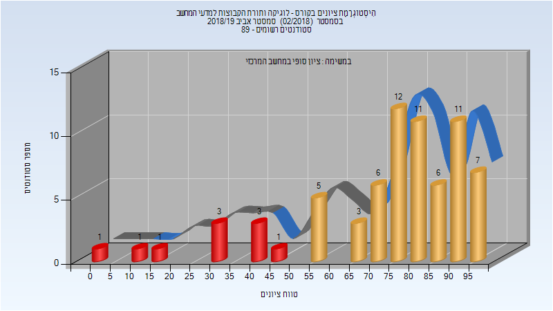

# 234293 - לוגיקה ותורת הקבוצות למדעי המחשב

## אביב 2009

| איש סגל | תפקיד |
| ---- | ---- |
| גרימברג אורנה | מרצה - אחראי מקצוע |

## קיץ 2011

| איש סגל | תפקיד |
| ---- | ---- |
| קמינסקי מיכאל | מרצה - אחראי מקצוע |

## חורף 2011-2012

| איש סגל | תפקיד |
| ---- | ---- |
| שפילקה אמיר | מרצה - אחראי מקצוע |

## חורף 2013-2014

| איש סגל | תפקיד |
| ---- | ---- |
| שפילקה אמיר | מרצה - אחראי מקצוע |

## חורף 2014-2015

| איש סגל | תפקיד |
| ---- | ---- |
| הלל צנזור קרן | מרצה - אחראי מקצוע |

### סופי

| סטודנטים | עברו/נכשלו | אחוז עוברים | ציון מינימלי | ציון מקסימלי | ממוצע | חציון |
| ---- | ---- | ---- | ---- | ---- | ---- | ---- |
| 230 | 198/32 | 86 | 18 | 100 | 75.587 | 78 |

## אביב 2015

| איש סגל | תפקיד |
| ---- | ---- |
| גרימברג אורנה | מרצה - אחראי מקצוע |

### סופי

| סטודנטים | עברו/נכשלו | אחוז עוברים | ציון מינימלי | ציון מקסימלי | ממוצע | חציון |
| ---- | ---- | ---- | ---- | ---- | ---- | ---- |
| 127 | 100/27 | 79 | 15 | 100 | 68.898 | 69 |

## חורף 2016-2017

| איש סגל | תפקיד |
| ---- | ---- |
| הלל צנזור קרן | מרצה - אחראי מקצוע |

### סופי

| סטודנטים | עברו/נכשלו | אחוז עוברים | ציון מינימלי | ציון מקסימלי | ממוצע | חציון |
| ---- | ---- | ---- | ---- | ---- | ---- | ---- |
| 287 | 239/48 | 83 | 4 | 100 | 75.01 | 81 |

## אביב 2017

### סופי

| סטודנטים | עברו/נכשלו | אחוז עוברים | ציון מינימלי | ציון מקסימלי | ממוצע | חציון |
| ---- | ---- | ---- | ---- | ---- | ---- | ---- |
| 227 | 169/58 | 74 | 2 | 100 | 70.388 | 74 |

## חורף 2017-2018

| איש סגל | תפקיד |
| ---- | ---- |
| הלל צנזור קרן | מרצה - אחראי מקצוע |

### סופי

| סטודנטים | עברו/נכשלו | אחוז עוברים | ציון מינימלי | ציון מקסימלי | ממוצע | חציון |
| ---- | ---- | ---- | ---- | ---- | ---- | ---- |
| 373 | 310/63 | 83 | 1 | 100 | 70.938 | 75 |

## אביב 2018

| איש סגל | תפקיד |
| ---- | ---- |
| גרימברג אורנה | מרצה - אחראי מקצוע |

### סופי

| סטודנטים | עברו/נכשלו | אחוז עוברים | ציון מינימלי | ציון מקסימלי | ממוצע | חציון |
| ---- | ---- | ---- | ---- | ---- | ---- | ---- |
| 259 | 214/45 | 83 | 6 | 100 | 71.541 | 75 |

## חורף 2018-2019

| איש סגל | תפקיד |
| ---- | ---- |
| הלל צנזור קרן | מרצה - אחראי מקצוע |

### סופי

| סטודנטים | עברו/נכשלו | אחוז עוברים | ציון מינימלי | ציון מקסימלי | ממוצע | חציון |
| ---- | ---- | ---- | ---- | ---- | ---- | ---- |
| 223 | 169/54 | 76 | 1 | 100 | 68.332 | 74 |

## אביב 2019

| איש סגל | תפקיד |
| ---- | ---- |
| גרימברג אורנה | מרצה - אחראי מקצוע |

### סופי

| סטודנטים | עברו/נכשלו | אחוז עוברים | ציון מינימלי | ציון מקסימלי | ממוצע | חציון |
| ---- | ---- | ---- | ---- | ---- | ---- | ---- |
| 72 | 62/10 | 86 | 2 | 99 | 73.761 | 78 |

