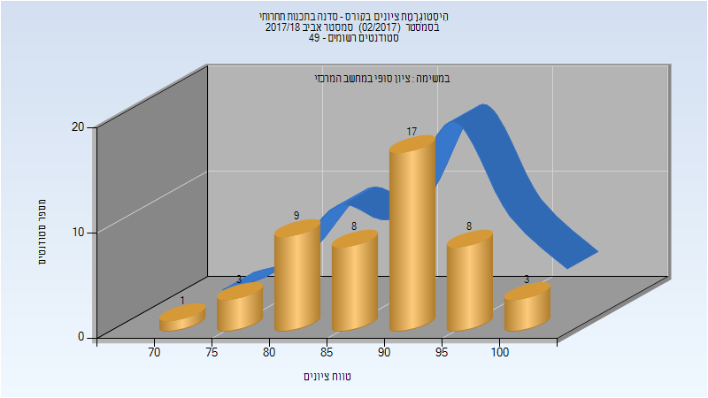

# 234900 - סדנה בתכנות תחרותי

## אביב 2018

| איש סגל | תפקיד |
| ---- | ---- |
| רז דן | מרצה - אחראי מקצוע |

### סופי

| סטודנטים | עברו/נכשלו | אחוז עוברים | ציון מינימלי | ציון מקסימלי | ממוצע | חציון |
| ---- | ---- | ---- | ---- | ---- | ---- | ---- |
| 49 | 49/0 | 100 | 72 | 100 | 89.49 | 90 |

