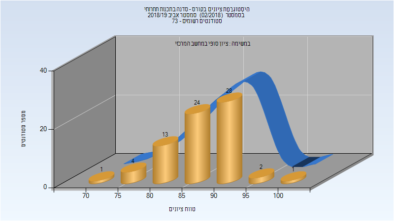
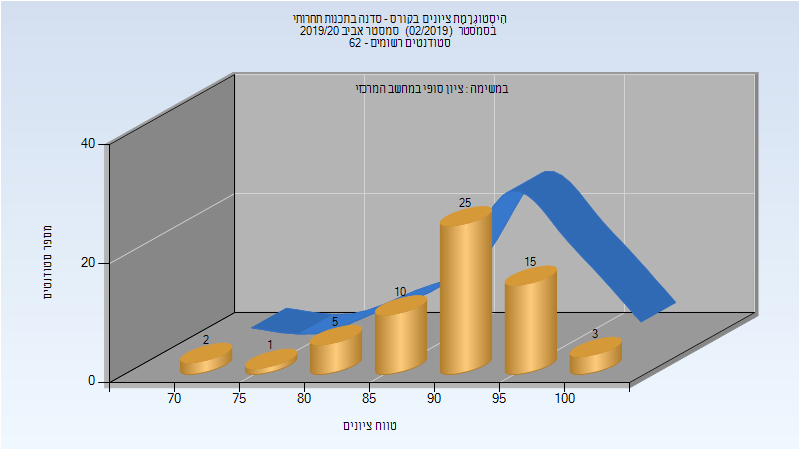

# 234901 - סדנה בתכנות תחרותי

## אביב 2019

| איש סגל | תפקיד |
| ---- | ---- |
| ברקת גיל | מרצה - אחראי מקצוע |

### סופי

| סטודנטים | עברו/נכשלו | אחוז עוברים | ציון מינימלי | ציון מקסימלי | ממוצע | חציון |
| ---- | ---- | ---- | ---- | ---- | ---- | ---- |
| 73 | 73/0 | 100 | 72 | 100 | 87.644 | 89 |

## אביב 2020

| איש סגל | תפקיד |
| ---- | ---- |
| ברקת גיל | מרצה - אחראי מקצוע |

### סופי

| סטודנטים | עברו/נכשלו | אחוז עוברים | ציון מינימלי | ציון מקסימלי | ממוצע | חציון |
| ---- | ---- | ---- | ---- | ---- | ---- | ---- |
| 61 | 61/0 | 100 | 71 | 100 | 91.033 | 92 |

