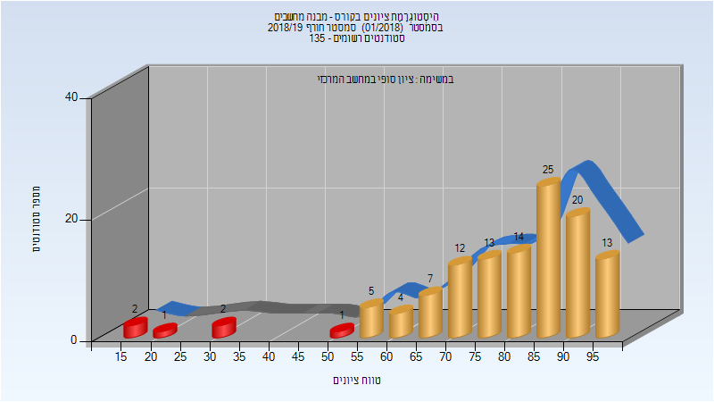
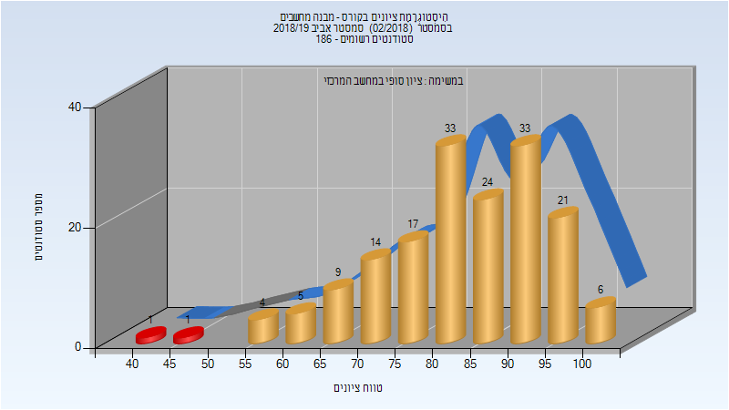
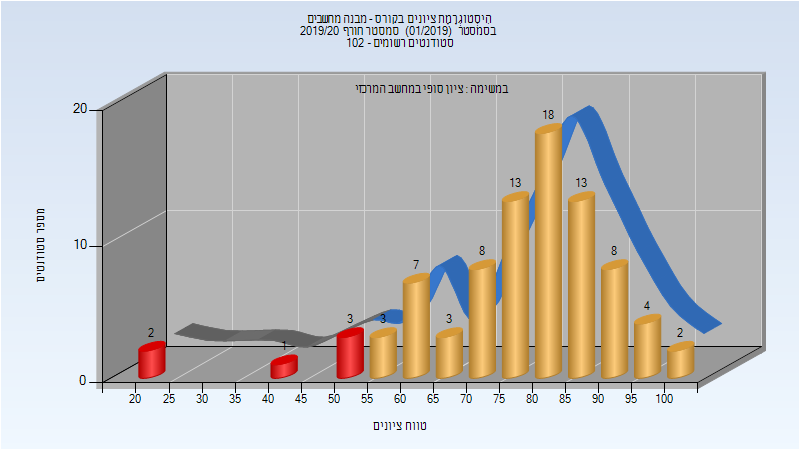
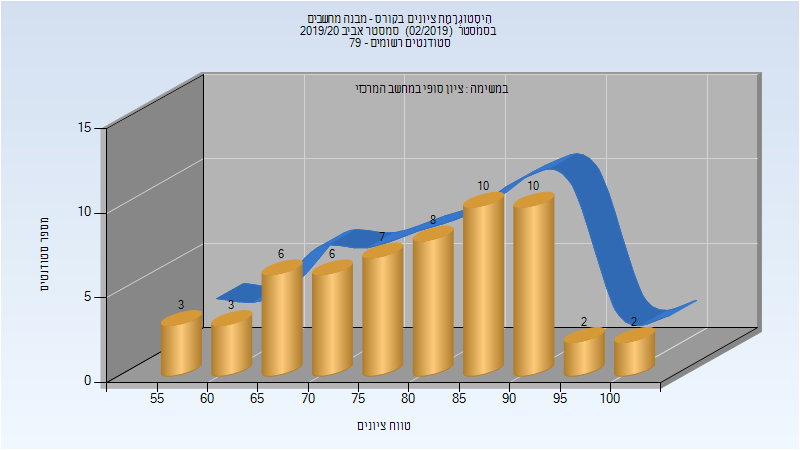
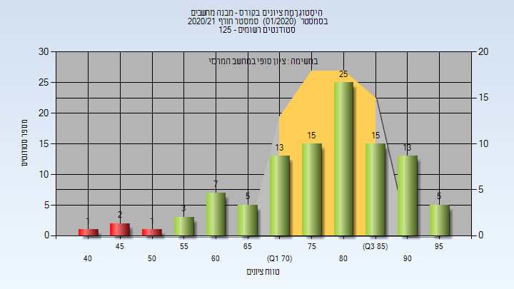

# 236267 - מבנה מחשבים

## חורף 2018-2019

| איש סגל | תפקיד |
| ---- | ---- |
| רפפורט ליהוא | מרצה - אחראי מקצוע |

### סופי

| סטודנטים | עברו/נכשלו | אחוז עוברים | ציון מינימלי | ציון מקסימלי | ממוצע | חציון |
| ---- | ---- | ---- | ---- | ---- | ---- | ---- |
| 120 | 114/6 | 95 | 17 | 99 | 79.642 | 83 |

## אביב 2019

| איש סגל | תפקיד |
| ---- | ---- |
| קופרשטוק אהרון | מרצה - אחראי מקצוע |

### סופי

| סטודנטים | עברו/נכשלו | אחוז עוברים | ציון מינימלי | ציון מקסימלי | ממוצע | חציון |
| ---- | ---- | ---- | ---- | ---- | ---- | ---- |
| 168 | 166/2 | 99 | 40 | 100 | 83.292 | 84.5 |

## חורף 2019-2020

| איש סגל | תפקיד |
| ---- | ---- |
| רפפורט ליהוא | מרצה - אחראי מקצוע |

### סופי

| סטודנטים | עברו/נכשלו | אחוז עוברים | ציון מינימלי | ציון מקסימלי | ממוצע | חציון |
| ---- | ---- | ---- | ---- | ---- | ---- | ---- |
| 86 | 80/6 | 93 | 20 | 100 | 76.907 | 80.5 |

## אביב 2020

| איש סגל | תפקיד |
| ---- | ---- |
| קופרשטוק אהרון | מרצה - אחראי מקצוע |

### סופי

| סטודנטים | עברו/נכשלו | אחוז עוברים | ציון מינימלי | ציון מקסימלי | ממוצע | חציון |
| ---- | ---- | ---- | ---- | ---- | ---- | ---- |
| 67 | 67/0 | 100 | 56 | 100 | 81.716 | 82 |

## חורף 2020-2021

| איש סגל | תפקיד |
| ---- | ---- |
| רפפורט ליהוא | מרצה - אחראי מקצוע |

### סופי

| סטודנטים | עברו/נכשלו | אחוז עוברים | ציון מינימלי | ציון מקסימלי | ממוצע | חציון |
| ---- | ---- | ---- | ---- | ---- | ---- | ---- |
| 105 | 101/4 | 96 | 44 | 98 | 78.686 | 80 |

