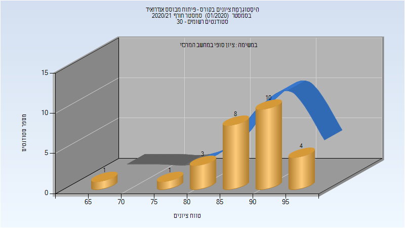
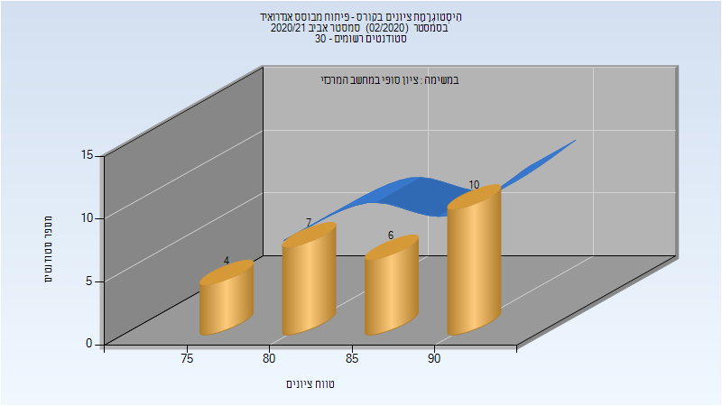
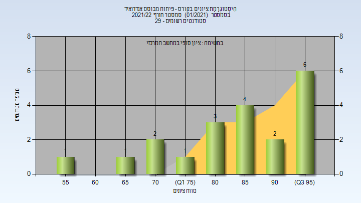

# 236271 - פיתוח מבוסס אנדרואיד

## חורף 2020-2021

| איש סגל | תפקיד |
| ---- | ---- |
| משלי אורן | מרצה - אחראי מקצוע |

### סופי

| סטודנטים | עברו/נכשלו | אחוז עוברים | ציון מינימלי | ציון מקסימלי | ממוצע | חציון |
| ---- | ---- | ---- | ---- | ---- | ---- | ---- |
| 30 | 30/0 | 100 | 68 | 97 | 88.267 | 90 |

## אביב 2021

| איש סגל | תפקיד |
| ---- | ---- |
| משלי אורן | מרצה - אחראי מקצוע |

### סופי

| סטודנטים | עברו/נכשלו | אחוז עוברים | ציון מינימלי | ציון מקסימלי | ממוצע | חציון |
| ---- | ---- | ---- | ---- | ---- | ---- | ---- |
| 27 | 27/0 | 100 | 77 | 94 | 86.148 | 85 |

## חורף 2021-2022

| איש סגל | תפקיד |
| ---- | ---- |
| משלי אורן | מרצה - אחראי מקצוע |

### סופי

| סטודנטים | עברו/נכשלו | אחוז עוברים | ציון מינימלי | ציון מקסימלי | ממוצע | חציון |
| ---- | ---- | ---- | ---- | ---- | ---- | ---- |
| 25 | 25/0 | 100 | 67 | 98 | 86.72 | 89 |

