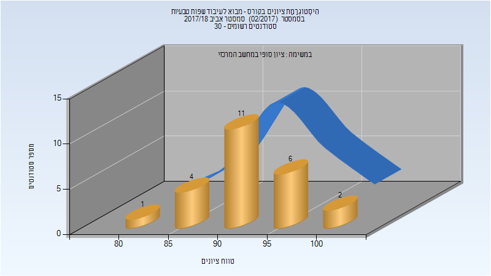
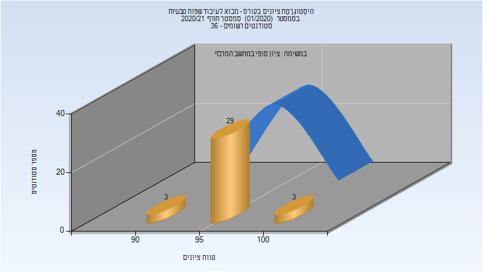

# 236299 - מבוא לעיבוד שפות טבעיות

## אביב 2018

| איש סגל | תפקיד |
| ---- | ---- |
| גולדברג יואב | מרצה - אחראי מקצוע |

### סופי

| סטודנטים | עברו/נכשלו | אחוז עוברים | ציון מינימלי | ציון מקסימלי | ממוצע | חציון |
| ---- | ---- | ---- | ---- | ---- | ---- | ---- |
| 24 | 24/0 | 100 | 83 | 100 | 93 | 93 |

## חורף 2020-2021

| איש סגל | תפקיד |
| ---- | ---- |
| בלינקוב יונתן | מרצה - אחראי מקצוע |

### סופי

| סטודנטים | עברו/נכשלו | אחוז עוברים | ציון מינימלי | ציון מקסימלי | ממוצע | חציון |
| ---- | ---- | ---- | ---- | ---- | ---- | ---- |
| 35 | 35/0 | 100 | 91 | 100 | 96.914 | 97 |

