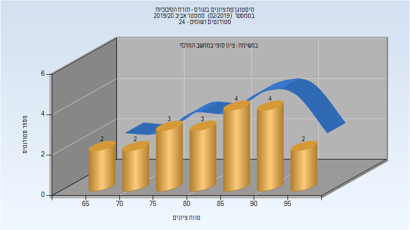

# 236313 - תורת הסיבוכיות

## אביב 2020

| איש סגל | תפקיד |
| ---- | ---- |
| קושילביץ איל | מרצה - אחראי מקצוע |

### סופי

| סטודנטים | עברו/נכשלו | אחוז עוברים | ציון מינימלי | ציון מקסימלי | ממוצע | חציון |
| ---- | ---- | ---- | ---- | ---- | ---- | ---- |
| 20 | 20/0 | 100 | 65 | 97 | 82.7 | 85 |

