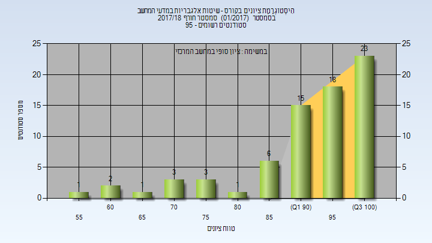

# 236315 - שיטות אלגבריות במדעי המחשב

## חורף 2017-2018

### סופי

| סטודנטים | עברו/נכשלו | אחוז עוברים | ציון מינימלי | ציון מקסימלי | ממוצע | חציון |
| ---- | ---- | ---- | ---- | ---- | ---- | ---- |
| 73 | 73/0 | 100 | 55 | 100 | 92.233 | 96 |

