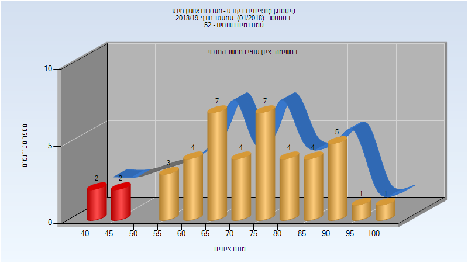
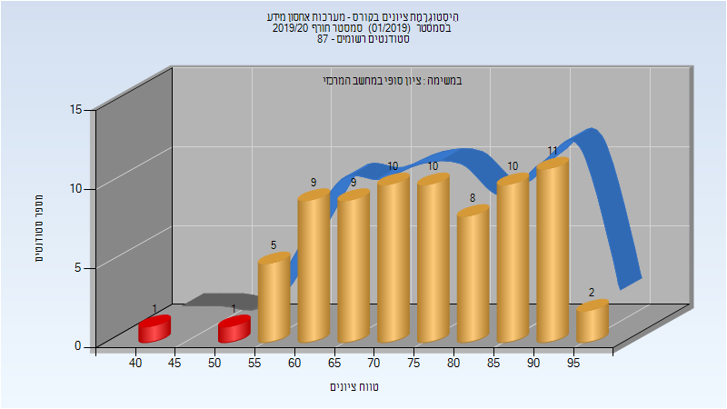
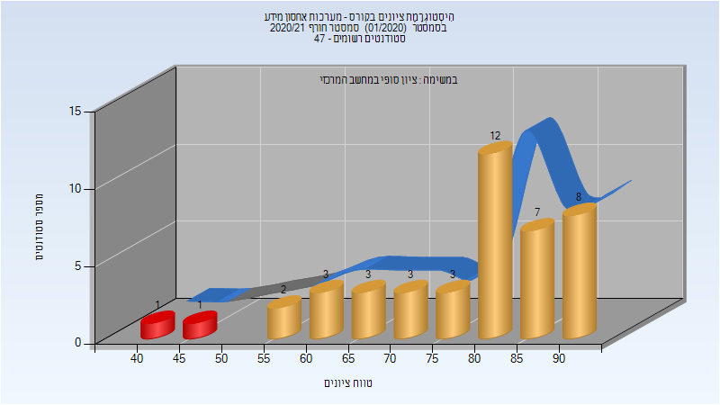

# 236322 - מערכות אחסון מידע

## חורף 2018-2019

| איש סגל | תפקיד |
| ---- | ---- |
| ידגר גלה | מרצה - אחראי מקצוע |

### סופי

| סטודנטים | עברו/נכשלו | אחוז עוברים | ציון מינימלי | ציון מקסימלי | ממוצע | חציון |
| ---- | ---- | ---- | ---- | ---- | ---- | ---- |
| 44 | 40/4 | 91 | 42 | 100 | 72.977 | 74 |

## חורף 2019-2020

| איש סגל | תפקיד |
| ---- | ---- |
| ידגר גלה | מרצה - אחראי מקצוע |

### סופי

| סטודנטים | עברו/נכשלו | אחוז עוברים | ציון מינימלי | ציון מקסימלי | ממוצע | חציון |
| ---- | ---- | ---- | ---- | ---- | ---- | ---- |
| 76 | 76/0 | 100 | 55 | 99 | 76.237 | 76 |

## חורף 2020-2021

| איש סגל | תפקיד |
| ---- | ---- |
| ידגר גלה | מרצה - אחראי מקצוע |

### סופי

| סטודנטים | עברו/נכשלו | אחוז עוברים | ציון מינימלי | ציון מקסימלי | ממוצע | חציון |
| ---- | ---- | ---- | ---- | ---- | ---- | ---- |
| 42 | 40/2 | 95 | 41 | 94 | 78.452 | 82 |

