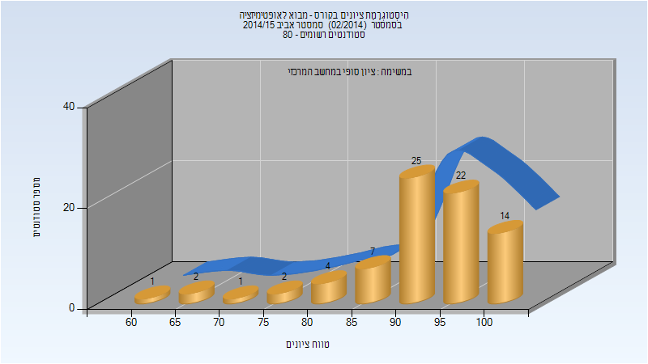
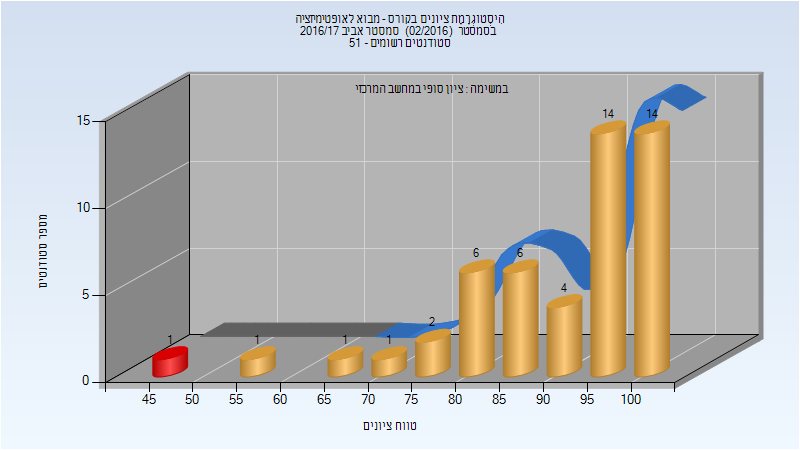
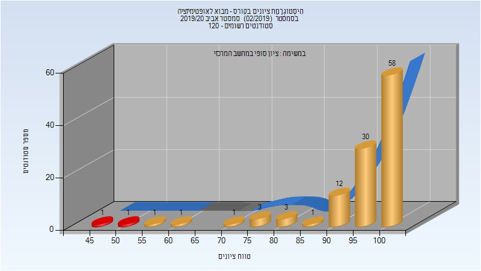
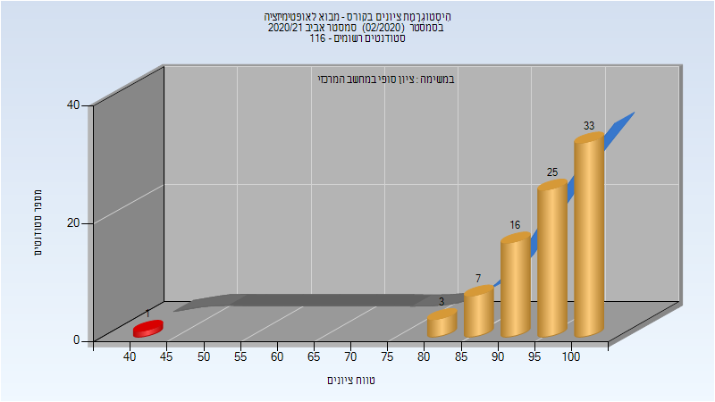

# 236330 - מבוא לאופטימיזציה

## אביב 2015

| איש סגל | תפקיד |
| ---- | ---- |
| ציבולבסקי מיכאל | מרצה - אחראי מקצוע |

### סופי

| סטודנטים | עברו/נכשלו | אחוז עוברים | ציון מינימלי | ציון מקסימלי | ממוצע | חציון |
| ---- | ---- | ---- | ---- | ---- | ---- | ---- |
| 78 | 78/0 | 100 | 62 | 100 | 91.962 | 93.5 |

## אביב 2017

| איש סגל | תפקיד |
| ---- | ---- |
| ציבולבסקי מיכאל | מרצה - אחראי מקצוע |

### סופי

| סטודנטים | עברו/נכשלו | אחוז עוברים | ציון מינימלי | ציון מקסימלי | ממוצע | חציון |
| ---- | ---- | ---- | ---- | ---- | ---- | ---- |
| 50 | 49/1 | 98 | 48 | 100 | 90.96 | 97 |

## אביב 2018

| איש סגל | תפקיד |
| ---- | ---- |
| ציבולבסקי מיכאל | מרצה - אחראי מקצוע |

### סופי

| סטודנטים | עברו/נכשלו | אחוז עוברים | ציון מינימלי | ציון מקסימלי | ממוצע | חציון |
| ---- | ---- | ---- | ---- | ---- | ---- | ---- |
| 92 | 91/1 | 99 | 54 | 100 | 86.957 | 88 |

## אביב 2019

| איש סגל | תפקיד |
| ---- | ---- |
| ציבולבסקי מיכאל | מרצה - אחראי מקצוע |

### סופי

| סטודנטים | עברו/נכשלו | אחוז עוברים | ציון מינימלי | ציון מקסימלי | ממוצע | חציון |
| ---- | ---- | ---- | ---- | ---- | ---- | ---- |
| 62 | 60/2 | 97 | 22 | 100 | 89.032 | 94 |

## אביב 2020

| איש סגל | תפקיד |
| ---- | ---- |
| ציבולבסקי מיכאל | מרצה - אחראי מקצוע |

### סופי

| סטודנטים | עברו/נכשלו | אחוז עוברים | ציון מינימלי | ציון מקסימלי | ממוצע | חציון |
| ---- | ---- | ---- | ---- | ---- | ---- | ---- |
| 112 | 111/1 | 99 | 53 | 100 | 95.661 | 100 |

## אביב 2021

| איש סגל | תפקיד |
| ---- | ---- |
| ציבולבסקי מיכאל | מרצה - אחראי מקצוע |

### סופי

| סטודנטים | עברו/נכשלו | אחוז עוברים | ציון מינימלי | ציון מקסימלי | ממוצע | חציון |
| ---- | ---- | ---- | ---- | ---- | ---- | ---- |
| 101 | 100/1 | 99 | 42 | 100 | 93.535 | 97 |

## אביב 2022

| איש סגל | תפקיד |
| ---- | ---- |
| ציבולבסקי מיכאל | מרצה - אחראי מקצוע |

