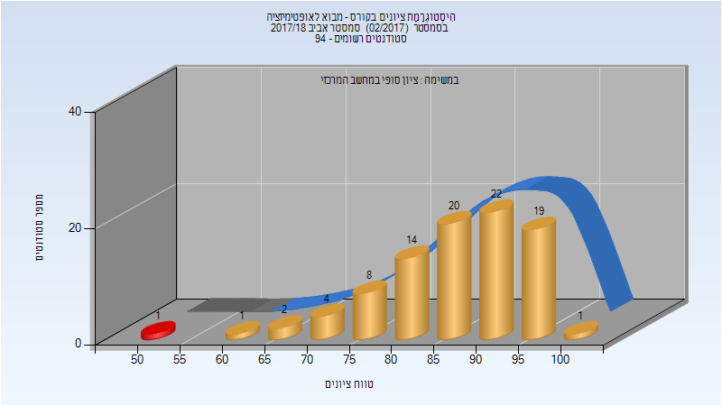
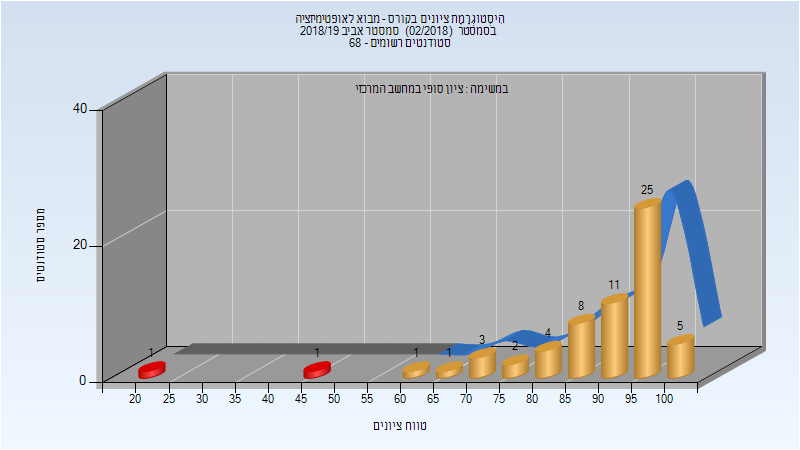

# 236330 - מבוא לאופטימיזציה

## אביב 2018

| איש סגל | תפקיד |
| ---- | ---- |
| ציבולבסקי מיכאל | מרצה - אחראי מקצוע |

### סופי

| סטודנטים | עברו/נכשלו | אחוז עוברים | ציון מינימלי | ציון מקסימלי | ממוצע | חציון |
| ---- | ---- | ---- | ---- | ---- | ---- | ---- |
| 92 | 91/1 | 99 | 54 | 100 | 86.957 | 88 |

## אביב 2019

### סופי

| סטודנטים | עברו/נכשלו | אחוז עוברים | ציון מינימלי | ציון מקסימלי | ממוצע | חציון |
| ---- | ---- | ---- | ---- | ---- | ---- | ---- |
| 62 | 60/2 | 97 | 22 | 100 | 89.032 | 94 |

