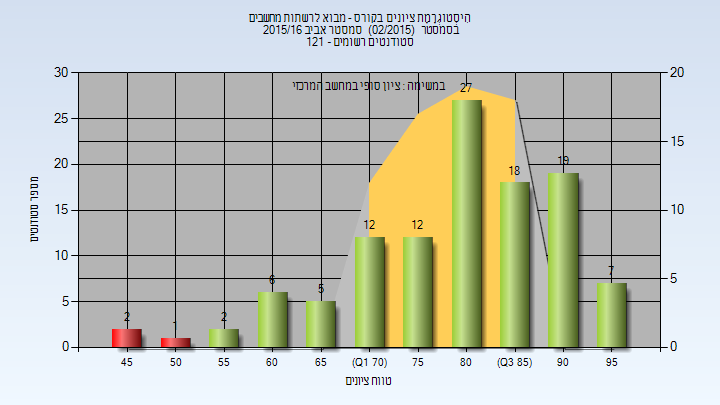
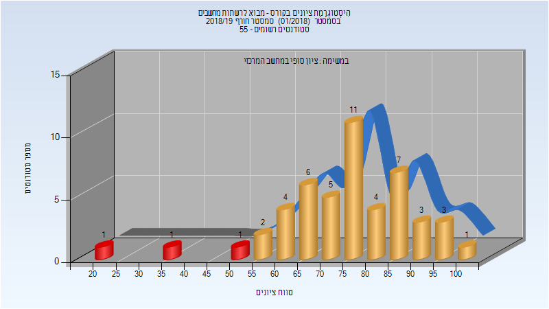
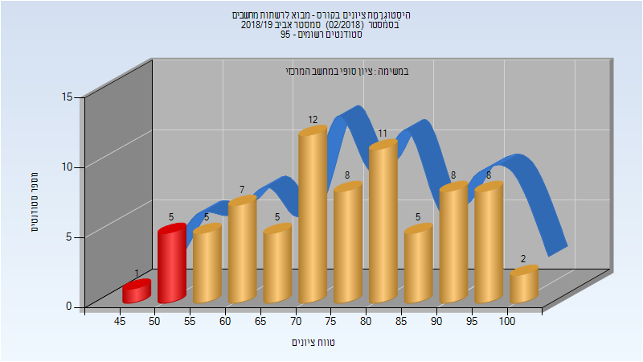
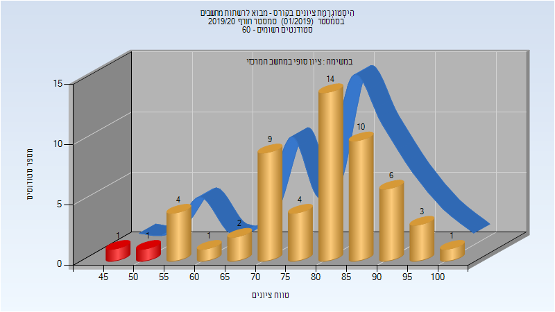
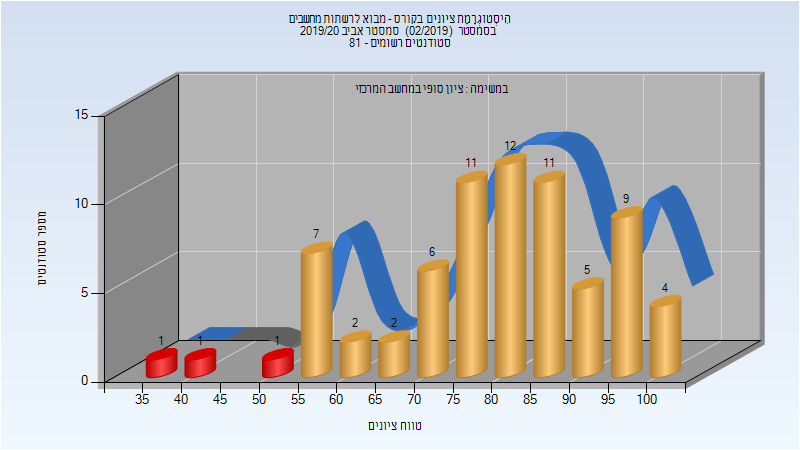

# 236334 - מבוא לרשתות מחשבים

## אביב 2016

### סופי

| סטודנטים | עברו/נכשלו | אחוז עוברים | ציון מינימלי | ציון מקסימלי | ממוצע | חציון |
| ---- | ---- | ---- | ---- | ---- | ---- | ---- |
| 111 | 108/3 | 97 | 49 | 98 | 80.712 | 83 |

## חורף 2018-2019

| איש סגל | תפקיד |
| ---- | ---- |
| רז דן | מרצה - אחראי מקצוע |

### סופי

| סטודנטים | עברו/נכשלו | אחוז עוברים | ציון מינימלי | ציון מקסימלי | ממוצע | חציון |
| ---- | ---- | ---- | ---- | ---- | ---- | ---- |
| 49 | 46/3 | 94 | 21 | 100 | 75.51 | 77 |

## אביב 2019

| איש סגל | תפקיד |
| ---- | ---- |
| רז דן | מרצה - אחראי מקצוע |

### סופי

| סטודנטים | עברו/נכשלו | אחוז עוברים | ציון מינימלי | ציון מקסימלי | ממוצע | חציון |
| ---- | ---- | ---- | ---- | ---- | ---- | ---- |
| 77 | 71/6 | 92 | 49 | 100 | 76.532 | 75 |

## חורף 2019-2020

| איש סגל | תפקיד |
| ---- | ---- |
| רז דן | מרצה - אחראי מקצוע |

### סופי

| סטודנטים | עברו/נכשלו | אחוז עוברים | ציון מינימלי | ציון מקסימלי | ממוצע | חציון |
| ---- | ---- | ---- | ---- | ---- | ---- | ---- |
| 56 | 54/2 | 96 | 49 | 100 | 79.089 | 82 |

## אביב 2020

| איש סגל | תפקיד |
| ---- | ---- |
| מזרחי טל | מרצה - אחראי מקצוע |

### סופי

| סטודנטים | עברו/נכשלו | אחוז עוברים | ציון מינימלי | ציון מקסימלי | ממוצע | חציון |
| ---- | ---- | ---- | ---- | ---- | ---- | ---- |
| 57 | 53/4 | 93 | 30 | 100 | 77.123 | 80 |

