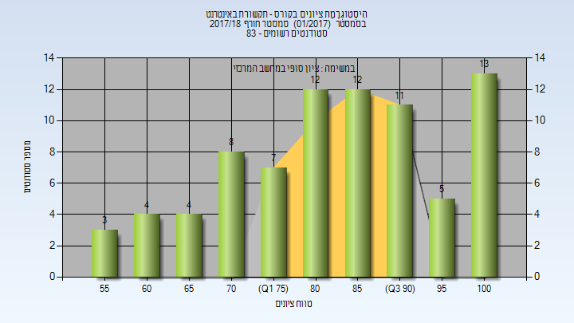
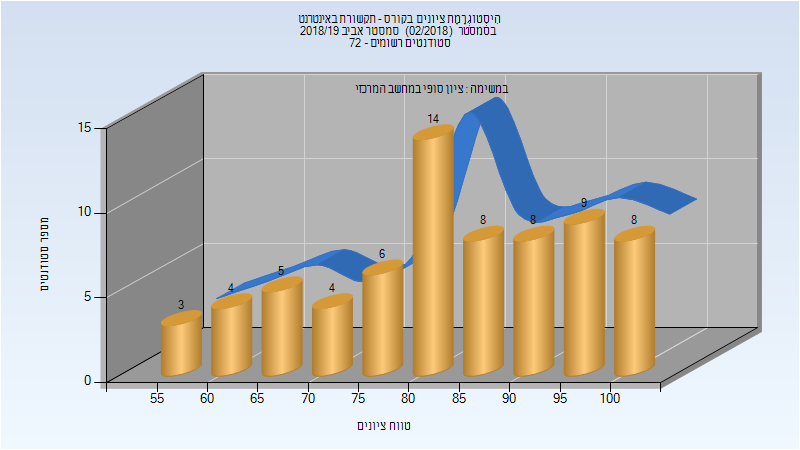
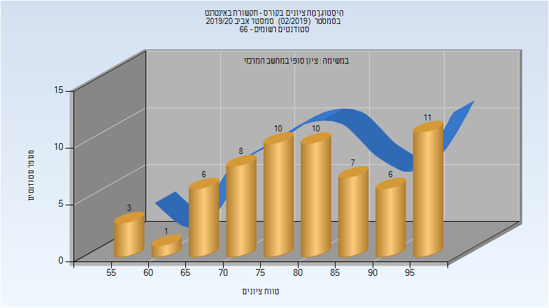
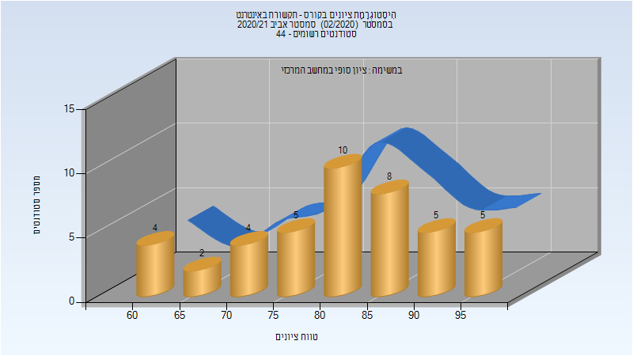
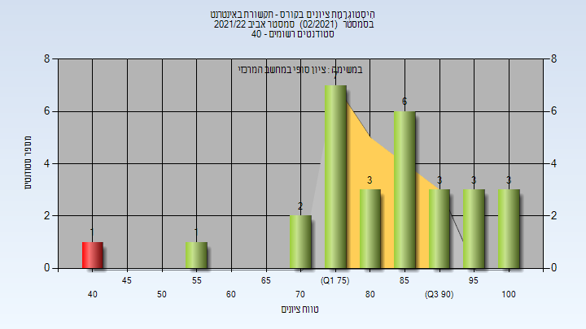

# 236341 - תקשורת באינטרנט

## חורף 2017-2018

| איש סגל | תפקיד |
| ---- | ---- |
| כהן ראובן | מרצה - אחראי מקצוע |

### סופי

| סטודנטים | עברו/נכשלו | אחוז עוברים | ציון מינימלי | ציון מקסימלי | ממוצע | חציון |
| ---- | ---- | ---- | ---- | ---- | ---- | ---- |
| 79 | 79/0 | 100 | 55 | 100 | 84.013 | 85 |

## אביב 2019

| איש סגל | תפקיד |
| ---- | ---- |
| כהן ראובן | מרצה - אחראי מקצוע |

### סופי

| סטודנטים | עברו/נכשלו | אחוז עוברים | ציון מינימלי | ציון מקסימלי | ממוצע | חציון |
| ---- | ---- | ---- | ---- | ---- | ---- | ---- |
| 69 | 69/0 | 100 | 58 | 100 | 83.594 | 84 |

## אביב 2020

| איש סגל | תפקיד |
| ---- | ---- |
| כהן ראובן | מרצה - אחראי מקצוע |

### סופי

| סטודנטים | עברו/נכשלו | אחוז עוברים | ציון מינימלי | ציון מקסימלי | ממוצע | חציון |
| ---- | ---- | ---- | ---- | ---- | ---- | ---- |
| 62 | 62/0 | 100 | 55 | 99 | 82.081 | 84 |

## אביב 2021

| איש סגל | תפקיד |
| ---- | ---- |
| כהן ראובן | מרצה - אחראי מקצוע |

### סופי

| סטודנטים | עברו/נכשלו | אחוז עוברים | ציון מינימלי | ציון מקסימלי | ממוצע | חציון |
| ---- | ---- | ---- | ---- | ---- | ---- | ---- |
| 43 | 43/0 | 100 | 60 | 98 | 81.93 | 82 |

## אביב 2022

| איש סגל | תפקיד |
| ---- | ---- |
| כהן ראובן | מרצה - אחראי מקצוע |

### סופי

| סטודנטים | עברו/נכשלו | אחוז עוברים | ציון מינימלי | ציון מקסימלי | ממוצע | חציון |
| ---- | ---- | ---- | ---- | ---- | ---- | ---- |
| 29 | 28/1 | 97 | 42 | 100 | 84.276 | 87 |

