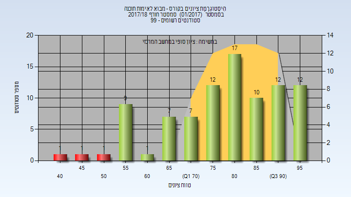
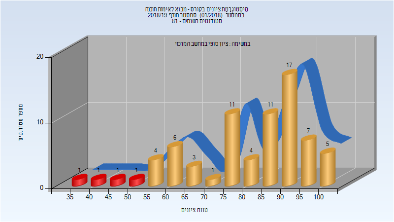
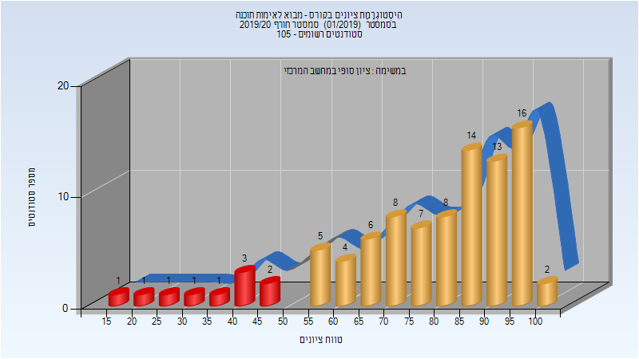
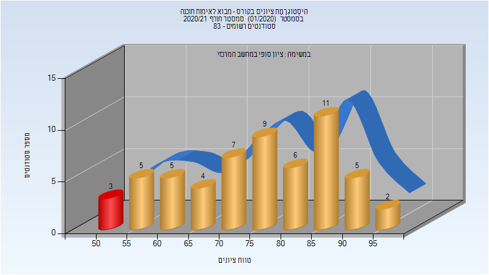

# 236342 - מבוא לאימות תוכנה

## חורף 2017-2018

| איש סגל | תפקיד |
| ---- | ---- |
| גרימברג אורנה | מרצה - אחראי מקצוע |

### סופי

| סטודנטים | עברו/נכשלו | אחוז עוברים | ציון מינימלי | ציון מקסימלי | ממוצע | חציון |
| ---- | ---- | ---- | ---- | ---- | ---- | ---- |
| 90 | 87/3 | 97 | 43 | 98 | 78.978 | 81 |

## חורף 2018-2019

| איש סגל | תפקיד |
| ---- | ---- |
| גרימברג אורנה | מרצה - אחראי מקצוע |

### סופי

| סטודנטים | עברו/נכשלו | אחוז עוברים | ציון מינימלי | ציון מקסימלי | ממוצע | חציון |
| ---- | ---- | ---- | ---- | ---- | ---- | ---- |
| 73 | 69/4 | 95 | 37 | 100 | 81.466 | 86 |

## חורף 2019-2020

| איש סגל | תפקיד |
| ---- | ---- |
| גרימברג אורנה | מרצה - אחראי מקצוע |

### סופי

| סטודנטים | עברו/נכשלו | אחוז עוברים | ציון מינימלי | ציון מקסימלי | ממוצע | חציון |
| ---- | ---- | ---- | ---- | ---- | ---- | ---- |
| 93 | 84/9 | 90 | 19 | 100 | 77.742 | 83 |

## חורף 2020-2021

| איש סגל | תפקיד |
| ---- | ---- |
| ויזל יקיר | מרצה - אחראי מקצוע |

### סופי

| סטודנטים | עברו/נכשלו | אחוז עוברים | ציון מינימלי | ציון מקסימלי | ממוצע | חציון |
| ---- | ---- | ---- | ---- | ---- | ---- | ---- |
| 72 | 71/1 | 99 | 41 | 96 | 77.139 | 80 |

