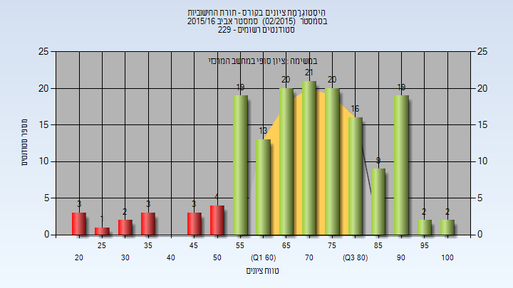
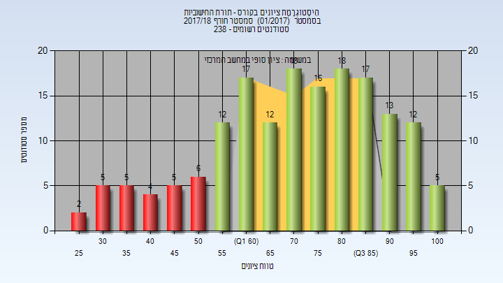
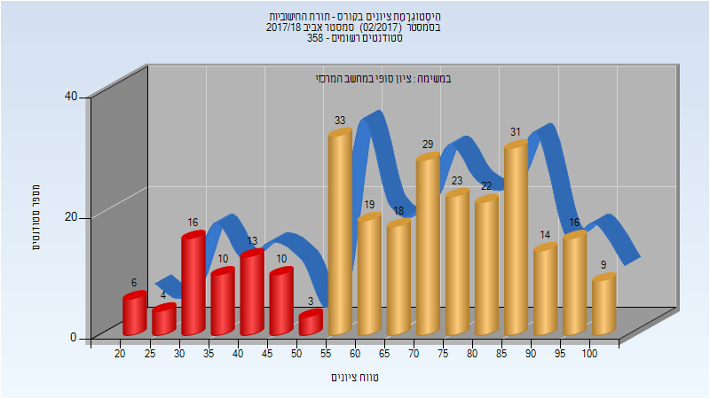
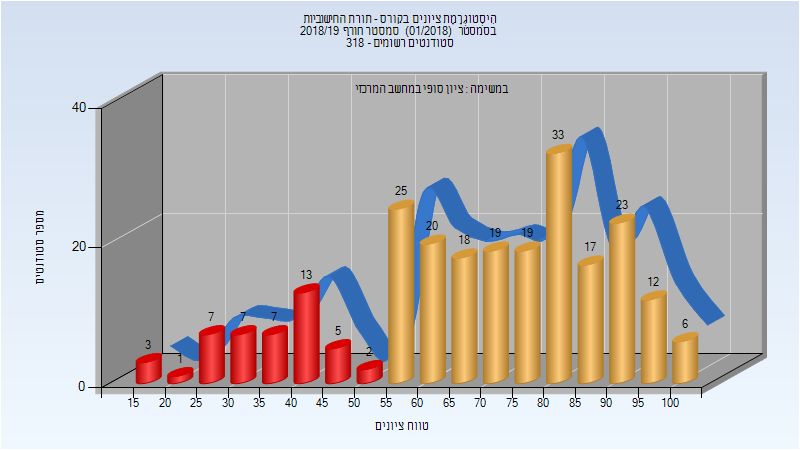
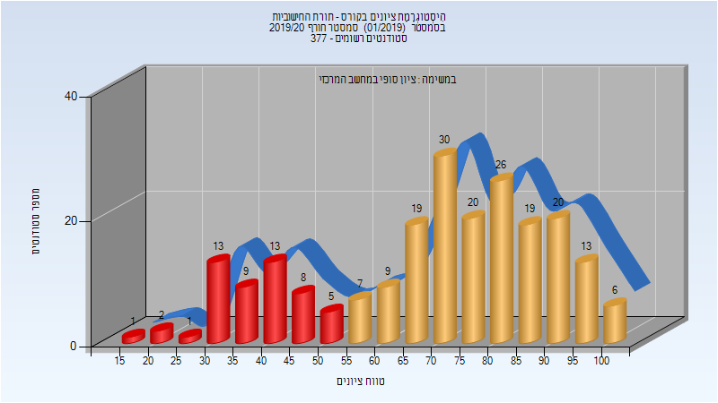
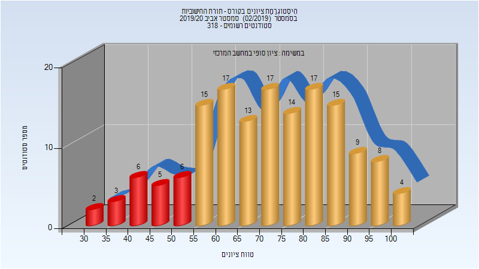
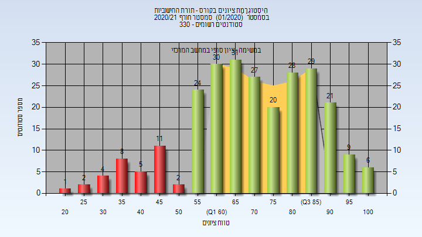

# 236343 - תורת החישוביות

## אביב 2013

| איש סגל | תפקיד |
| ---- | ---- |
| ישי יובל | מרצה - אחראי מקצוע |

## אביב 2016

### סופי

| סטודנטים | עברו/נכשלו | אחוז עוברים | ציון מינימלי | ציון מקסימלי | ממוצע | חציון |
| ---- | ---- | ---- | ---- | ---- | ---- | ---- |
| 157 | 141/16 | 90 | 21 | 100 | 70.777 | 72 |

## חורף 2016-2017

| איש סגל | תפקיד |
| ---- | ---- |
| קושילביץ איל | מרצה - אחראי מקצוע |

## חורף 2017-2018

| איש סגל | תפקיד |
| ---- | ---- |
| בן ששון אליהו | מרצה - אחראי מקצוע |

### סופי

| סטודנטים | עברו/נכשלו | אחוז עוברים | ציון מינימלי | ציון מקסימלי | ממוצע | חציון |
| ---- | ---- | ---- | ---- | ---- | ---- | ---- |
| 167 | 140/27 | 84 | 28 | 100 | 71.749 | 74 |

## אביב 2018

| איש סגל | תפקיד |
| ---- | ---- |
| קושילביץ איל | מרצה - אחראי מקצוע |

### סופי

| סטודנטים | עברו/נכשלו | אחוז עוברים | ציון מינימלי | ציון מקסימלי | ממוצע | חציון |
| ---- | ---- | ---- | ---- | ---- | ---- | ---- |
| 276 | 214/62 | 78 | 20 | 100 | 67.438 | 70 |

## חורף 2018-2019

| איש סגל | תפקיד |
| ---- | ---- |
| קושילביץ איל | מרצה - אחראי מקצוע |

### סופי

| סטודנטים | עברו/נכשלו | אחוז עוברים | ציון מינימלי | ציון מקסימלי | ממוצע | חציון |
| ---- | ---- | ---- | ---- | ---- | ---- | ---- |
| 237 | 192/45 | 81 | 18 | 100 | 69.186 | 72 |

## אביב 2019

| איש סגל | תפקיד |
| ---- | ---- |
| ישי יובל | מרצה - אחראי מקצוע |

### סופי

| סטודנטים | עברו/נכשלו | אחוז עוברים | ציון מינימלי | ציון מקסימלי | ממוצע | חציון |
| ---- | ---- | ---- | ---- | ---- | ---- | ---- |
| 272 | 227/45 | 83 | 19 | 100 | 69.438 | 71 |

## חורף 2019-2020

| איש סגל | תפקיד |
| ---- | ---- |
| קושילביץ איל | מרצה - אחראי מקצוע |

### סופי

| סטודנטים | עברו/נכשלו | אחוז עוברים | ציון מינימלי | ציון מקסימלי | ממוצע | חציון |
| ---- | ---- | ---- | ---- | ---- | ---- | ---- |
| 275 | 233/42 | 85 | 32 | 100 | 74.026 | 77 |

## אביב 2020

| איש סגל | תפקיד |
| ---- | ---- |
| ישי יובל | מרצה - אחראי מקצוע |

### סופי

| סטודנטים | עברו/נכשלו | אחוז עוברים | ציון מינימלי | ציון מקסימלי | ממוצע | חציון |
| ---- | ---- | ---- | ---- | ---- | ---- | ---- |
| 217 | 187/30 | 86 | 32 | 100 | 71.755 | 73 |

## חורף 2020-2021

| איש סגל | תפקיד |
| ---- | ---- |
| ישי יובל | מרצה - אחראי מקצוע |

### סופי

| סטודנטים | עברו/נכשלו | אחוז עוברים | ציון מינימלי | ציון מקסימלי | ממוצע | חציון |
| ---- | ---- | ---- | ---- | ---- | ---- | ---- |
| 254 | 216/38 | 85 | 20 | 100 | 70.193 | 71 |

