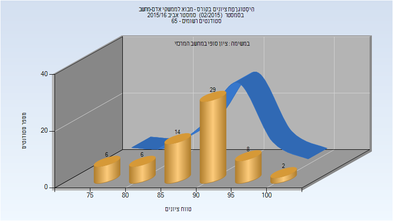

# 236348 - מבוא לממשקי אדם-מחשב

## אביב 2016

### סופי

| סטודנטים | עברו/נכשלו | אחוז עוברים | ציון מינימלי | ציון מקסימלי | ממוצע | חציון |
| ---- | ---- | ---- | ---- | ---- | ---- | ---- |
| 65 | 65/0 | 100 | 75 | 100 | 89.277 | 91 |

