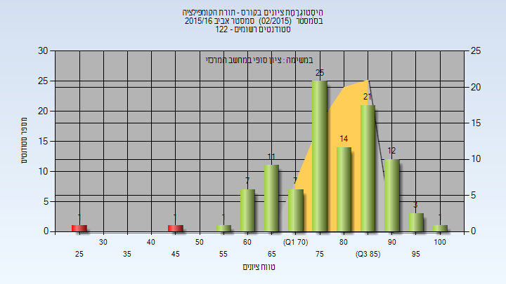
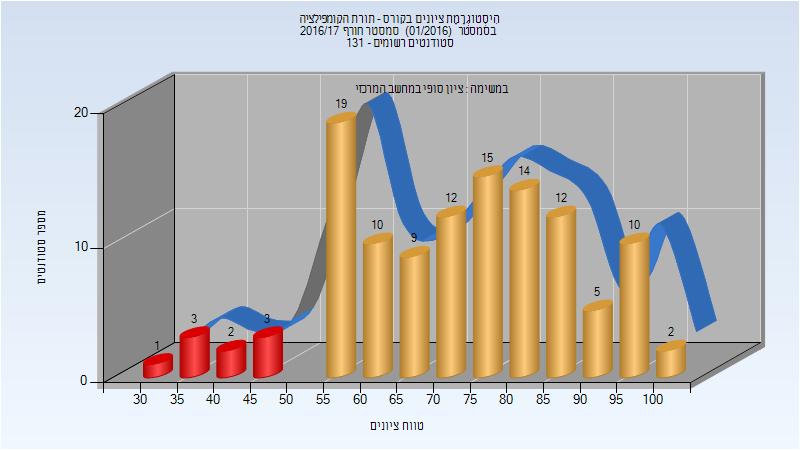
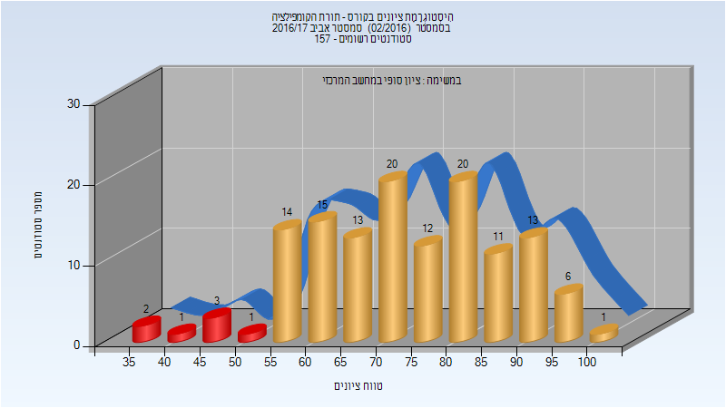
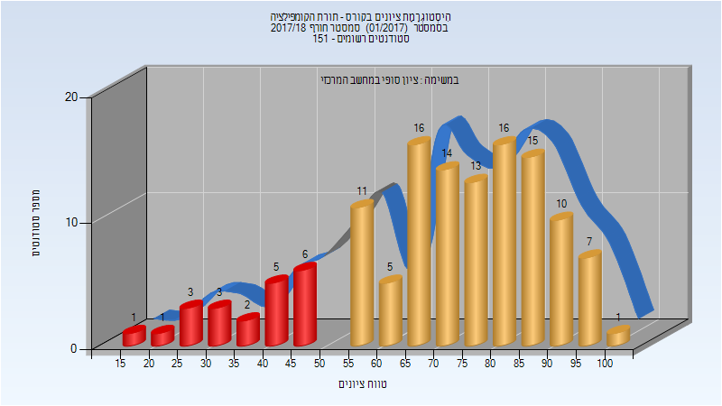
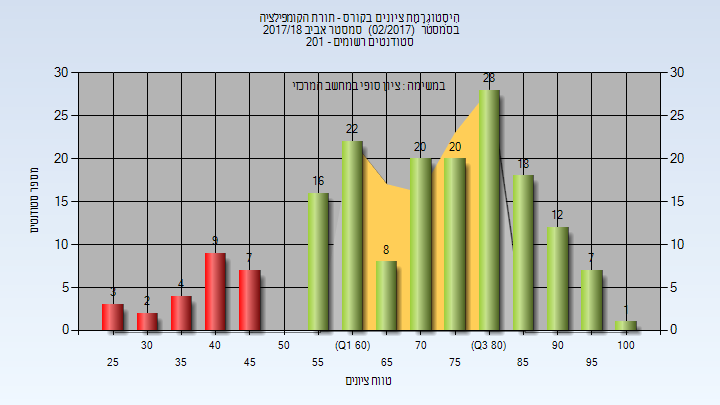
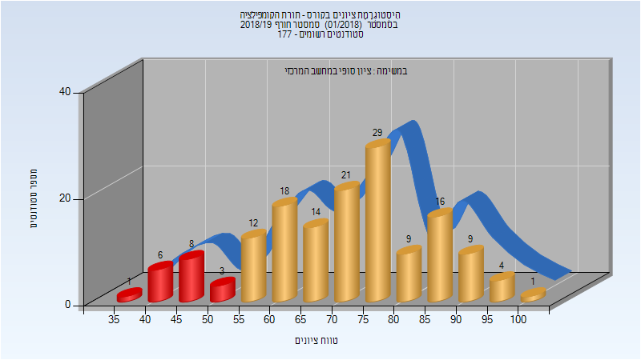
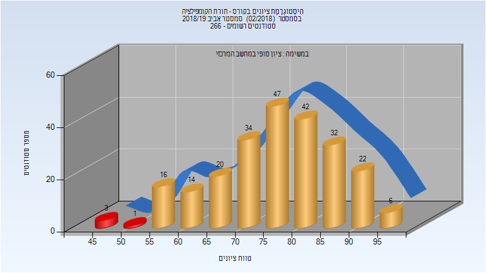
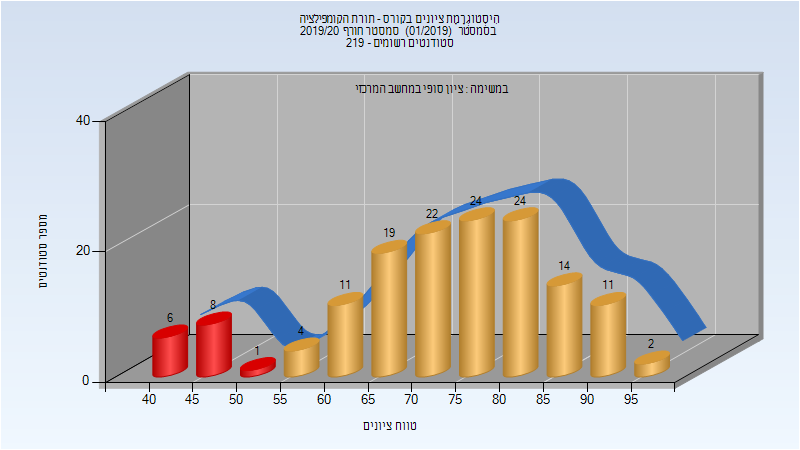
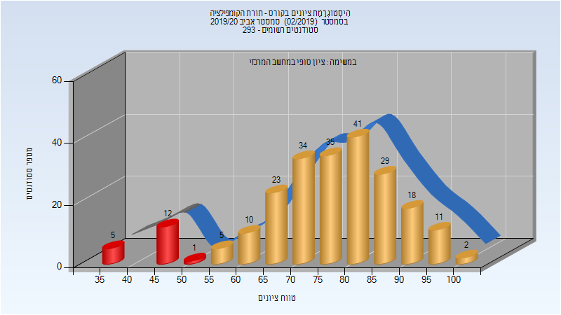
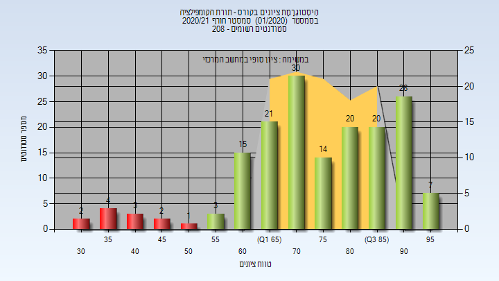

# 236360 - תורת הקומפילציה

## אביב 2013

| איש סגל | תפקיד |
| ---- | ---- |
| יהב ערן | מרצה - אחראי מקצוע |

## אביב 2016

### סופי

| סטודנטים | עברו/נכשלו | אחוז עוברים | ציון מינימלי | ציון מקסימלי | ממוצע | חציון |
| ---- | ---- | ---- | ---- | ---- | ---- | ---- |
| 104 | 102/2 | 98 | 27 | 100 | 78.712 | 79 |

## חורף 2016-2017

| איש סגל | תפקיד |
| ---- | ---- |
| פטרנק ארז | מרצה - אחראי מקצוע |

### סופי

| סטודנטים | עברו/נכשלו | אחוז עוברים | ציון מינימלי | ציון מקסימלי | ממוצע | חציון |
| ---- | ---- | ---- | ---- | ---- | ---- | ---- |
| 117 | 108/9 | 92 | 33 | 100 | 72.624 | 74 |

## אביב 2017

### סופי

| סטודנטים | עברו/נכשלו | אחוז עוברים | ציון מינימלי | ציון מקסימלי | ממוצע | חציון |
| ---- | ---- | ---- | ---- | ---- | ---- | ---- |
| 132 | 125/7 | 95 | 38 | 100 | 73.712 | 73.5 |

## חורף 2017-2018

| איש סגל | תפקיד |
| ---- | ---- |
| יצחקי שחר | מרצה - אחראי מקצוע |

### סופי

| סטודנטים | עברו/נכשלו | אחוז עוברים | ציון מינימלי | ציון מקסימלי | ממוצע | חציון |
| ---- | ---- | ---- | ---- | ---- | ---- | ---- |
| 129 | 108/21 | 84 | 15 | 100 | 70.86 | 74 |

## אביב 2018

| איש סגל | תפקיד |
| ---- | ---- |
| שחם אוהד | מרצה - אחראי מקצוע |

### סופי

| סטודנטים | עברו/נכשלו | אחוז עוברים | ציון מינימלי | ציון מקסימלי | ממוצע | חציון |
| ---- | ---- | ---- | ---- | ---- | ---- | ---- |
| 177 | 152/25 | 86 | 25 | 100 | 70.678 | 73 |

## חורף 2018-2019

| איש סגל | תפקיד |
| ---- | ---- |
| יצחקי שחר | מרצה - אחראי מקצוע |

### סופי

| סטודנטים | עברו/נכשלו | אחוז עוברים | ציון מינימלי | ציון מקסימלי | ממוצע | חציון |
| ---- | ---- | ---- | ---- | ---- | ---- | ---- |
| 151 | 133/18 | 88 | 38 | 100 | 71.132 | 73 |

## אביב 2019

| איש סגל | תפקיד |
| ---- | ---- |
| יהב ערן | מרצה - אחראי מקצוע |

### סופי

| סטודנטים | עברו/נכשלו | אחוז עוברים | ציון מינימלי | ציון מקסימלי | ממוצע | חציון |
| ---- | ---- | ---- | ---- | ---- | ---- | ---- |
| 238 | 234/4 | 98 | 45 | 98 | 76.773 | 78 |

## חורף 2019-2020

| איש סגל | תפקיד |
| ---- | ---- |
| יצחקי שחר | מרצה - אחראי מקצוע |

### סופי

| סטודנטים | עברו/נכשלו | אחוז עוברים | ציון מינימלי | ציון מקסימלי | ממוצע | חציון |
| ---- | ---- | ---- | ---- | ---- | ---- | ---- |
| 176 | 159/17 | 90 | 33 | 100 | 74.288 | 76 |

## אביב 2020

| איש סגל | תפקיד |
| ---- | ---- |
| כהן טל | מרצה - אחראי מקצוע |

### סופי

| סטודנטים | עברו/נכשלו | אחוז עוברים | ציון מינימלי | ציון מקסימלי | ממוצע | חציון |
| ---- | ---- | ---- | ---- | ---- | ---- | ---- |
| 254 | 240/14 | 94 | 35 | 100 | 76.921 | 79 |

## חורף 2020-2021

| איש סגל | תפקיד |
| ---- | ---- |
| יצחקי שחר | מרצה - אחראי מקצוע |

### סופי

| סטודנטים | עברו/נכשלו | אחוז עוברים | ציון מינימלי | ציון מקסימלי | ממוצע | חציון |
| ---- | ---- | ---- | ---- | ---- | ---- | ---- |
| 167 | 155/12 | 93 | 32 | 99 | 75.401 | 75 |

