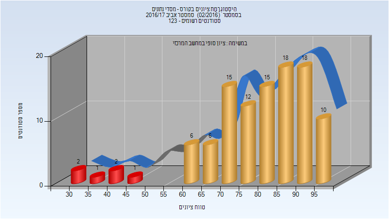
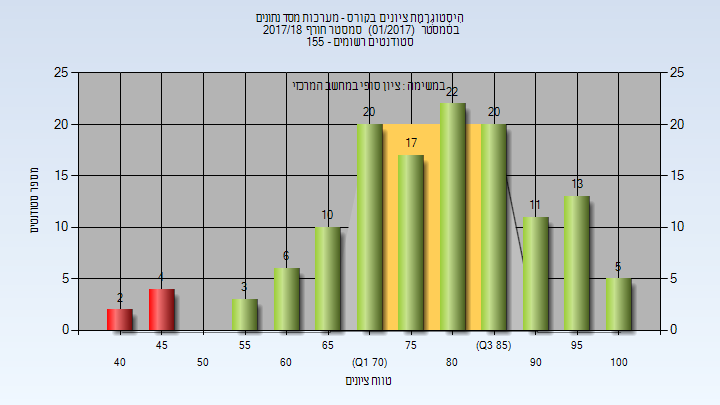
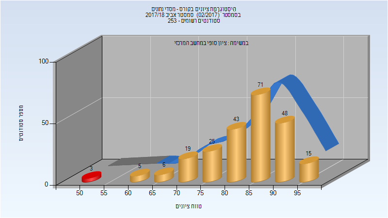
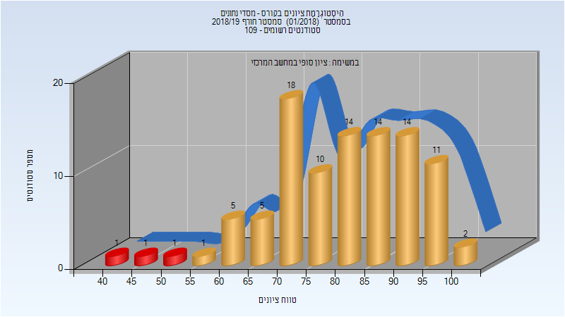
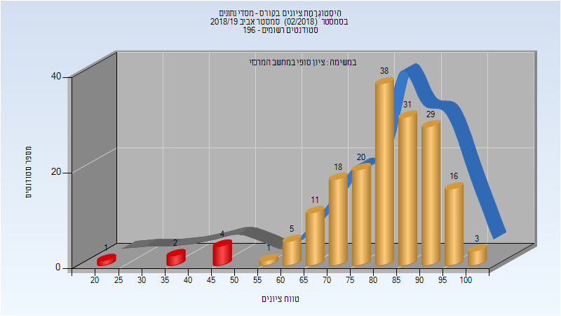
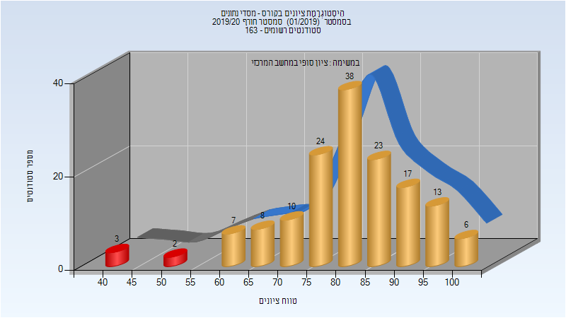
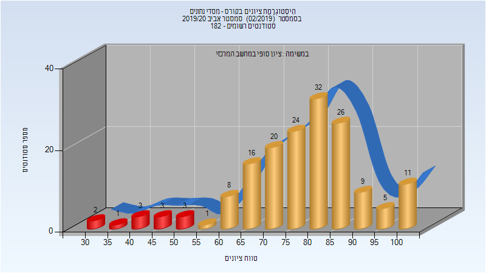

# 236363 - מערכות מסד נתונים

## אביב 2017

### סופי

| סטודנטים | עברו/נכשלו | אחוז עוברים | ציון מינימלי | ציון מקסימלי | ממוצע | חציון |
| ---- | ---- | ---- | ---- | ---- | ---- | ---- |
| 106 | 100/6 | 94 | 31 | 99 | 79.311 | 81.5 |

## חורף 2017-2018

### סופי

| סטודנטים | עברו/נכשלו | אחוז עוברים | ציון מינימלי | ציון מקסימלי | ממוצע | חציון |
| ---- | ---- | ---- | ---- | ---- | ---- | ---- |
| 133 | 127/6 | 95 | 42 | 100 | 79.376 | 80 |

## אביב 2018

| איש סגל | תפקיד |
| ---- | ---- |
| שמואלי עודד | מרצה - אחראי מקצוע |

### סופי

| סטודנטים | עברו/נכשלו | אחוז עוברים | ציון מינימלי | ציון מקסימלי | ממוצע | חציון |
| ---- | ---- | ---- | ---- | ---- | ---- | ---- |
| 235 | 232/3 | 99 | 51 | 99 | 83.957 | 86 |

## חורף 2018-2019

| איש סגל | תפקיד |
| ---- | ---- |
| שמואלי עודד | מרצה - אחראי מקצוע |

### סופי

| סטודנטים | עברו/נכשלו | אחוז עוברים | ציון מינימלי | ציון מקסימלי | ממוצע | חציון |
| ---- | ---- | ---- | ---- | ---- | ---- | ---- |
| 97 | 94/3 | 97 | 41 | 100 | 80.845 | 82 |

## אביב 2019

| איש סגל | תפקיד |
| ---- | ---- |
| קימלפלד בני | מרצה - אחראי מקצוע |

### סופי

| סטודנטים | עברו/נכשלו | אחוז עוברים | ציון מינימלי | ציון מקסימלי | ממוצע | חציון |
| ---- | ---- | ---- | ---- | ---- | ---- | ---- |
| 179 | 172/7 | 96 | 24 | 100 | 81.33 | 84 |

## חורף 2019-2020

| איש סגל | תפקיד |
| ---- | ---- |
| שמואלי עודד | מרצה - אחראי מקצוע |

### סופי

| סטודנטים | עברו/נכשלו | אחוז עוברים | ציון מינימלי | ציון מקסימלי | ממוצע | חציון |
| ---- | ---- | ---- | ---- | ---- | ---- | ---- |
| 151 | 146/5 | 97 | 41 | 100 | 81.656 | 83 |

## אביב 2020

| איש סגל | תפקיד |
| ---- | ---- |
| קימלפלד בני | מרצה - אחראי מקצוע |

### סופי

| סטודנטים | עברו/נכשלו | אחוז עוברים | ציון מינימלי | ציון מקסימלי | ממוצע | חציון |
| ---- | ---- | ---- | ---- | ---- | ---- | ---- |
| 138 | 121/17 | 88 | 19 | 100 | 73.37 | 76 |

