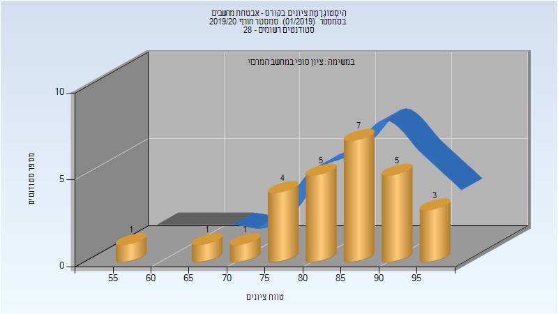
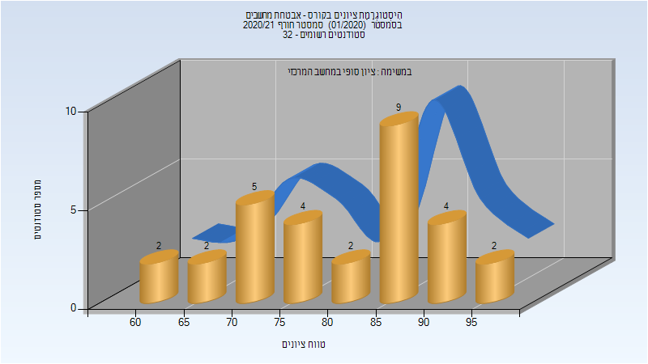

# 236490 - אבטחת מחשבים

## חורף 2019-2020

| איש סגל | תפקיד |
| ---- | ---- |
| ביתן-ארליך שרה | מרצה - אחראי מקצוע |

### סופי

| סטודנטים | עברו/נכשלו | אחוז עוברים | ציון מינימלי | ציון מקסימלי | ממוצע | חציון |
| ---- | ---- | ---- | ---- | ---- | ---- | ---- |
| 27 | 27/0 | 100 | 59 | 99 | 84.111 | 85 |

## חורף 2020-2021

| איש סגל | תפקיד |
| ---- | ---- |
| ביתן-ארליך שרה | מרצה - אחראי מקצוע |

### סופי

| סטודנטים | עברו/נכשלו | אחוז עוברים | ציון מינימלי | ציון מקסימלי | ממוצע | חציון |
| ---- | ---- | ---- | ---- | ---- | ---- | ---- |
| 30 | 30/0 | 100 | 62 | 97 | 81.133 | 83 |

