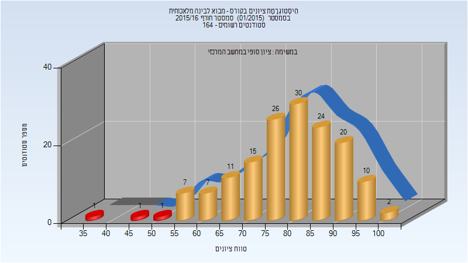
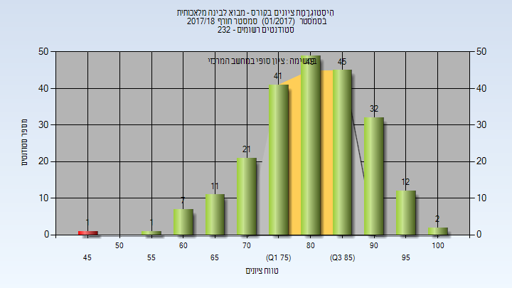
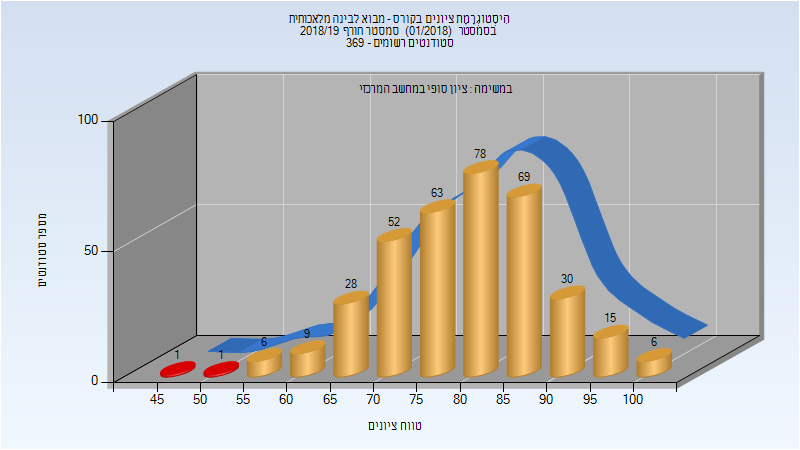
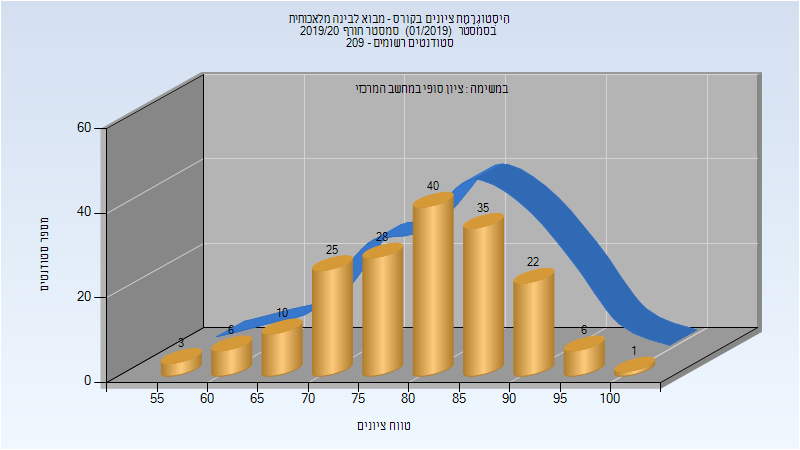
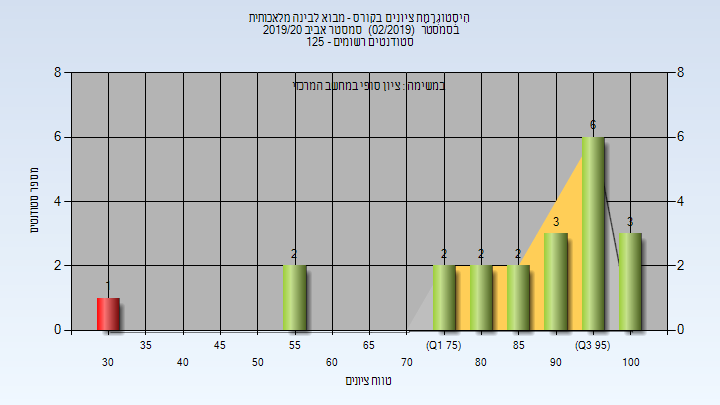

# 236501 - מבוא לבינה מלאכותית

## חורף 2015-2016

### סופי

| סטודנטים | עברו/נכשלו | אחוז עוברים | ציון מינימלי | ציון מקסימלי | ממוצע | חציון |
| ---- | ---- | ---- | ---- | ---- | ---- | ---- |
| 155 | 152/3 | 98 | 35 | 100 | 79.723 | 80 |

## חורף 2017-2018

| איש סגל | תפקיד |
| ---- | ---- |
| מרקוביץ שאול | מרצה - אחראי מקצוע |

### סופי

| סטודנטים | עברו/נכשלו | אחוז עוברים | ציון מינימלי | ציון מקסימלי | ממוצע | חציון |
| ---- | ---- | ---- | ---- | ---- | ---- | ---- |
| 222 | 221/1 | 100 | 48 | 100 | 81.878 | 82.5 |

## חורף 2018-2019

| איש סגל | תפקיד |
| ---- | ---- |
| מרקוביץ שאול | מרצה - אחראי מקצוע |

### סופי

| סטודנטים | עברו/נכשלו | אחוז עוברים | ציון מינימלי | ציון מקסימלי | ממוצע | חציון |
| ---- | ---- | ---- | ---- | ---- | ---- | ---- |
| 357 | 355/2 | 99 | 49 | 100 | 80.017 | 80 |

## חורף 2019-2020

| איש סגל | תפקיד |
| ---- | ---- |
| מרקוביץ שאול | מרצה - אחראי מקצוע |

### סופי

| סטודנטים | עברו/נכשלו | אחוז עוברים | ציון מינימלי | ציון מקסימלי | ממוצע | חציון |
| ---- | ---- | ---- | ---- | ---- | ---- | ---- |
| 200 | 200/0 | 100 | 55 | 100 | 84.229 | 86 |

## אביב 2020

| איש סגל | תפקיד |
| ---- | ---- |
| מרקוביץ שאול | מרצה - אחראי מקצוע |

### סופי

| סטודנטים | עברו/נכשלו | אחוז עוברים | ציון מינימלי | ציון מקסימלי | ממוצע | חציון |
| ---- | ---- | ---- | ---- | ---- | ---- | ---- |
| 121 | 120/1 | 99 | 30 | 100 | 85.19 | 92 |

