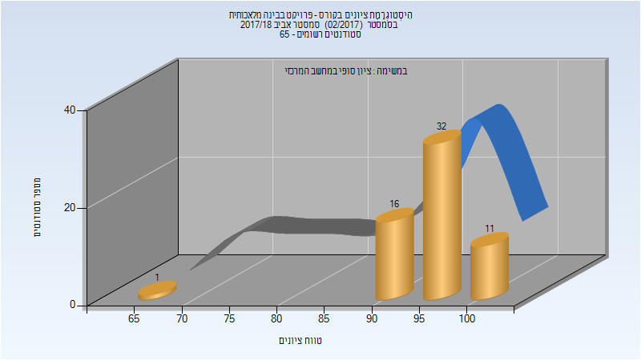
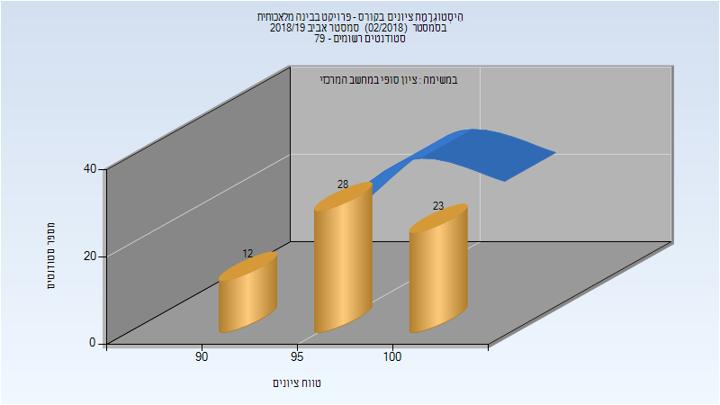
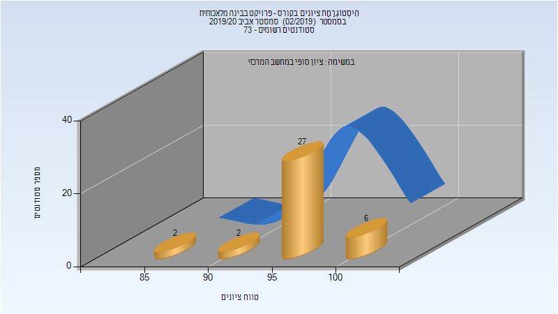

# 236502 - פרויקט בבינה מלאכותית

## אביב 2018

| איש סגל | תפקיד |
| ---- | ---- |
| מרקוביץ שאול | מרצה - אחראי מקצוע |

### סופי

| סטודנטים | עברו/נכשלו | אחוז עוברים | ציון מינימלי | ציון מקסימלי | ממוצע | חציון |
| ---- | ---- | ---- | ---- | ---- | ---- | ---- |
| 60 | 60/0 | 100 | 65 | 100 | 95.75 | 97 |

## אביב 2019

| איש סגל | תפקיד |
| ---- | ---- |
| מרקוביץ שאול | מרצה - אחראי מקצוע |

### סופי

| סטודנטים | עברו/נכשלו | אחוז עוברים | ציון מינימלי | ציון מקסימלי | ממוצע | חציון |
| ---- | ---- | ---- | ---- | ---- | ---- | ---- |
| 67 | 67/0 | 100 | 90 | 100 | 96.985 | 98 |

## אביב 2020

| איש סגל | תפקיד |
| ---- | ---- |
| מרקוביץ שאול | מרצה - אחראי מקצוע |

### סופי

| סטודנטים | עברו/נכשלו | אחוז עוברים | ציון מינימלי | ציון מקסימלי | ממוצע | חציון |
| ---- | ---- | ---- | ---- | ---- | ---- | ---- |
| 39 | 39/0 | 100 | 85 | 100 | 96.378 | 97 |

