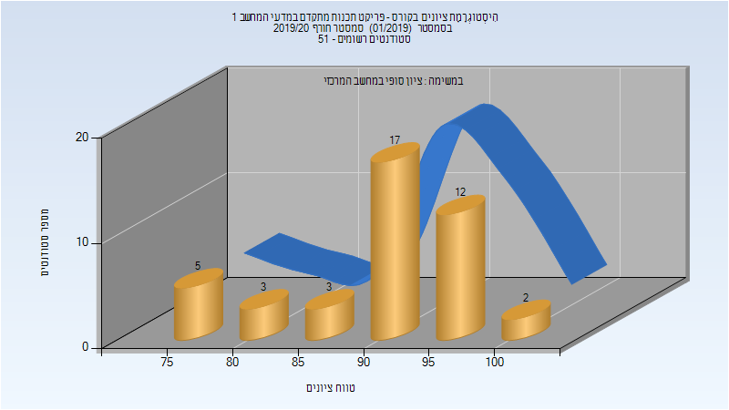

# 236503 - פרויקט תכנות מתקדם במדעי המחשב 1

## חורף 2019-2020

| איש סגל | תפקיד |
| ---- | ---- |
| משלי אורן | מרצה - אחראי מקצוע |

### סופי

| סטודנטים | עברו/נכשלו | אחוז עוברים | ציון מינימלי | ציון מקסימלי | ממוצע | חציון |
| ---- | ---- | ---- | ---- | ---- | ---- | ---- |
| 43 | 43/0 | 100 | 75 | 100 | 91.744 | 94 |

