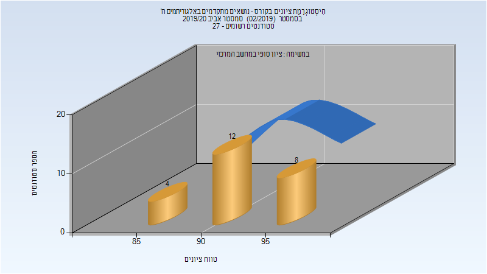

# 236620 - נושאים מתקדמים באלגוריתמים ה'

## חורף 2019-2020

| איש סגל | תפקיד |
| ---- | ---- |
| נאור יוסף | מרצה - אחראי מקצוע |

## אביב 2020

| איש סגל | תפקיד |
| ---- | ---- |
| פינטר רון יאיר | מרצה - אחראי מקצוע |

### סופי

| סטודנטים | עברו/נכשלו | אחוז עוברים | ציון מינימלי | ציון מקסימלי | ממוצע | חציון |
| ---- | ---- | ---- | ---- | ---- | ---- | ---- |
| 25 | 25/0 | 100 | 87 | 100 | 93.52 | 94 |

