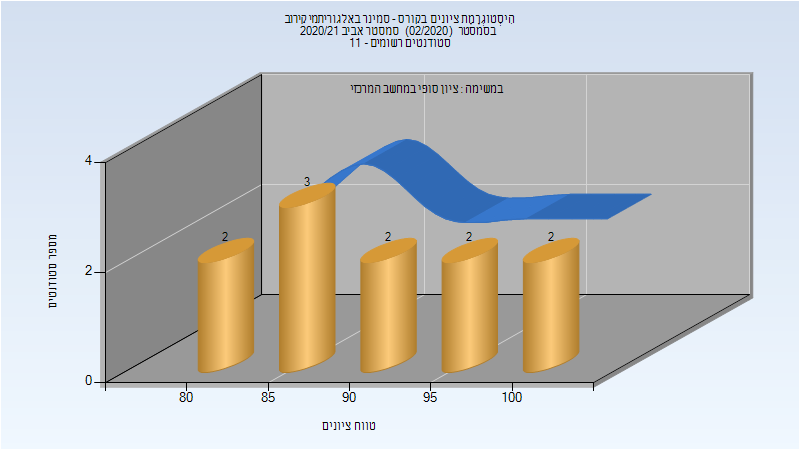

# 236829 - סמינר באלגוריתמי קירוב

## אביב 2020

| איש סגל | תפקיד |
| ---- | ---- |
| בר-יהודה ראובן | מרצה - אחראי מקצוע |

## אביב 2021

| איש סגל | תפקיד |
| ---- | ---- |
| בר-יהודה ראובן | מרצה - אחראי מקצוע |

### סופי

| סטודנטים | עברו/נכשלו | אחוז עוברים | ציון מינימלי | ציון מקסימלי | ממוצע | חציון |
| ---- | ---- | ---- | ---- | ---- | ---- | ---- |
| 11 | 11/0 | 100 | 81 | 100 | 91.364 | 89 |

