# 314009 - מעבדה בחומרים הנדסיים ח'

## קיץ 2015

| איש סגל | תפקיד |
| ---- | ---- |
| לנדאו אסנת | מרצה - אחראי מקצוע |
| מאיר שי | סגל מנהלי - עם הרשאות מרצה אחראי |
| הופמן מיכל | סגל מנהלי - עם הרשאות מרצה אחראי |
| דוד רותי | סגל מנהלי - עם הרשאות מרצה אחראי |

### סופי מועד א'

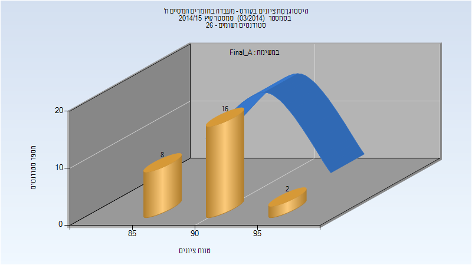

| סטודנטים | עברו/נכשלו | אחוז עוברים | ציון מינימלי | ציון מקסימלי | ממוצע | חציון |
| ---- | ---- | ---- | ---- | ---- | ---- | ---- |
| 26 | 26/0 | 100 | 87 | 96 | 90.923 | 91 |

### סופי

| סטודנטים | עברו/נכשלו | אחוז עוברים | ציון מינימלי | ציון מקסימלי | ממוצע | חציון |
| ---- | ---- | ---- | ---- | ---- | ---- | ---- |
| 26 | 26/0 | 100 | 87 | 96 | 90.923 | 91 |

## חורף 2015-2016

| איש סגל | תפקיד |
| ---- | ---- |
| סוסניק אלחנדרו | מרצה - אחראי מקצוע |
| מאיר שי | סגל מנהלי - עם הרשאות מרצה אחראי |

### סופי מועד א'

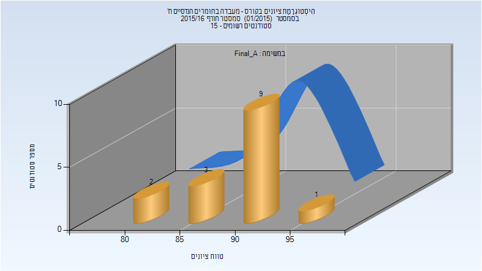

| סטודנטים | עברו/נכשלו | אחוז עוברים | ציון מינימלי | ציון מקסימלי | ממוצע | חציון |
| ---- | ---- | ---- | ---- | ---- | ---- | ---- |
| 15 | 15/0 | 100 | 82 | 95 | 90.933 | 92 |

### סופי

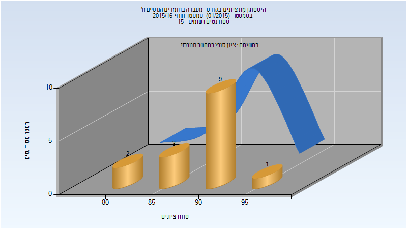

| סטודנטים | עברו/נכשלו | אחוז עוברים | ציון מינימלי | ציון מקסימלי | ממוצע | חציון |
| ---- | ---- | ---- | ---- | ---- | ---- | ---- |
| 15 | 15/0 | 100 | 82 | 95 | 90.933 | 92 |

## קיץ 2016

| איש סגל | תפקיד |
| ---- | ---- |
| משה-דרזנר חייקה |  |
| מאיר שי |  |
| דוד רותי | סגל מנהלי - עם הרשאות מרצה אחראי |
| הופמן מיכל | סגל מנהלי - עם הרשאות מרצה אחראי |

### סופי מועד א'

| סטודנטים | עברו/נכשלו | אחוז עוברים | ציון מינימלי | ציון מקסימלי | ממוצע | חציון |
| ---- | ---- | ---- | ---- | ---- | ---- | ---- |
| 30 | 30/0 | 100 | 69 | 96 | 90.3 | 93 |

### סופי

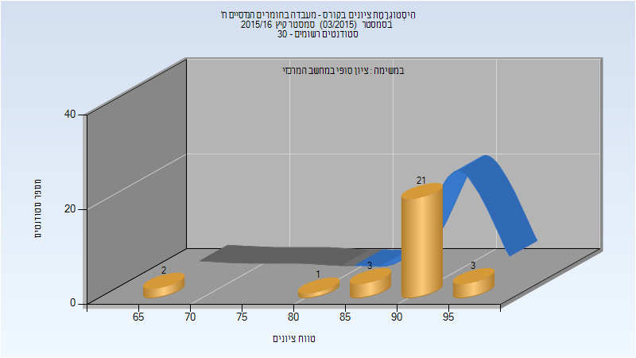

| סטודנטים | עברו/נכשלו | אחוז עוברים | ציון מינימלי | ציון מקסימלי | ממוצע | חציון |
| ---- | ---- | ---- | ---- | ---- | ---- | ---- |
| 30 | 30/0 | 100 | 69 | 96 | 90.3 | 93 |

## חורף 2016-2017

| איש סגל | תפקיד |
| ---- | ---- |
| רוטשילד אבנר |  |
| משה-דרזנר חייקה | סגל מנהלי - עם הרשאות מרצה אחראי |

### סופי מועד א'

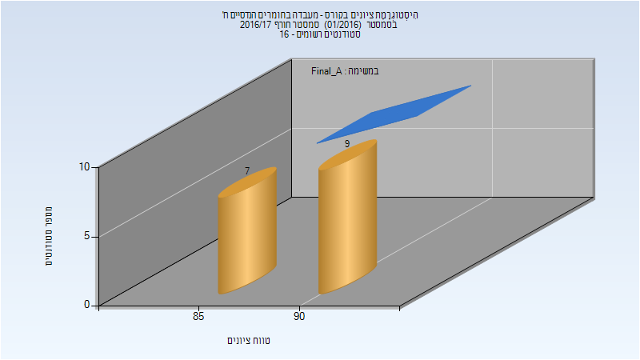

| סטודנטים | עברו/נכשלו | אחוז עוברים | ציון מינימלי | ציון מקסימלי | ממוצע | חציון |
| ---- | ---- | ---- | ---- | ---- | ---- | ---- |
| 16 | 16/0 | 100 | 86 | 94 | 90.375 | 90.5 |

### סופי

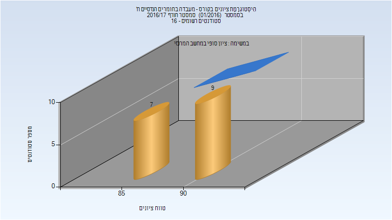

| סטודנטים | עברו/נכשלו | אחוז עוברים | ציון מינימלי | ציון מקסימלי | ממוצע | חציון |
| ---- | ---- | ---- | ---- | ---- | ---- | ---- |
| 16 | 16/0 | 100 | 86 | 94 | 90.375 | 90.5 |

## קיץ 2017

| איש סגל | תפקיד |
| ---- | ---- |
| משה-דרזנר חייקה |  |
| הופמן מיכל | סגל מנהלי - עם הרשאות מרצה אחראי |
| דוד רותי | סגל מנהלי - עם הרשאות מרצה אחראי |

### סופי מועד א'

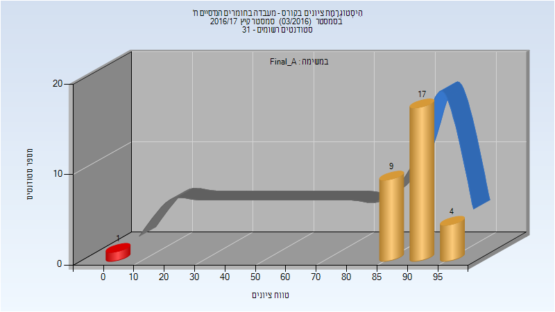

| סטודנטים | עברו/נכשלו | אחוז עוברים | ציון מינימלי | ציון מקסימלי | ממוצע | חציון |
| ---- | ---- | ---- | ---- | ---- | ---- | ---- |
| 31 | 30/1 | 97 | 0 | 97 | 88.516 | 91 |

### סופי

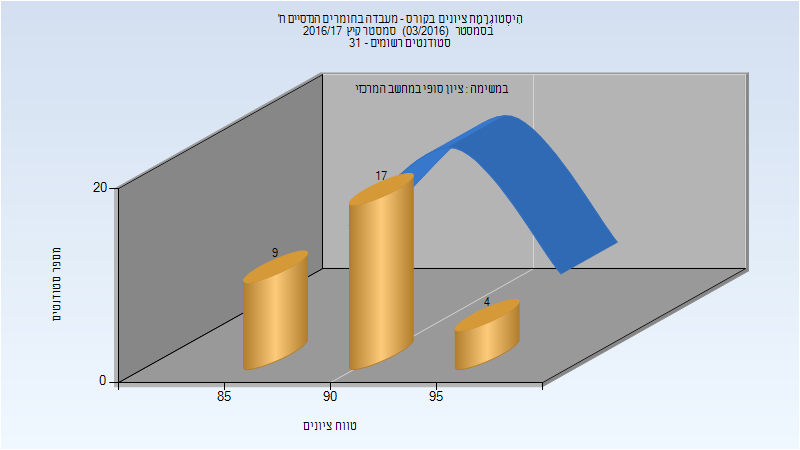

| סטודנטים | עברו/נכשלו | אחוז עוברים | ציון מינימלי | ציון מקסימלי | ממוצע | חציון |
| ---- | ---- | ---- | ---- | ---- | ---- | ---- |
| 30 | 30/0 | 100 | 85 | 97 | 91.467 | 91.5 |

## חורף 2017-2018

| איש סגל | תפקיד |
| ---- | ---- |
| עברי יכין | מדריך מעבדה - עם הרשאות מרצה אחראי |
| משה-דרזנר חייקה | סגל מנהלי - עם הרשאות מרצה אחראי |

### סופי מועד א'

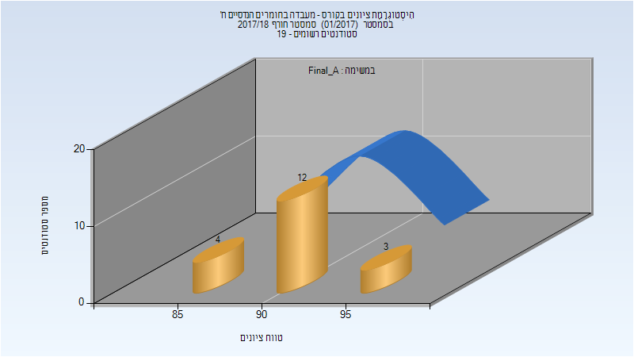

| סטודנטים | עברו/נכשלו | אחוז עוברים | ציון מינימלי | ציון מקסימלי | ממוצע | חציון |
| ---- | ---- | ---- | ---- | ---- | ---- | ---- |
| 19 | 19/0 | 100 | 88.25 | 96.38 | 92.325 | 92.25 |

### סופי

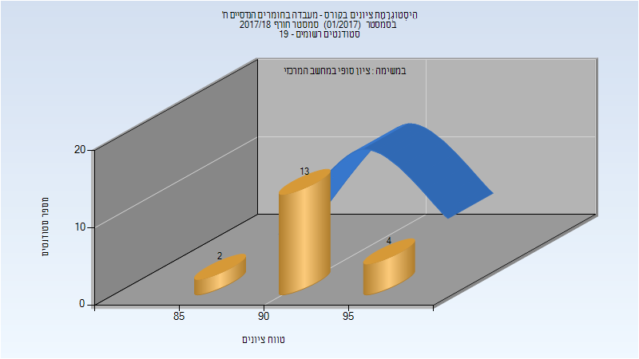

| סטודנטים | עברו/נכשלו | אחוז עוברים | ציון מינימלי | ציון מקסימלי | ממוצע | חציון |
| ---- | ---- | ---- | ---- | ---- | ---- | ---- |
| 19 | 19/0 | 100 | 88 | 96 | 92.368 | 92 |

## קיץ 2018

| איש סגל | תפקיד |
| ---- | ---- |
| משה-דרזנר חייקה |  |
| סנדר אושרית | סגל מנהלי - עם הרשאות מרצה אחראי |
| רם-און מאור | סגל מנהלי - עם הרשאות מרצה אחראי |
| דוד רותי | סגל מנהלי - עם הרשאות מרצה אחראי |

### סופי מועד א'

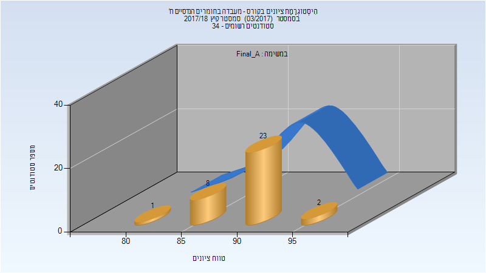

| סטודנטים | עברו/נכשלו | אחוז עוברים | ציון מינימלי | ציון מקסימלי | ממוצע | חציון |
| ---- | ---- | ---- | ---- | ---- | ---- | ---- |
| 34 | 34/0 | 100 | 84.28 | 95.78 | 91.146 | 91.28 |

### סופי

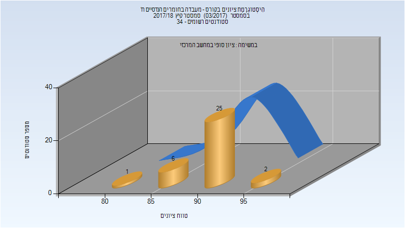

| סטודנטים | עברו/נכשלו | אחוז עוברים | ציון מינימלי | ציון מקסימלי | ממוצע | חציון |
| ---- | ---- | ---- | ---- | ---- | ---- | ---- |
| 34 | 34/0 | 100 | 84 | 96 | 91.176 | 91 |

## חורף 2018-2019

| איש סגל | תפקיד |
| ---- | ---- |
| רם-און מאור | סגל מנהלי - עם הרשאות מרצה אחראי |
| דוד רותי | סגל מנהלי - עם הרשאות מרצה אחראי |
| סנדר אושרית | סגל מנהלי - עם הרשאות מרצה אחראי |
| משה-דרזנר חייקה | סגל מנהלי - עם הרשאות מרצה אחראי |

## קיץ 2019

| איש סגל | תפקיד |
| ---- | ---- |
| דוד רותי | סגל מנהלי - עם הרשאות מרצה אחראי |
| משה-דרזנר חייקה | סגל מנהלי - עם הרשאות מרצה אחראי |
| סנדר אושרית | סגל מנהלי - עם הרשאות מרצה אחראי |
| רם-און מאור | סגל מנהלי - עם הרשאות מרצה אחראי |

### סופי מועד א'

| סטודנטים | עברו/נכשלו | אחוז עוברים | ציון מינימלי | ציון מקסימלי | ממוצע | חציון |
| ---- | ---- | ---- | ---- | ---- | ---- | ---- |
| 22 | 22/0 | 100 | 87 | 97 | 93.545 | 94 |

### סופי

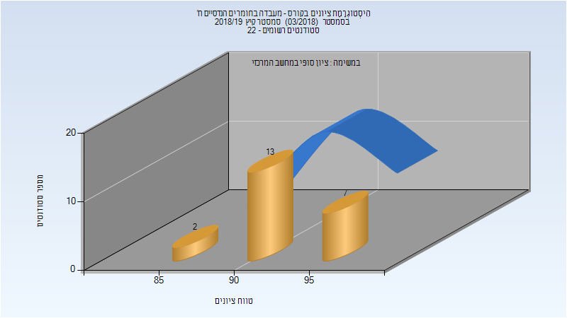

| סטודנטים | עברו/נכשלו | אחוז עוברים | ציון מינימלי | ציון מקסימלי | ממוצע | חציון |
| ---- | ---- | ---- | ---- | ---- | ---- | ---- |
| 22 | 22/0 | 100 | 87 | 97 | 93.545 | 94 |

## חורף 2019-2020

| איש סגל | תפקיד |
| ---- | ---- |
| עברי יכין | מרצה - אחראי מקצוע |
| רם-און מאור | סגל מנהלי - עם הרשאות מרצה אחראי |
| משה-דרזנר חייקה | סגל מנהלי - עם הרשאות מרצה אחראי |

### סופי מועד א'

| סטודנטים | עברו/נכשלו | אחוז עוברים | ציון מינימלי | ציון מקסימלי | ממוצע | חציון |
| ---- | ---- | ---- | ---- | ---- | ---- | ---- |
| 19 | 19/0 | 100 | 89 | 96 | 92.316 | 92 |

### סופי

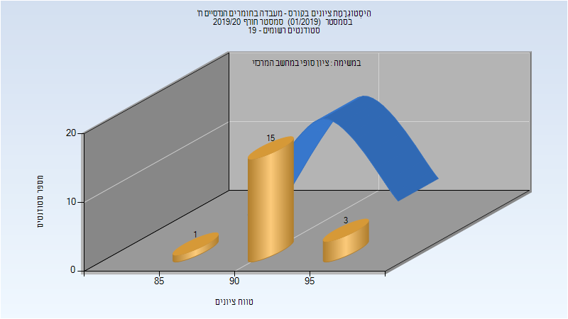

| סטודנטים | עברו/נכשלו | אחוז עוברים | ציון מינימלי | ציון מקסימלי | ממוצע | חציון |
| ---- | ---- | ---- | ---- | ---- | ---- | ---- |
| 19 | 19/0 | 100 | 89 | 96 | 92.316 | 92 |

## קיץ 2020

| איש סגל | תפקיד |
| ---- | ---- |
| דוד רותי | סגל מנהלי - עם הרשאות מרצה אחראי |
| סנדר אושרית | סגל מנהלי - עם הרשאות מרצה אחראי |
| משה-דרזנר חייקה | סגל מנהלי - עם הרשאות מרצה אחראי |
| רם-און מאור | סגל מנהלי - עם הרשאות מרצה אחראי |

### סופי מועד א'

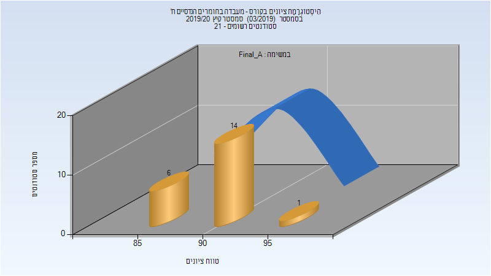

| סטודנטים | עברו/נכשלו | אחוז עוברים | ציון מינימלי | ציון מקסימלי | ממוצע | חציון |
| ---- | ---- | ---- | ---- | ---- | ---- | ---- |
| 21 | 21/0 | 100 | 87 | 96 | 91.333 | 92 |

### סופי

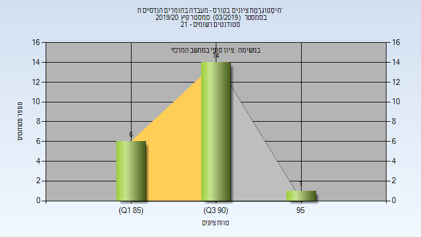

| סטודנטים | עברו/נכשלו | אחוז עוברים | ציון מינימלי | ציון מקסימלי | ממוצע | חציון |
| ---- | ---- | ---- | ---- | ---- | ---- | ---- |
| 21 | 21/0 | 100 | 87 | 96 | 91.333 | 92 |

## חורף 2020-2021

| איש סגל | תפקיד |
| ---- | ---- |
| דובגולבסקי יקטרינה |  |
| רם-און מאור | סגל מנהלי - עם הרשאות מרצה אחראי |
| דוד רותי | סגל מנהלי - עם הרשאות מרצה אחראי |
| משה-דרזנר חייקה | סגל מנהלי - עם הרשאות מרצה אחראי |
| סנדר אושרית | סגל מנהלי - עם הרשאות מרצה אחראי |

### סופי מועד א'

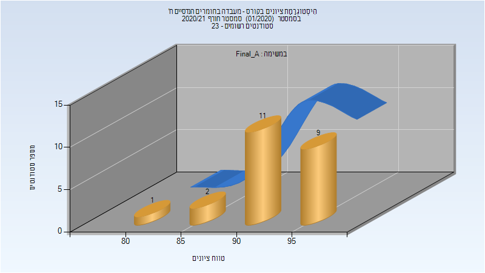

| סטודנטים | עברו/נכשלו | אחוז עוברים | ציון מינימלי | ציון מקסימלי | ממוצע | חציון |
| ---- | ---- | ---- | ---- | ---- | ---- | ---- |
| 23 | 23/0 | 100 | 80 | 97 | 92.783 | 94 |

### סופי

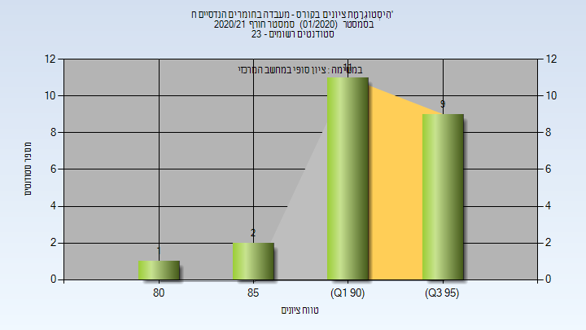

| סטודנטים | עברו/נכשלו | אחוז עוברים | ציון מינימלי | ציון מקסימלי | ממוצע | חציון |
| ---- | ---- | ---- | ---- | ---- | ---- | ---- |
| 23 | 23/0 | 100 | 80 | 97 | 92.783 | 94 |

